# 04 — User Flows

**Document Version:** 1.0  
**Status:** Active  
**Last Updated:** 2025-06-22  
**Owner:** Product Lead  

---

## Purpose of This Document

This document maps every significant user journey through Job Finder AI, end to end. Each flow shows the sequence of screens, system processes, and decision points a user (or the system itself) moves through. Where a flow spans both human and machine steps — like the scraper pipeline — both are shown so engineers can see exactly where their component fits into the larger journey.

Every flow includes a Mermaid diagram for visual reference and a step-by-step narrative for implementation detail. Related features are cross-referenced to `03_FEATURES.md` by Feature ID.

---

## Flow Index

| # | Flow | Type | Primary Persona | Features Involved |
|---|---|---|---|---|
| 1 | [Student Registration & Onboarding](#flow-1--student-registration--onboarding) | Human | Aarav, Priya, Rahul | F-AUTH-01/02, F-PROF-01/02/03 |
| 2 | [Google OAuth Login (Returning User)](#flow-2--google-oauth-login-returning-user) | Human | All | F-AUTH-02/03 |
| 3 | [Telegram Bot Connection](#flow-3--telegram-bot-connection) | Human | Aarav, Rahul, Sneha | F-NOTIF-01 |
| 4 | [End-to-End Job Discovery Pipeline](#flow-4--end-to-end-job-discovery-pipeline) | System | All (background) | F-SCRP-01–05, F-AGNT-01–05 |
| 5 | [Receiving & Acting on a Telegram Alert](#flow-5--receiving--acting-on-a-telegram-alert) | Human | Aarav, Rahul, Sneha | F-NOTIF-02, F-JOBS-05, F-TRACK-01 |
| 6 | [Browsing & Filtering the Jobs Feed](#flow-6--browsing--filtering-the-jobs-feed) | Human | All | F-JOBS-01/02/03 |
| 7 | [Daily Email Digest](#flow-7--daily-email-digest) | System + Human | Priya | F-NOTIF-03 |
| 8 | [Saving a Job & Tracking Application Status](#flow-8--saving-a-job--tracking-application-status) | Human | Priya, Aarav | F-TRACK-01/02 |
| 9 | [Closing-Soon Deadline Reminder](#flow-9--closing-soon-deadline-reminder) | System + Human | Aarav, Priya | F-TRACK-03 |
| 10 | [Resume Upload & AI Skill Extraction](#flow-10--resume-upload--ai-skill-extraction) | Human + System | Rahul, Priya | F-PROF-04 |
| 11 | [Notification Preferences & Quiet Hours Setup](#flow-11--notification-preferences--quiet-hours-setup) | Human | Sneha, Priya | F-PROF-03 |
| 12 | [Password Reset](#flow-12--password-reset) | Human | All | F-AUTH-04 |
| 13 | [Account Deletion](#flow-13--account-deletion) | Human | All | F-AUTH-05 |
| 14 | [Admin: Adding a New Company to Scrape](#flow-14--admin-adding-a-new-company-to-scrape) | Human | Karan | F-ADMN-02 |
| 15 | [Admin: Scraper Failure Detection & Alert](#flow-15--admin-scraper-failure-detection--alert) | System + Human | Karan | F-SCRP-04, F-ADMN-01/05 |
| 16 | [Admin: Reviewing a Low-Confidence Job](#flow-16--admin-reviewing-a-low-confidence-job) | Human | Karan | F-ADMN-03 |
| 17 | [Admin: Suspending a User Account](#flow-17--admin-suspending-a-user-account) | Human | Karan | F-ADMN-04 |

---

## Flow 1 — Student Registration & Onboarding

**Persona:** Aarav, Priya, Rahul · **Features:** F-AUTH-01, F-AUTH-02, F-PROF-01, F-PROF-02, F-PROF-03, F-NOTIF-01

### Narrative

A new student arrives at the platform — usually via a referral or a Telegram community post — and needs to go from "never heard of this" to "receiving my first matched job alert" with minimal friction. This is the single most important conversion flow in the product: every drop-off here is a student we never serve.

```
1. Landing page → "Get Started" button
2. Choose registration method:
   a. Email + password → fills form → verification email sent →
      clicks link → account activated
   b. Continue with Google → OAuth consent → account created instantly
3. Redirected to /onboarding/step-1
4. Step 1 — Skills (F-PROF-01)
   Searchable multi-select. Minimum 1 skill required.
5. Step 2 — Job Preferences (F-PROF-02)
   Role types (multi-select), Locations (multi-select + Remote toggle),
   Experience level (single-select)
6. Step 3 — Notifications (F-PROF-03, F-NOTIF-01)
   Connect Telegram (QR code or link) — optional but strongly encouraged
   Set email digest preference (default: daily)
7. Step 4 — Confirmation
   "You're all set! We're already looking for jobs that match you."
8. Redirect to /jobs (main feed) — first matches may already be visible
   if existing jobs in DB match the new profile
```

### Diagram

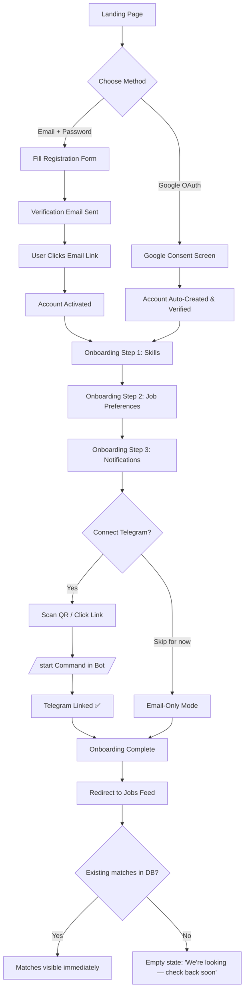

### Decision Points & Edge Cases

| Decision Point | Path A | Path B |
|---|---|---|
| Registration method | Email/password → requires email verification before continuing | Google OAuth → instantly verified, skips verification step |
| Telegram connection | Connected → instant alerts enabled | Skipped → user can connect later from settings; email digest becomes primary channel |
| Existing matching jobs at signup | Shown immediately on first feed visit | None exist yet → empty state with reassurance message, first notification typically arrives within hours |

### Cross-References
- F-AUTH-01 (Email registration), F-AUTH-02 (Google OAuth) — `03_FEATURES.md`
- F-PROF-01 (Skills), F-PROF-02 (Preferences), F-PROF-03 (Notification prefs) — `03_FEATURES.md`
- F-NOTIF-01 (Telegram connection) — `03_FEATURES.md`

---

## Flow 2 — Google OAuth Login (Returning User)

**Persona:** All · **Features:** F-AUTH-02, F-AUTH-03

### Narrative

A returning user logs back in. This flow is intentionally near-instant — no friction for someone who has already onboarded.

```
1. User opens app → /login
2. Clicks "Continue with Google"
3. Google recognizes already-authorized app → instant redirect (no consent screen if previously approved)
4. Backend validates Google ID token
5. Backend finds existing user by google_id
6. JWT access token + refresh token issued
7. Redirected to /jobs feed with full session
```

### Diagram

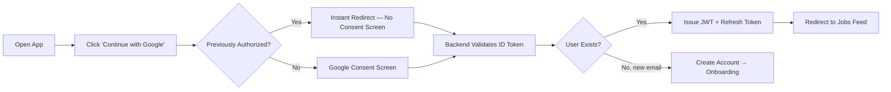

### Cross-References
- F-AUTH-02 (Google OAuth), F-AUTH-03 (JWT session) — `03_FEATURES.md`

---

## Flow 3 — Telegram Bot Connection

**Persona:** Aarav, Rahul, Sneha · **Features:** F-NOTIF-01

### Narrative

This flow can happen during onboarding (Flow 1) or later from Settings. It's documented separately because it's also a common re-entry point — users who skipped it initially often return to connect Telegram once they see the value of the platform via email digest.

```
1. User navigates to Settings → Notifications → "Connect Telegram"
2. Backend generates a one-time link code (UUID, 10-min expiry)
3. Frontend displays:
   - QR code (for mobile scan)
   - Direct link: t.me/JobFinderAIBot?start={code}
4. User opens Telegram app (scan or tap link)
5. Telegram opens chat with bot, pre-fills /start {code}
6. User sends the message
7. Telegram webhook delivers message to backend
8. Backend validates code (not expired, not used)
9. Backend links telegram_id to user account
10. Bot replies: "✅ Connected! You'll receive job alerts here."
11. Frontend polls /api/profile/telegram-status every 3 seconds
12. UI updates to "Telegram Connected ✅" once linked
```

### Diagram

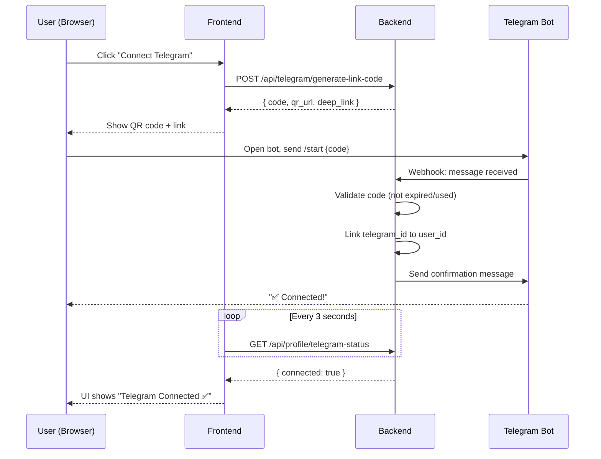

### Edge Cases
| Case | Handling |
|---|---|
| Code expires before user sends /start | Bot replies "Link expired — generate a new one from the website" |
| User already has Telegram linked to another account | Bot replies with error; link request rejected |
| User closes browser before polling completes | Status syncs correctly next time they open Settings |

### Cross-References
- F-NOTIF-01 (Telegram Bot Connection) — `03_FEATURES.md`

---

## Flow 4 — End-to-End Job Discovery Pipeline

**Persona:** All (background system flow, no direct human interaction until notification) · **Features:** F-SCRP-01 through F-SCRP-05, F-AGNT-01 through F-AGNT-05

### Narrative

This is the engine room of the entire product. It runs continuously, every 15 minutes, with zero human involvement until a matched notification reaches a student. Understanding this flow end-to-end is mandatory for any engineer working on scrapers, agents, or matching logic.

```
1. APScheduler fires (every 15 minutes)
2. Query companies table: active=true, ordered by last_scraped_at ASC
3. Select batch of N companies (default 20)
4. For each company:
   a. Run ATS Auto-Detector → identify ATS type
   b. Select appropriate adapter (Workday/Greenhouse/Lever/iCIMS/Taleo/Generic)
   c. Check robots.txt compliance
   d. Apply rate limiting (1 req / 3s per domain)
   e. Fetch job listings (with retry + backoff on failure)
   f. For each raw job found:
      i.   Duplicate Detector — hash check against existing jobs
      ii.  If duplicate → skip, increment counter
      iii. If new → Job Extractor agent → structured fields
      iv.  Skill Extractor agent → required/preferred skills + degree flag
      v.   JD Summarizer agent → 5-point summary
      vi.  Job Classifier agent → role_type, domain, experience_level, etc.
      vii. Save complete job record to PostgreSQL
   g. Update company.last_scraped_at
   h. Write scrape_run record (status, jobs_found, jobs_new, duration)
5. For every newly saved job:
   a. Run matching service — find all users whose profile matches
   b. For each matched user: check quiet hours → queue or dispatch immediately
   c. Telegram Dispatcher sends instant alerts
   d. Email jobs queued for next daily digest run
6. Log all notification attempts
```

### Diagram

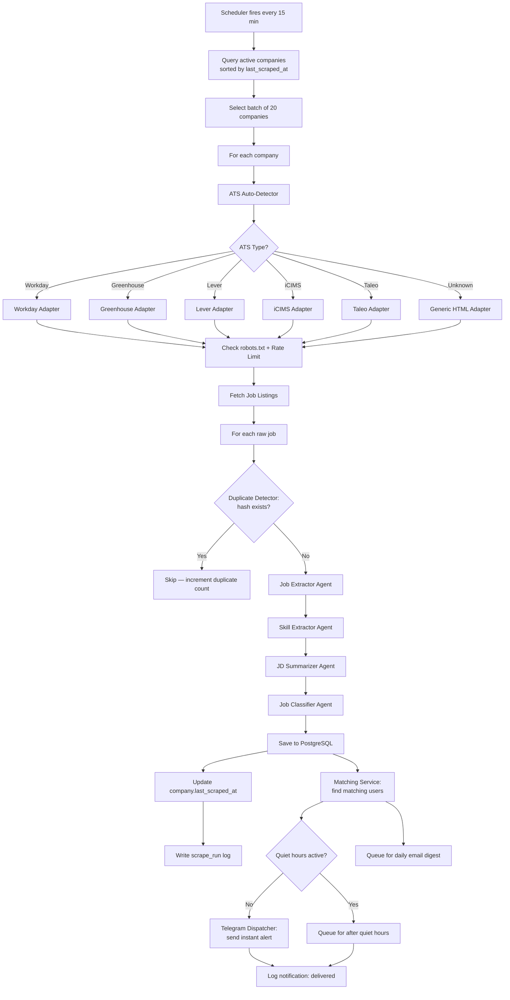

### Timing Budget

| Stage | Target Duration | Cumulative |
|---|---|---|
| Scheduler trigger to scrape start | < 30 sec | 0:30 |
| Scrape (per company) | < 30 sec | 1:00 |
| AI agent pipeline (per job) | < 15 sec | 1:15 |
| Matching + notification dispatch | < 2 min | 3:15 |
| **Total: posting → notification** | — | **< 30 min** |

### Cross-References
- F-SCRP-01 (ATS Detector), F-SCRP-02 (Adapters), F-SCRP-03 (Scheduler), F-SCRP-04 (Run Logging), F-SCRP-05 (Compliance) — `03_FEATURES.md`
- F-AGNT-01 through F-AGNT-05 (full agent pipeline) — `03_FEATURES.md`

---

## Flow 5 — Receiving & Acting on a Telegram Alert

**Persona:** Aarav, Rahul, Sneha · **Features:** F-NOTIF-02, F-JOBS-05, F-TRACK-01

### Narrative

This is the core value-delivery moment of the entire product. Everything upstream — scraping, AI extraction, matching — exists to make this single interaction as fast and decisive as possible.

```
1. Telegram message arrives on student's phone
2. Message contains: title, company, location, posted time,
   5-point summary, skill match icons, 3 inline buttons
3. Student reads message (target: 30 seconds or less)
4. Student taps one of three buttons:
   a. "Apply Now" → opens ATS apply URL in external browser
   b. "Save" → job saved to user_saved_jobs (status: saved)
   c. "Not Interested" → logged as feedback signal, no further action
5. If "Apply Now" tapped:
   - Click logged to notification_logs (action: apply_click)
   - Browser opens original ATS application page
   - Student completes application outside the platform
6. Student may later open the web app to mark the job as "Applied"
   in their tracker (Flow 8)
```

### Diagram

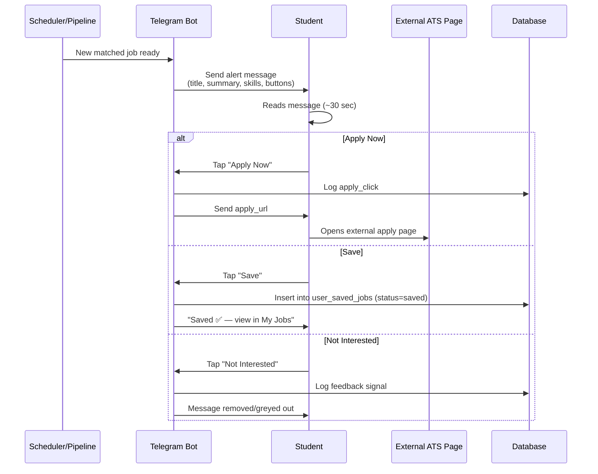

### Edge Cases
| Case | Handling |
|---|---|
| User taps "Apply Now" but ATS page is now 404 (job filled) | Browser shows ATS's own error page; platform cannot detect this in real time for MVP |
| User taps a button on an old message (job since deactivated) | Action still processes (save/not interested), but apply link may be stale |
| Message fails to render inline buttons (older Telegram client) | Falls back to plain text with the apply URL as a clickable link |

### Cross-References
- F-NOTIF-02 (Telegram Instant Alert) — `03_FEATURES.md`
- F-JOBS-05 (Direct Apply Link) — `03_FEATURES.md`
- F-TRACK-01 (Save Job) — `03_FEATURES.md`

---

## Flow 6 — Browsing & Filtering the Jobs Feed

**Persona:** All · **Features:** F-JOBS-01, F-JOBS-02, F-JOBS-03

### Narrative

While Telegram is the primary discovery channel, the web feed serves manual browsing, especially for users like Priya who prefer deliberate research sessions on desktop.

```
1. User opens /jobs
2. Feed loads first 20 jobs, sorted by company_posted_at DESC
3. User applies filters:
   - Role type (multi-select)
   - Location (multi-select + Remote toggle)
   - Experience level (single-select)
4. Each filter change triggers a new API call (debounced 300ms)
5. Results update without full page reload
6. User scrolls → infinite scroll loads next page
7. User clicks a job card → navigates to job detail page (Flow not
   separately diagrammed — see F-JOBS-03 in Features doc)
8. User can return to feed; filters persist via URL query params
```

### Diagram

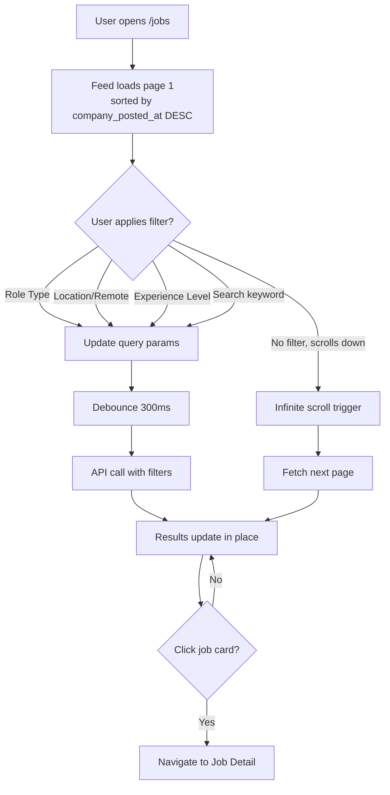

### Cross-References
- F-JOBS-01 (Job Listings Feed), F-JOBS-02 (Filters & Search), F-JOBS-03 (Job Detail View) — `03_FEATURES.md`

---

## Flow 7 — Daily Email Digest

**Persona:** Priya · **Features:** F-NOTIF-03

### Narrative

For users who set email_digest_frequency = 'daily', this flow runs automatically every morning, compiling the prior 24 hours of matches into a single, well-formatted email.

```
1. Scheduler fires daily (adjusted for each user's timezone, target 8 AM local)
2. For each user with email_enabled=true AND email_digest='daily':
   a. Query jobs matched to this user in the last 24 hours
   b. Filter out jobs already included in a previous digest
   c. If zero matches → skip silently (no empty email sent)
   d. If matches exist → select top 10 by company_posted_at DESC
   e. Render HTML email template with job cards
   f. Send via email service (SendGrid/Resend)
   g. Log to notification_logs
3. User receives email, opens at their convenience
4. User clicks "Apply Now" on any job card → opens ATS page directly
5. User clicks "View all matches" → opens web app jobs feed
```

### Diagram

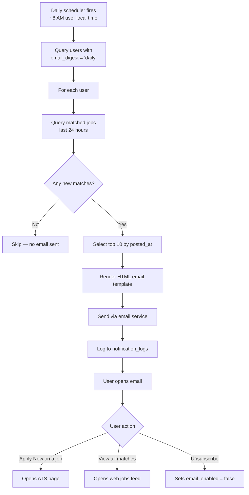

### Cross-References
- F-NOTIF-03 (Daily Email Digest) — `03_FEATURES.md`

---

## Flow 8 — Saving a Job & Tracking Application Status

**Persona:** Priya, Aarav · **Features:** F-TRACK-01, F-TRACK-02

### Narrative

Students who actively manage their job search (Priya especially) need a lightweight pipeline view. This flow covers the full lifecycle from discovering a job to recording its final outcome.

```
1. User saves a job from:
   a. Job card / detail page on web ("Save" button), OR
   b. Telegram inline button ("Save 📌")
2. Job appears in /my-jobs under "Saved" tab
3. User applies externally (outside the platform)
4. User returns to /my-jobs, finds the job, updates status to "Applied"
5. Time passes. Company responds (or doesn't).
6. User updates status again:
   - "Interviewing" if invited to interview
   - "Offer" if offer extended
   - "Rejected" if declined
7. User can add free-text notes at any status (e.g., "Recruiter said
   they'll respond by Friday")
8. Stats summary at top of /my-jobs updates in real time
   (e.g., "12 saved · 8 applied · 2 interviewing · 1 offer · 5 rejected")
```

### Diagram

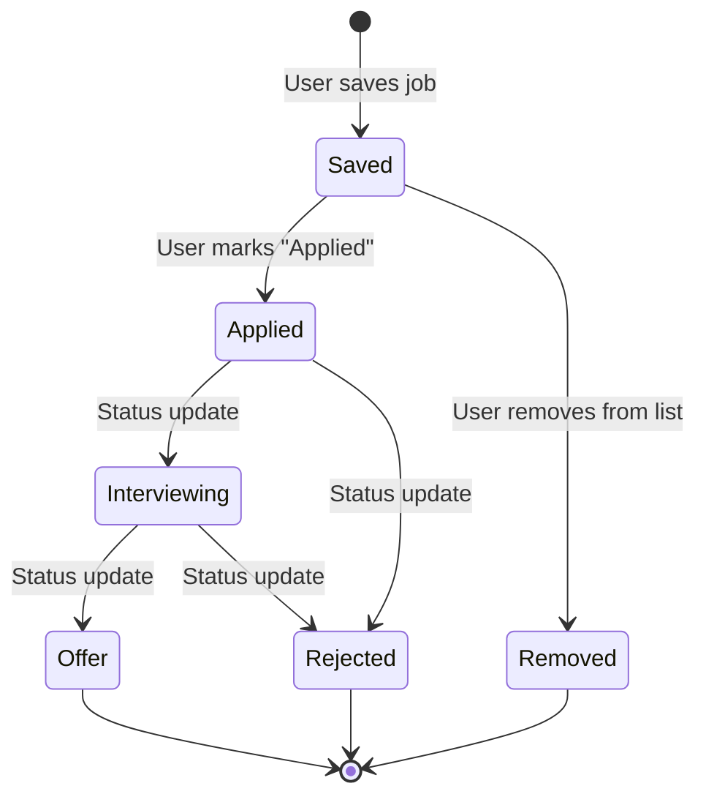

### Sequence Diagram (Save Action)

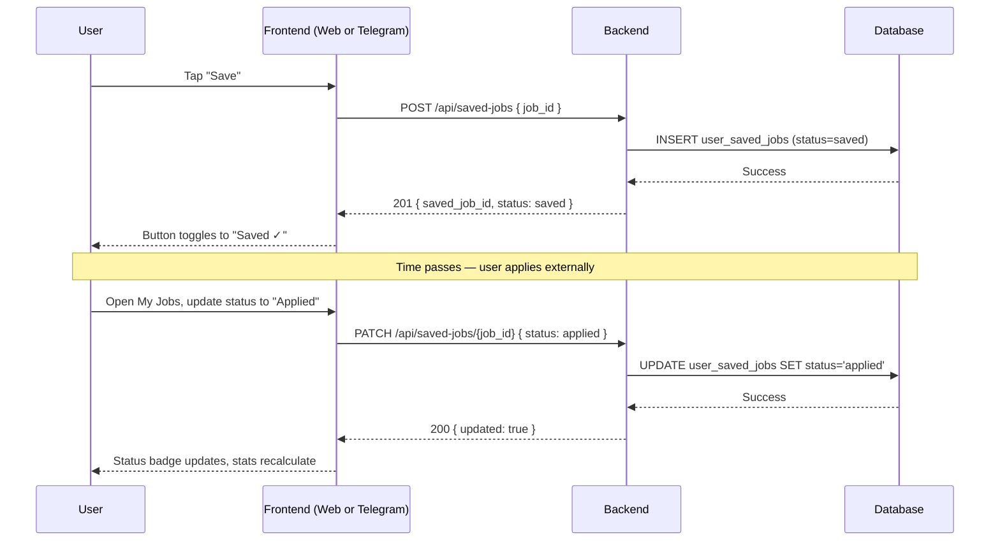

### Cross-References
- F-TRACK-01 (Save Job), F-TRACK-02 (Application Status Tracker) — `03_FEATURES.md`

---

## Flow 9 — Closing-Soon Deadline Reminder

**Persona:** Aarav, Priya · **Features:** F-TRACK-03

### Narrative

A safety net for students who save jobs but get busy and forget about approaching deadlines. Runs daily, scans all saved-but-not-yet-applied jobs.

```
1. Daily scheduler fires at 9 AM
2. Query user_saved_jobs WHERE status='saved'
   AND job.deadline <= now + 48 hours
   AND reminder_sent_at IS NULL
3. For each matching saved job:
   a. Send reminder via user's preferred channel (Telegram/email)
   b. Set reminder_sent_at = now (prevents duplicate reminders)
4. User receives: "⏰ Closing Soon — {Job Title} closes in {N} hours"
5. User taps "Apply Now" / "Mark Applied" / "Remove from Saved"
```

### Diagram

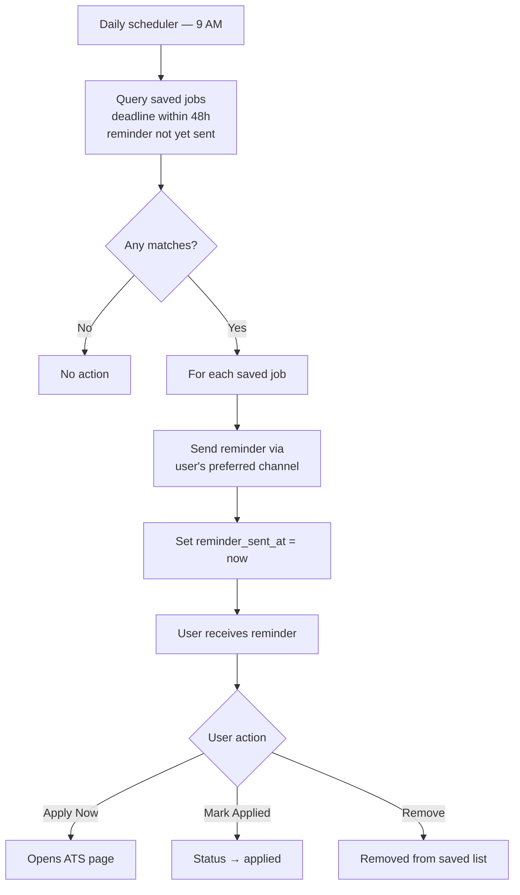

### Cross-References
- F-TRACK-03 (Closing Soon Reminder) — `03_FEATURES.md`

---

## Flow 10 — Resume Upload & AI Skill Extraction

**Persona:** Rahul, Priya · **Features:** F-PROF-04

### Narrative

An optional, lower-friction path to populating the skills profile. Particularly valuable for users who find the manual skill selector tedious or who want the platform to "figure it out" from an existing document.

```
1. User navigates to Profile → Resume → "Upload Resume"
2. File picker opens — client validates: PDF only, max 5MB
3. File uploaded via signed URL directly to object storage
4. Backend records resume_url, sets extraction_status = 'pending'
5. Resume Skill Extractor agent triggered asynchronously
6. Agent reads PDF text, extracts skill mentions
7. Agent maps extracted terms to canonical skills table
8. extraction_status updated to 'done'
9. Frontend polls status, shows "We found these skills" review screen
10. User reviews extracted skills:
    - Confirms all → merged into user_skills
    - Edits (removes incorrect, adds missing) → edited set saved
11. Profile updated; user can continue to other settings
```

### Diagram

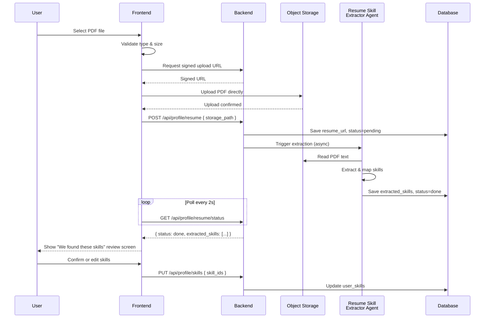

### Cross-References
- F-PROF-04 (Resume Upload & AI Skill Extraction) — `03_FEATURES.md`

---

## Flow 11 — Notification Preferences & Quiet Hours Setup

**Persona:** Sneha, Priya · **Features:** F-PROF-03

### Narrative

Configuring how and when notifications arrive — essential for users who want precision over volume (Sneha) or who want to batch their job search into specific windows (Priya).

```
1. User navigates to Settings → Notifications
2. Toggles: Telegram enabled / Email enabled (independently)
3. Sets Telegram frequency: "All matches" or "Exact matches only"
4. Sets email digest frequency: Daily / Weekly / Off
5. Enables quiet hours toggle
6. Sets quiet_start, quiet_end, and applicable days (e.g., weekdays only)
7. Sets timezone (defaults to Asia/Kolkata)
8. Saves — preferences take effect on next matching run (within 15 min)
```

### Diagram

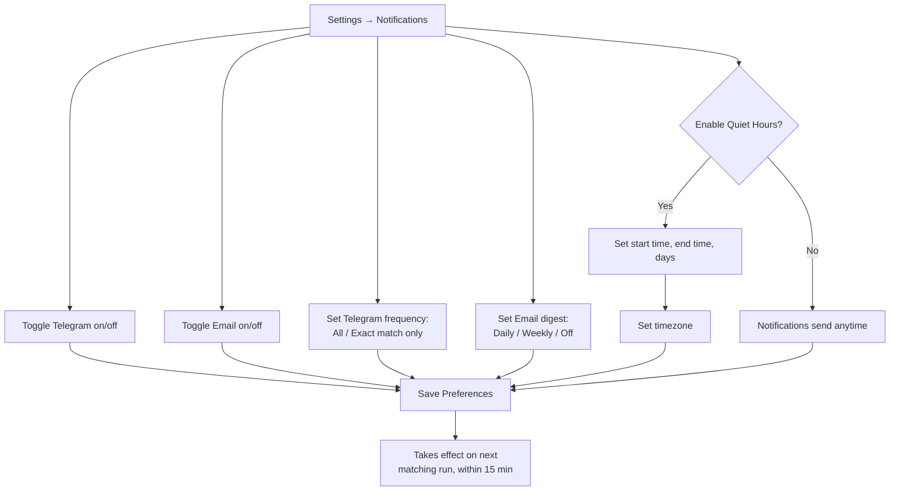

### Cross-References
- F-PROF-03 (Notification Preferences & Quiet Hours) — `03_FEATURES.md`

---

## Flow 12 — Password Reset

**Persona:** All · **Features:** F-AUTH-04

### Narrative

A standard, security-conscious password recovery flow for users who registered with email/password (not applicable to Google OAuth users).

```
1. User clicks "Forgot password?" on /login
2. Enters email on /forgot-password
3. Backend looks up email — regardless of found/not found,
   returns the same generic success message (prevents email enumeration)
4. If account exists: reset token generated (1-hour expiry), email sent
5. User clicks link in email → /reset-password?token={uuid}
6. User enters new password + confirmation
7. Backend validates token (exists, not expired, not used)
8. Password updated, token deleted, all refresh tokens revoked
9. User redirected to /login with success message
10. User logs in with new password
```

### Diagram

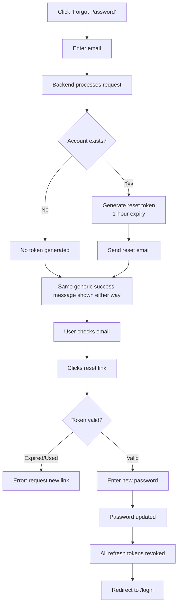

### Cross-References
- F-AUTH-04 (Password Reset) — `03_FEATURES.md`

---

## Flow 13 — Account Deletion

**Persona:** All · **Features:** F-AUTH-05

### Narrative

A GDPR-aligned, user-controlled deletion flow with a safety grace period to prevent accidental permanent loss.

```
1. User navigates to Settings → Danger Zone → "Delete Account"
2. Modal appears: explains consequences, requires typing email to confirm
3. User types email, confirms
4. Backend validates email matches authenticated session
5. Account soft-deleted: is_deleted=true, deleted_at=now
6. All active sessions/refresh tokens revoked immediately
7. Confirmation email sent: "Your account will be permanently deleted
   in 30 days. Contact support to cancel."
8. [30 days pass]
9. Scheduled job hard-deletes: user row, profile, saved jobs,
   notification logs (anonymized), resume file from storage
10. Final confirmation email sent
```

### Diagram

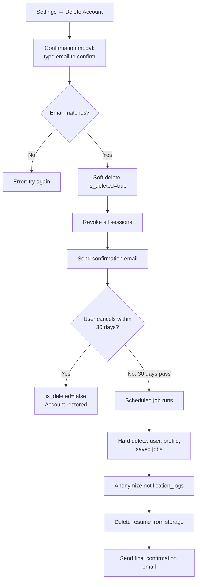

### Cross-References
- F-AUTH-05 (Account Deletion / GDPR) — `03_FEATURES.md`

---

## Flow 14 — Admin: Adding a New Company to Scrape

**Persona:** Karan · **Features:** F-ADMN-02

### Narrative

Karan's most frequent admin action. This flow must be fast and require zero engineering involvement, since he adds 5–10 companies per week.

```
1. Admin logs in → /admin/companies
2. Clicks "Add Company"
3. Fills form: company name, career page URL, ATS type
   (dropdown defaults to "Auto-detect")
4. Submits form
5. Backend runs ATS Auto-Detector against the provided URL
6. Result displayed: "Detected: Greenhouse" (or "Could not detect —
   please select manually")
7. Admin confirms
8. Company record saved: active=true, added_by_admin_id=Karan's ID
9. First scrape automatically queued — runs within 5 minutes
10. Admin checks Scraper Health dashboard to confirm successful first run
```

### Diagram

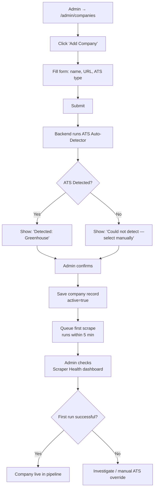

### Cross-References
- F-ADMN-02 (Company Management) — `03_FEATURES.md`

---

## Flow 15 — Admin: Scraper Failure Detection & Alert

**Persona:** Karan · **Features:** F-SCRP-04, F-ADMN-01, F-ADMN-05

### Narrative

This flow demonstrates the platform's commitment to "no silent failures." It runs automatically and proactively reaches Karan before he would otherwise discover the problem.

```
1. Scrape run for "Freshworks" fails (3rd consecutive failure)
2. System checks: were the last 3 runs all failed? → Yes
3. System checks: has an alert already been sent today for this
   company? → No
4. Admin Telegram alert sent immediately:
   "⚠️ SCRAPER FAILURE ALERT — Freshworks — 3 consecutive failures —
   Last error: Job listing container not found"
5. Karan receives alert on his phone within seconds
6. Karan opens admin dashboard → Scraper Health
7. Sees "Freshworks" marked ❌ Failed
8. Clicks "View Errors" → sees last 10 scrape_run records with
   human-readable error messages
9. Karan messages the engineering team with the company name and error
10. Engineer investigates — likely a page layout change — and either
    patches the adapter or flags the company for manual review
11. Once fixed, Karan triggers "Run Now" to verify the fix
12. Scraper Health updates to ✅ Healthy
```

### Diagram

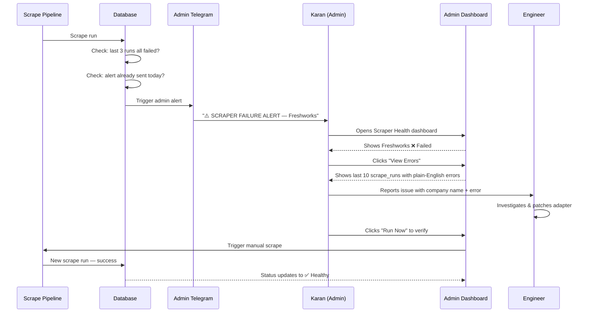

### Cross-References
- F-SCRP-04 (Scrape Run Logging) — `03_FEATURES.md`
- F-ADMN-01 (Scraper Health Dashboard), F-ADMN-05 (Admin Telegram Alerts) — `03_FEATURES.md`

---

## Flow 16 — Admin: Reviewing a Low-Confidence Job

**Persona:** Karan · **Features:** F-ADMN-03

### Narrative

A quality-control checkpoint that prevents bad AI extractions from ever reaching students. Karan reviews this queue daily.

```
1. Job Extractor agent returns extraction_confidence = 0.68 for a job
   (below the 0.75 threshold)
2. Job automatically flagged: enters review queue, is_active = false
   (hidden from students until approved)
3. Karan opens /admin/review-queue
4. Sees job #1 of 8 pending
5. Reviews side-by-side: raw scraper output vs. AI-extracted fields
6. Decision:
   a. Looks correct → clicks "Approve" → extraction_confidence set to
      1.0, is_active = true, job becomes visible to students
   b. Minor error (e.g., wrong location) → clicks "Edit & Approve",
      corrects the field, saves → job becomes visible
   c. Completely wrong / garbage data → clicks "Reject" →
      is_active stays false permanently, job never reaches students
7. Queue advances to next pending job
8. Repeats until queue is cleared
```

### Diagram

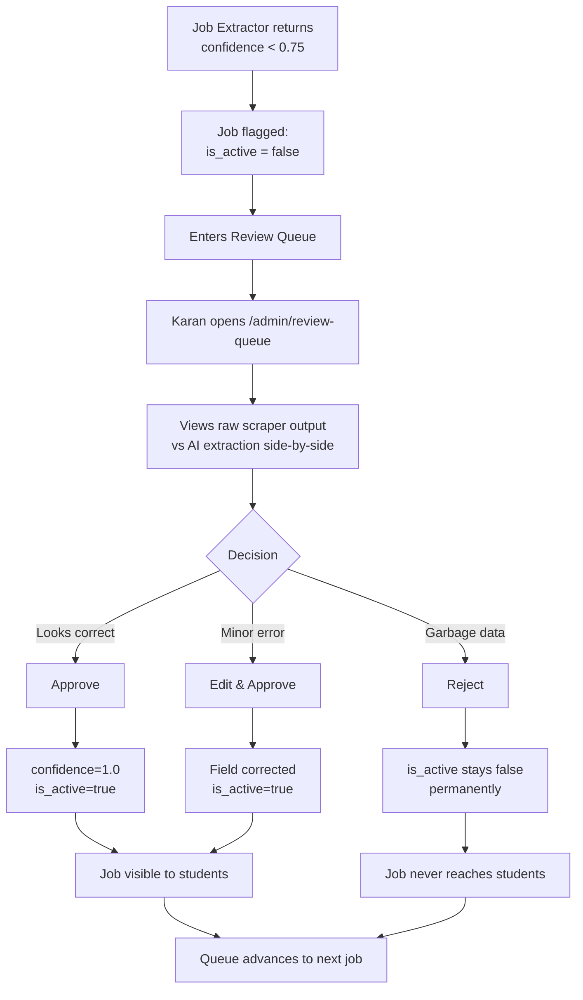

### Cross-References
- F-ADMN-03 (Low-Confidence Job Review Queue) — `03_FEATURES.md`

---

## Flow 17 — Admin: Suspending a User Account

**Persona:** Karan · **Features:** F-ADMN-04

### Narrative

Used rarely, but critical when needed — e.g., abuse, spam registration, or a user request requiring immediate access revocation distinct from full deletion.

```
1. Karan navigates to /admin/users
2. Searches for the user by name or email
3. Opens user detail view — sees profile, activity, notification history
4. Clicks "Suspend"
5. Confirmation prompt: "Suspend {user}'s account?"
6. Confirms
7. Backend sets user.is_active = false
8. All active refresh tokens for that user revoked immediately
9. If user attempts to log in: receives 403 "Account suspended —
   contact support" message
10. User no longer receives notifications (excluded from matching queries)
11. Karan can reverse this at any time via "Reactivate"
```

### Diagram

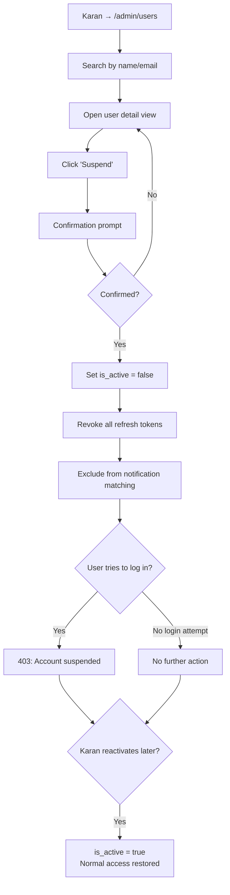

### Cross-References
- F-ADMN-04 (User Management) — `03_FEATURES.md`

---

## Flow Dependency Map

This shows which flows depend on or feed into others — useful for sequencing engineering work.

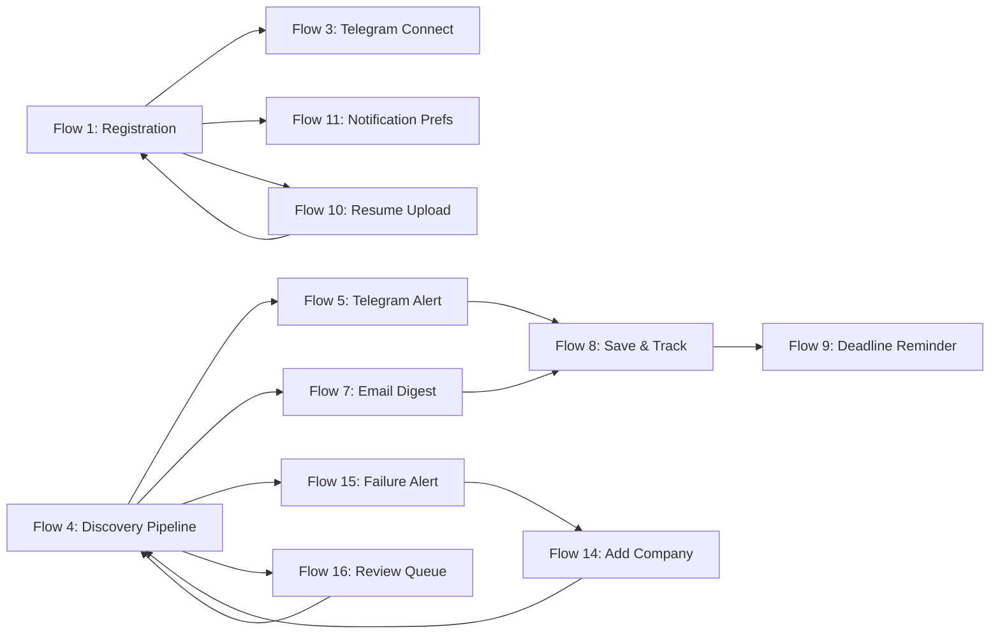

---

*Every flow in this document corresponds to one or more features in `03_FEATURES.md`. If a flow changes — a new step is added, a decision point changes, or a screen is removed — this document must be updated alongside the corresponding feature specs. Flows not documented here should be treated as undefined behavior until added.*