# 05 — Architecture

**Document Version:** 1.0  
**Status:** Active  
**Last Updated:** 2025-06-22  
**Owner:** Engineering Lead  

---

## Purpose of This Document

This document is the canonical technical blueprint for Job Finder AI. It describes how every subsystem is structured, how data flows between them, and why each architectural decision was made. Every engineer — human or AI assistant — must read this document before writing infrastructure-level code. If a proposed change conflicts with this document, the change must be reflected here first, with a corresponding entry in `18_DECISIONS.md`.

---

## Table of Contents

1. [System Overview](#1-system-overview)
2. [Backend Architecture](#2-backend-architecture)
3. [Frontend Architecture](#3-frontend-architecture)
4. [Database Architecture](#4-database-architecture)
5. [Scheduler Architecture](#5-scheduler-architecture)
6. [AI Agent Architecture](#6-ai-agent-architecture)
7. [Notification Service Architecture](#7-notification-service-architecture)
8. [Queue Architecture](#8-queue-architecture)
9. [Redis Architecture](#9-redis-architecture)
10. [Deployment Architecture](#10-deployment-architecture)
11. [Observability & Monitoring](#11-observability--monitoring)
12. [Scalability Plan](#12-scalability-plan)

---

## 1. System Overview

Job Finder AI is composed of six cooperating subsystems: a request-response **API layer**, a continuously running **background pipeline** (scraper + AI agents), a **notification engine**, a **data layer** (PostgreSQL + Redis + object storage), a **frontend client**, and an **admin control plane**. The system is designed so the background pipeline can run entirely unattended — the API and frontend exist primarily to let humans observe, configure, and consume what the pipeline produces.

### 1.1 System Context Diagram

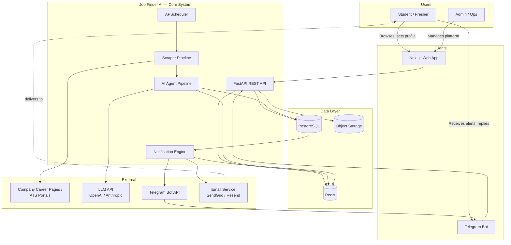

### 1.2 Architectural Principles

| Principle | What It Means in Practice |
|---|---|
| **Pipeline-first** | The scraper + agent pipeline is the core asset. API and frontend are consumers of its output, not the other way around. |
| **Stateless services** | API servers and scraper workers hold no in-memory state between requests — all state lives in PostgreSQL or Redis, enabling horizontal scaling. |
| **Detection over assumption** | Scrapers detect ATS type dynamically rather than hardcoding per-company logic, so the system survives layout drift. |
| **No silent failures** | Every stage of the pipeline writes a log record. Failures are visible in the admin dashboard and trigger alerts — never swallowed. |
| **Structured AI output only** | Every LLM call must produce parseable JSON against a defined schema. Free-text LLM output is never stored directly in the database. |
| **Single source of truth per concern** | PostgreSQL owns durable state. Redis owns ephemeral/fast-access state (cache, queues, rate limits). Object storage owns binary files. No overlap. |

---

## 2. Backend Architecture

The backend is a single FastAPI application, organized by domain rather than by technical layer at the top level, with a clean separation between routing, business logic, and data access within each domain.

### 2.1 Layered Structure

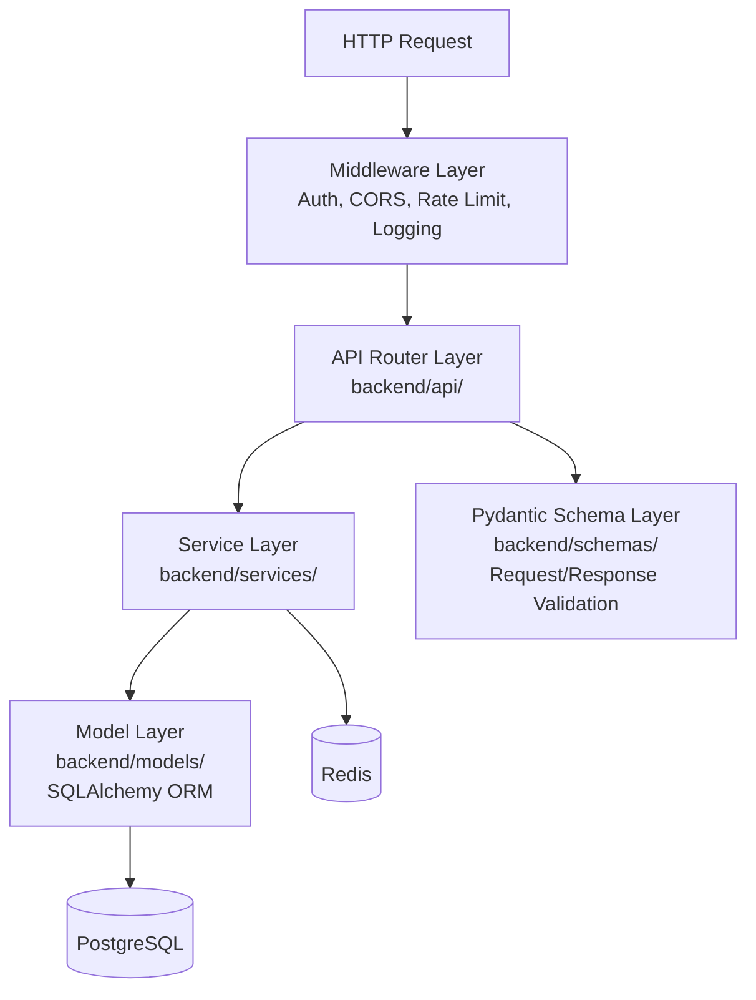

**Rule:** Routers never call the database directly. Routers call services. Services call models. This separation is enforced in code review — a router importing `sqlalchemy` directly is a violation.

### 2.2 Directory Structure

```
backend/
├── main.py                     # FastAPI app entrypoint, middleware registration
├── config.py                   # Settings loaded from environment variables
│
├── api/                        # Route handlers — one router per domain
│   ├── auth.py                 # /api/auth/*
│   ├── profile.py               # /api/profile/*
│   ├── jobs.py                  # /api/jobs/*
│   ├── saved_jobs.py            # /api/saved-jobs/*
│   ├── notifications.py         # /api/notifications/*
│   ├── admin/
│   │   ├── companies.py         # /api/admin/companies/*
│   │   ├── scraper_health.py    # /api/admin/scraper-health
│   │   ├── review_queue.py      # /api/admin/review-queue/*
│   │   └── users.py             # /api/admin/users/*
│   └── webhooks/
│       └── telegram.py          # Telegram webhook receiver
│
├── services/                   # Business logic — no HTTP, no SQL specifics
│   ├── auth_service.py
│   ├── profile_service.py
│   ├── job_service.py
│   ├── matching_service.py       # Core: finds users matching a given job
│   ├── notification_service.py
│   └── admin_service.py
│
├── models/                     # SQLAlchemy ORM models — one file per table
│   ├── user.py
│   ├── profile.py
│   ├── job.py
│   ├── company.py
│   ├── scrape_run.py
│   ├── notification_log.py
│   ├── user_saved_job.py
│   └── agent_log.py
│
├── schemas/                    # Pydantic request/response models
│   ├── auth_schemas.py
│   ├── job_schemas.py
│   └── ...
│
├── middleware/
│   ├── auth_middleware.py       # JWT validation, role checks
│   ├── rate_limit_middleware.py
│   └── logging_middleware.py    # Structured request logging
│
└── core/
    ├── security.py               # Password hashing, JWT encode/decode
    ├── database.py               # SQLAlchemy session management
    └── redis_client.py           # Redis connection pool
```

### 2.3 Request Lifecycle Example

A concrete walkthrough for `GET /api/jobs`:

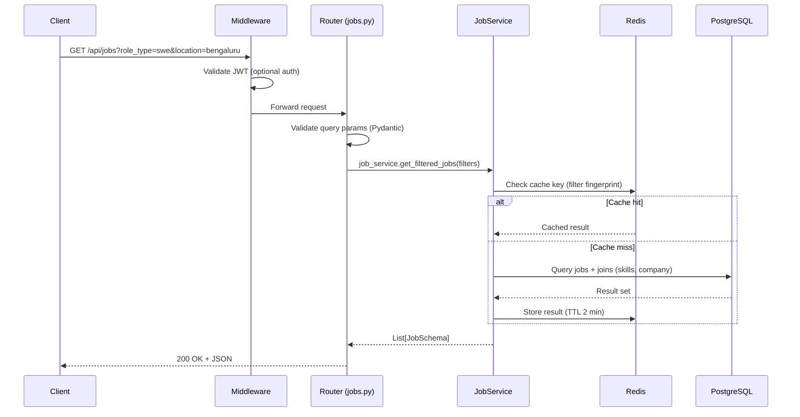

### 2.4 Backend Technology Choices

| Component | Choice | Rationale |
|---|---|---|
| Web framework | FastAPI | Async-native, automatic OpenAPI docs, Pydantic integration, strong typing |
| ORM | SQLAlchemy 2.0 (async) | Mature, explicit, works well with Alembic migrations |
| Validation | Pydantic v2 | Already integrated with FastAPI; fast validation |
| Server | Uvicorn (2+ workers) | ASGI server, production-ready with Gunicorn process manager |
| Task scheduling | APScheduler | Python-native; no separate infrastructure needed for MVP scale |
| Background jobs | Redis + custom worker loop | Avoids Celery's operational complexity at MVP scale; revisit at Phase 3 |

---

## 3. Frontend Architecture

The frontend is a Next.js (App Router) application using TypeScript and Tailwind CSS, serving both the student-facing jobs platform and the admin dashboard from a single codebase with route-based access control.

### 3.1 Directory Structure

```
frontend/
├── app/
│   ├── (auth)/
│   │   ├── login/page.tsx
│   │   ├── register/page.tsx
│   │   └── verify-email/page.tsx
│   ├── (onboarding)/
│   │   └── onboarding/[step]/page.tsx
│   ├── (dashboard)/
│   │   ├── jobs/page.tsx              # Main jobs feed
│   │   ├── jobs/[id]/page.tsx         # Job detail
│   │   ├── my-jobs/page.tsx           # Saved/tracked jobs
│   │   └── settings/page.tsx          # Profile & notification settings
│   ├── (admin)/
│   │   ├── admin/companies/page.tsx
│   │   ├── admin/scraper-health/page.tsx
│   │   ├── admin/review-queue/page.tsx
│   │   └── admin/users/page.tsx
│   ├── layout.tsx                      # Root layout
│   └── globals.css
│
├── components/
│   ├── ui/                             # shadcn/ui primitives
│   ├── jobs/
│   │   ├── JobCard.tsx
│   │   ├── JobDetail.tsx
│   │   ├── FilterBar.tsx
│   │   └── SkillMatchChips.tsx
│   ├── profile/
│   │   ├── SkillPicker.tsx
│   │   └── OnboardingSteps.tsx
│   ├── admin/
│   │   ├── ScraperHealthTable.tsx
│   │   ├── ReviewQueueCard.tsx
│   │   └── CompanyForm.tsx
│   └── shared/
│       ├── Navbar.tsx
│       └── LoadingState.tsx
│
├── lib/
│   ├── api.ts                          # Axios instance + React Query hooks
│   ├── auth.ts                         # NextAuth configuration
│   └── utils.ts
│
├── hooks/
│   ├── useJobs.ts
│   ├── useProfile.ts
│   └── useAdminHealth.ts
│
└── types/
    └── index.ts                        # Shared TypeScript types, mirrors backend schemas
```

### 3.2 Frontend Data Flow

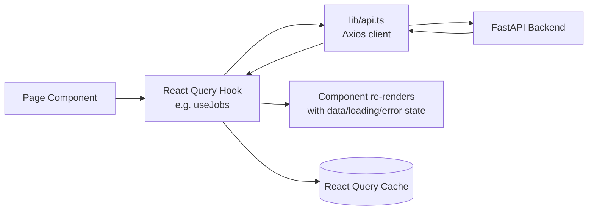

### 3.3 Key Frontend Decisions

| Decision | Choice | Rationale |
|---|---|---|
| Framework | Next.js (App Router) | SSR for SEO on public job listing pages; file-based routing |
| Styling | Tailwind CSS | Rapid iteration, design-token-friendly, no separate CSS files to maintain |
| Component library | shadcn/ui | Accessible primitives, fully customizable, no runtime CSS-in-JS overhead |
| Data fetching | React Query (TanStack Query) | Built-in caching, refetching, and loading states; avoids manual useEffect fetch logic |
| Auth | NextAuth.js (Google provider) + custom JWT handling for email/password | Handles OAuth complexity; integrates cleanly with FastAPI backend |
| State management | React Query + local component state | No global state library needed at this scale; avoids Redux overhead |

---

## 4. Database Architecture

PostgreSQL is the single source of truth for all durable data. Full table-by-table schema definitions live in `07_DATABASE.md` — this section covers the relational structure and the rationale behind it.

### 4.1 Entity Relationship Overview

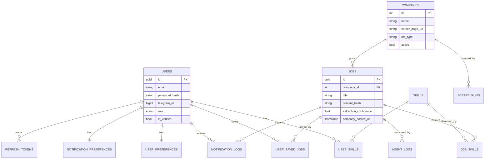

### 4.2 Why PostgreSQL Over MongoDB

This decision is recorded in full in `18_DECISIONS.md`, summarized here:

| Factor | PostgreSQL | MongoDB |
|---|---|---|
| Relational integrity (users ↔ jobs ↔ skills) | Native foreign keys | Manual application-level enforcement |
| Semi-structured data (raw scraped JD) | JSONB columns — best of both worlds | Native, but loses relational benefits elsewhere |
| Full-text search | Built-in `tsvector` — sufficient for MVP scale | Requires separate text index config |
| Query complexity (multi-table joins for matching) | Strong | Weaker, requires aggregation pipelines |
| Operational maturity for a small team | Extremely mature tooling (Alembic, pgAdmin) | Also mature, but adds a second paradigm to learn |

**Decision:** PostgreSQL as the sole primary datastore. Raw scraped HTML/JSON is stored in JSONB columns where needed rather than introducing a second database technology.

### 4.3 Indexing Strategy (Summary)

| Table | Key Indexes | Reason |
|---|---|---|
| `jobs` | `content_hash` (unique), `company_posted_at` (desc), `is_active`, GIN on `search_vector` | Deduplication, feed sorting, filtering, full-text search |
| `scrape_runs` | `company_id`, `started_at` (desc), `status` | Admin health dashboard queries |
| `notification_logs` | `user_id`, `sent_at` (desc), unique `(user_id, job_id, channel)` | Delivery history, duplicate prevention |
| `user_skills` | `user_id` | Fast profile reads for matching |

Full index definitions are in `07_DATABASE.md`.

---

## 5. Scheduler Architecture

APScheduler runs inside the backend process (or a dedicated worker process in production) and is the heartbeat of the entire pipeline.

### 5.1 Scheduled Jobs

```mermaid
gantt
    dateFormat HH:mm
    axisFormat %H:%M
    title Daily Scheduler Timeline (illustrative)
    section Continuous
    Scrape Batch (every 15 min) : 00:00, 15m
    section Daily
    Daily Email Digest (8 AM IST) : 08:00, 30m
    Deadline Reminder Scan (9 AM IST) : 09:00, 15m
    section Weekly
    Weekly Summary Email (Mon 8 AM) : 08:00, 30m
```

### 5.2 Scheduler Module Structure

```
scheduler/
├── main.py                     # APScheduler instance, job registration, startup
└── jobs/
    ├── scrape_batch.py         # Runs every 15 min — see Flow 4 in 04_USER_FLOWS.md
    ├── daily_digest.py         # Runs daily ~8 AM per user timezone
    ├── deadline_reminder.py    # Runs daily at 9 AM
    └── weekly_summary.py       # Runs Monday 8 AM (Phase 2)
```

### 5.3 Concurrency & Failure Handling

| Concern | Handling |
|---|---|
| Overlapping runs of the same job | APScheduler's `max_instances=1` per job prevents concurrent execution |
| Scheduler process crash | On restart, APScheduler resumes its schedule; missed runs are not retroactively executed for MVP (acceptable — next 15-min cycle catches up) |
| Long-running scrape batch exceeding interval | Batch size (default 20 companies) is tuned so a run completes well within 15 minutes; monitored via `scrape_runs.duration_seconds` |
| Timezone-aware daily jobs | Each user's preferred send time is computed by converting their stored `timezone` field against the job's trigger time |

---

## 6. AI Agent Architecture

Each agent is a small, single-responsibility class implementing a shared `BaseAgent` interface. Agents never call each other directly — they are orchestrated sequentially by the scraper pipeline runner.

### 6.1 Agent Pipeline Sequence

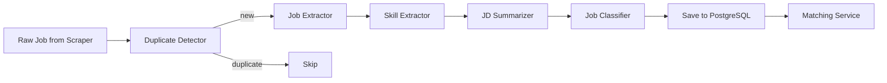

### 6.2 BaseAgent Interface

```python
# agents/base_agent.py
class BaseAgent(ABC):
    agent_name: str
    prompt_version: str
    model: str

    @abstractmethod
    def build_prompt(self, input_data: dict) -> str:
        """Constructs the prompt from docs/20_PROMPTS.md template."""

    @abstractmethod
    def parse_output(self, raw_response: str) -> dict:
        """Parses and validates LLM JSON output against expected schema."""

    def run(self, input_data: dict) -> AgentResult:
        prompt = self.build_prompt(input_data)
        cache_key = hash_input(prompt)
        if cached := redis_cache.get(cache_key):
            return cached
        response = call_llm(self.model, prompt)
        try:
            parsed = self.parse_output(response)
        except ParseError:
            response = call_llm(self.model, prompt + REPAIR_INSTRUCTION)
            parsed = self.parse_output(response)  # second attempt; raises on failure
        log_agent_call(self.agent_name, self.prompt_version, parsed, status="success")
        redis_cache.set(cache_key, parsed, ttl=86400)
        return parsed
```

### 6.3 Why This Pattern

| Design Choice | Reason |
|---|---|
| One class per agent, shared base interface | Consistent retry, logging, and caching behavior without duplicating logic |
| Prompts loaded from `docs/20_PROMPTS.md`, never hardcoded | Enables prompt iteration without code deploys; full audit trail of prompt versions |
| Cache by hash of input | Identical job descriptions (common with reposted roles) skip redundant LLM calls, controlling cost |
| Sequential, not parallel, agent execution per job | Each agent's output can inform the next (e.g., classifier uses extracted skills); simpler to reason about and debug |
| Model selection per agent, not platform-wide | Classifier and Duplicate Detector use cheaper models; Extractor and Summarizer use stronger models where nuance matters |

### 6.4 Agent-to-Model Mapping

| Agent | Model Tier | Reasoning |
|---|---|---|
| Duplicate Detector | No LLM (hash-based) | Deterministic logic; no AI needed |
| Job Extractor | Strong model (GPT-4o / Claude Sonnet) | Highest-stakes extraction; errors cascade downstream |
| Skill Extractor | Strong model | Skill nuance and the `degree_required` signal need careful reading |
| JD Summarizer | Strong model | User-facing quality directly affects trust |
| Job Classifier | Cheaper model (GPT-4o-mini) | Classification is a simpler, more bounded task |

---

## 7. Notification Service Architecture

### 7.1 Component Structure

```
notifications/
├── telegram/
│   ├── bot.py                  # python-telegram-bot setup, webhook handler
│   ├── dispatcher.py           # Sends formatted messages to telegram_id
│   └── templates.py            # Message string templates
├── email/
│   ├── client.py                # SendGrid/Resend API wrapper
│   ├── digest.py                 # Compiles daily digest content per user
│   └── templates/                # Jinja2 HTML templates
└── router.py                    # Decides channel(s) per user per job, respects quiet hours
```

### 7.2 Notification Dispatch Flow

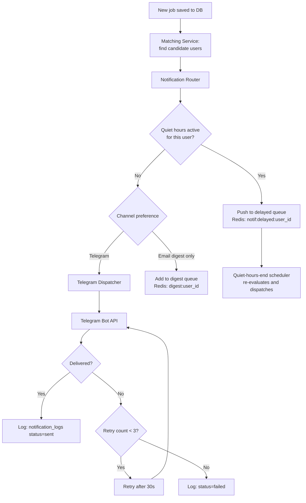

### 7.3 Why a Router Layer

The `router.py` module exists as a single decision point so that channel selection logic (Telegram vs. email, instant vs. digest, quiet hours) is never duplicated across the scraper pipeline and the daily digest job. Both call into the same router.

---

## 8. Queue Architecture

Redis-backed queues coordinate work between the scraper pipeline and the notification engine without requiring a heavier message broker at MVP scale.

### 8.1 Queue Inventory

| Queue Key Pattern | Purpose | Producer | Consumer |
|---|---|---|---|
| `scrape:queue` | Companies pending scrape in current batch | Scheduler | Scraper workers |
| `agent:queue:{job_id}` | Raw jobs awaiting AI agent processing | Scraper | Agent pipeline runner |
| `notif:instant:{user_id}` | Telegram messages ready for immediate dispatch | Matching Service | Telegram Dispatcher |
| `notif:delayed:{user_id}` | Notifications held during quiet hours | Notification Router | Quiet-hours-end job |
| `digest:{user_id}:{date}` | Jobs accumulated for next daily digest | Matching Service | Daily Digest job |
| `notif:retry` | Failed notifications awaiting retry | Telegram Dispatcher | Retry worker |

### 8.2 Queue Processing Pattern

```python
# Simplified worker loop pattern used across consumers
while True:
    job_id = redis.blpop("agent:queue", timeout=5)
    if job_id:
        try:
            process_job(job_id)
        except Exception as e:
            log_error(e)
            redis.rpush("agent:queue:failed", job_id)
    else:
        continue  # no items, loop again
```

### 8.3 Why Redis Queues Over Celery/RabbitMQ (at MVP Scale)

| Factor | Redis Queues (chosen) | Celery + RabbitMQ |
|---|---|---|
| Operational complexity | Single Redis instance, already required for caching | Additional broker + worker fleet to operate |
| Team size fit | Appropriate for 1–3 engineers | Better suited to larger teams with dedicated DevOps |
| Throughput needs at MVP | Well within Redis list/queue capacity (thousands/sec) | Overkill for current job volume |
| Migration path | Can introduce Celery or a managed queue (SQS) later without touching business logic, since queue access is abstracted behind service functions | — |

This is logged as a formal decision in `18_DECISIONS.md`, with an explicit note to revisit at >10,000 daily active users or >50,000 notifications/day.

---

## 9. Redis Architecture

Redis serves four distinct purposes in this system. Using separate key namespaces keeps these concerns from colliding.

### 9.1 Redis Usage Map

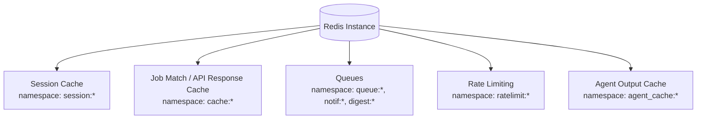

### 9.2 Key Namespace Reference

| Namespace | Example Key | TTL | Purpose |
|---|---|---|---|
| `cache:jobs:*` | `cache:jobs:role=swe&loc=bengaluru&page=0` | 2 min | API response caching for jobs feed |
| `cache:skills_list` | `cache:skills_list` | 1 hour | Canonical skills list (rarely changes) |
| `agent_cache:*` | `agent_cache:{sha256_of_jd_text}` | 24 hours | Avoids redundant LLM calls for identical job descriptions |
| `ratelimit:scrape:{domain}` | `ratelimit:scrape:greenhouse.io` | 60 sec | Per-domain scraper rate limiting |
| `ratelimit:auth:{ip}` | `ratelimit:auth:103.21.4.5` | 60 sec | Auth endpoint abuse prevention |
| `queue:*`, `notif:*`, `digest:*` | (see Section 8.1) | Varies | Work queues |
| `telegram_link_code:{code}` | `telegram_link_code:a1b2c3` | 10 min | Telegram bot account linking |

### 9.3 Persistence Configuration

Redis is configured with RDB snapshotting (not AOF) since all data in Redis is either ephemeral (cache, rate limits) or reproducible/recoverable from PostgreSQL (queue items reference durable record IDs). A Redis restart at worst causes a brief reprocessing of in-flight queue items — it does not cause data loss of durable state.

---

## 10. Deployment Architecture

### 10.1 Production Topology

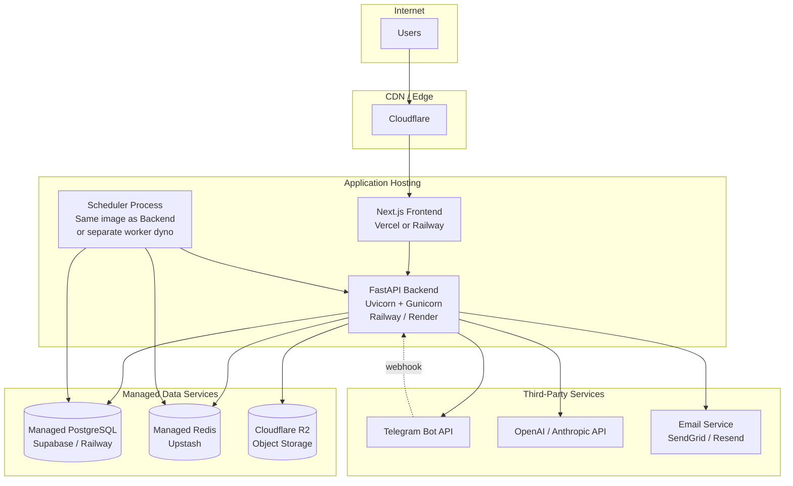

### 10.2 CI/CD Pipeline

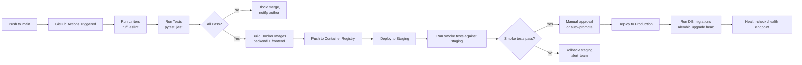

### 10.3 Environment Matrix

| Environment | Purpose | Database | Notes |
|---|---|---|---|
| Local | Individual development | Docker Compose PostgreSQL + Redis | `.env` from `.env.example`, seeded with sample data |
| Staging | Pre-production validation | Separate managed PostgreSQL instance | Mirrors production config; used for smoke tests in CI/CD |
| Production | Live system | Managed PostgreSQL (Supabase/Railway) | Backups enabled, connection pooling via PgBouncer |

### 10.4 Service Responsibilities in Production

| Service | Process | Scaling Approach |
|---|---|---|
| FastAPI Backend | Uvicorn workers behind Gunicorn (2–4 workers to start) | Horizontal — add more container instances behind load balancer |
| Scheduler | Single dedicated process (must not run more than once — would duplicate scrape batches) | Vertical only, or leader-election pattern if scaled later |
| Scraper Workers | Pulled from `scrape:queue`, can run as multiple worker processes | Horizontal — safe to scale since work is queue-driven and idempotent (dedup at DB level) |
| Next.js Frontend | Stateless, served via Vercel/Railway | Horizontal, auto-scales with hosting provider |

---

## 11. Observability & Monitoring

### 11.1 Logging Strategy

All services emit structured JSON logs with a consistent shape:

```json
{
  "timestamp": "2025-06-22T08:30:00Z",
  "level": "INFO",
  "service": "scraper",
  "trace_id": "a1b2c3d4",
  "company_id": 42,
  "message": "Scrape completed",
  "jobs_found": 14,
  "duration_ms": 3200
}
```

### 11.2 Monitoring Surfaces

```mermaid
flowchart LR
    A[Application Logs] --> B[Log Aggregation<br/>e.g. Better Stack / hosted log viewer]
    C[scrape_runs table] --> D[Admin Scraper<br/>Health Dashboard]
    E[agent_logs table] --> F[Admin Agent<br/>Failure View]
    G[notification_logs table] --> H[Admin Notification<br/>Metrics View]
    I[/health endpoint] --> J[Uptime Monitor<br/>UptimeRobot / Better Uptime]
    K[Critical errors] --> L[Admin Telegram<br/>Alert Channel]
```

### 11.3 Alerting Rules

| Condition | Alert Destination | Severity |
|---|---|---|
| Scraper fails 3+ consecutive runs for a company | Admin Telegram | Warning |
| API error rate exceeds 5% over 5 minutes | Admin Telegram + log aggregator | Critical |
| LLM agent parse failure rate exceeds 10% over 1 hour | Admin Telegram | Warning |
| `/health` endpoint fails 3 consecutive checks | Uptime monitor → SMS/Email to engineering | Critical |
| Notification delivery success rate drops below 95% | Admin Telegram | Warning |

---

## 12. Scalability Plan

The architecture is intentionally simple at MVP scale, with explicit, documented upgrade paths for each component as load grows. This section exists so that scaling decisions are made deliberately, not reactively under incident pressure.

### 12.1 Scaling Triggers & Responses

| Component | Current Approach (MVP) | Trigger to Scale | Scaled Approach |
|---|---|---|---|
| FastAPI Backend | 2 Uvicorn workers, single instance | p95 latency > 500ms sustained | Add instances behind load balancer; enable connection pooling tuning |
| PostgreSQL | Single managed instance | Query latency degradation, >70% CPU sustained | Read replicas for jobs feed queries; consider partitioning `notification_logs` by month |
| Redis | Single managed instance | Memory pressure, queue backlog growth | Upgrade instance tier; consider Redis Cluster only if truly necessary |
| Scraper Workers | In-process, queue-driven | Scrape batch duration approaches 15-min interval | Separate worker processes/containers, scale horizontally |
| Notification Dispatch | Synchronous Redis queue consumer | >50,000 notifications/day | Move to Celery + dedicated broker, or managed queue (AWS SQS) |
| AI Agent Calls | Direct LLM API calls with Redis caching | LLM cost exceeds budget, or latency impacts pipeline SLA | Increase cache TTL, batch agent calls, consider self-hosted smaller models for classification |

### 12.2 The 50,000-User Target

The non-functional requirement in `01_PRD.md` (NFR-SCAL-01) states the architecture must support 50,000 users without a structural rewrite. This is achievable under the current design because:

- All API services are stateless and horizontally scalable by adding instances
- PostgreSQL with proper indexing comfortably handles millions of job rows and hundreds of thousands of user rows
- Redis queues decouple the scraper pipeline from the notification engine, so spikes in one don't block the other
- The scraper pipeline's bottleneck is external (ATS rate limits, not our infrastructure) — scaling our side doesn't help past a certain point, so this is a natural ceiling we don't fight against

---

*This document is the canonical technical reference for how Job Finder AI is built. Any architectural change — a new service, a changed data flow, a different scaling approach — must be reflected here and recorded as a decision in `18_DECISIONS.md` before implementation.*