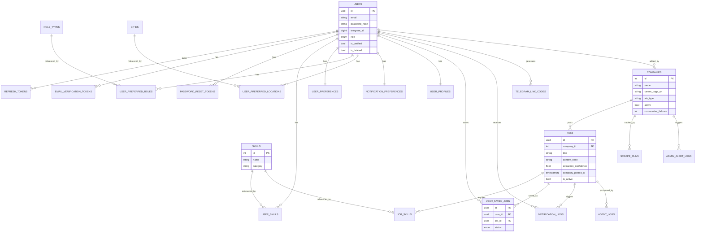

# 07 — Database

**Document Version:** 1.0  
**Status:** Active  
**Last Updated:** 2025-06-22  
**Owner:** Engineering Lead  

---

## Purpose of This Document

This is the canonical database schema reference for Job Finder AI. Every table, column, index, relationship, and constraint used in production is defined here. No table should exist in the database that is not documented here, and no documented table should differ from what's actually deployed. All schema changes go through Alembic migrations and must be reflected in this document in the same pull request.

---

## Table of Contents

1. [Schema Overview & Conventions](#1-schema-overview--conventions)
2. [Users](#2-users)
3. [Refresh Tokens](#3-refresh-tokens)
4. [Email Verification Tokens](#4-email-verification-tokens)
5. [Password Reset Tokens](#5-password-reset-tokens)
6. [Skills](#6-skills)
7. [User Skills](#7-user-skills)
8. [Role Types](#8-role-types)
9. [Cities](#9-cities)
10. [User Preferences](#10-user-preferences)
11. [User Preferred Roles](#11-user-preferred-roles)
12. [User Preferred Locations](#12-user-preferred-locations)
13. [Notification Preferences](#13-notification-preferences)
14. [User Profiles (Resume)](#14-user-profiles-resume)
15. [Companies](#15-companies)
16. [Jobs](#16-jobs)
17. [Job Skills](#17-job-skills)
18. [Scrape Runs](#18-scrape-runs)
19. [Agent Logs](#19-agent-logs)
20. [Notification Logs](#20-notification-logs)
21. [Telegram Link Codes](#21-telegram-link-codes)
22. [User Saved Jobs](#22-user-saved-jobs)
23. [Admin Alert Logs](#23-admin-alert-logs)
24. [Full Entity Relationship Diagram](#24-full-entity-relationship-diagram)
25. [Retention Policy Summary](#25-retention-policy-summary)
26. [Backup Strategy](#26-backup-strategy)
27. [Migration Strategy](#27-migration-strategy)
28. [Common Query Patterns](#28-common-query-patterns)

---

## 1. Schema Overview & Conventions

### 1.1 Naming Conventions

| Convention | Rule |
|---|---|
| Table names | Plural, snake_case (`users`, `scrape_runs`) |
| Column names | snake_case (`created_at`, `telegram_id`) |
| Primary keys | `id` — `UUID` for user-facing entities, `SERIAL`/`INTEGER` for small reference tables |
| Foreign keys | `{singular_table_name}_id` (e.g., `company_id`, `user_id`) |
| Timestamps | `created_at`, `updated_at` on all mutable tables; always `TIMESTAMP WITH TIME ZONE` |
| Booleans | Prefixed with `is_` or written as a clear adjective (`is_active`, `active`) |
| Enums | PostgreSQL native `ENUM` types where the value set is small and stable |

### 1.2 ID Strategy

- **UUID v4** is used for all tables where records are user-facing, referenced externally (e.g., in URLs, API responses), or where merge/distributed-generation matters (`users`, `jobs`, `notification_logs`, `scrape_runs`, `agent_logs`, `user_saved_jobs`).
- **SERIAL (auto-increment integer)** is used for small, internally-managed reference/lookup tables that are never exposed as opaque identifiers in URLs and benefit from simple ordering (`skills`, `role_types`, `cities`, `companies`).

### 1.3 Standard Column Set

Every table includes, at minimum:
```sql
id              UUID/SERIAL PRIMARY KEY
created_at      TIMESTAMPTZ NOT NULL DEFAULT now()
```
Mutable tables additionally include:
```sql
updated_at      TIMESTAMPTZ
```

---

## 2. Users

The core identity table. Every account — student or admin — is a row here.

### Schema

```sql
CREATE TYPE user_role AS ENUM ('student', 'admin');

CREATE TABLE users (
    id                  UUID PRIMARY KEY DEFAULT gen_random_uuid(),
    name                VARCHAR(255) NOT NULL,
    email               VARCHAR(255) NOT NULL UNIQUE,
    password_hash       VARCHAR(255),              -- NULL for Google-only accounts
    google_id           VARCHAR(255) UNIQUE,        -- NULL for email/password-only accounts
    profile_picture_url VARCHAR(500),
    role                user_role NOT NULL DEFAULT 'student',
    is_verified         BOOLEAN NOT NULL DEFAULT false,
    is_active           BOOLEAN NOT NULL DEFAULT true,   -- false = suspended
    is_deleted          BOOLEAN NOT NULL DEFAULT false,  -- soft delete flag
    deleted_at          TIMESTAMPTZ,
    telegram_id         BIGINT UNIQUE,
    telegram_linked_at  TIMESTAMPTZ,
    created_at          TIMESTAMPTZ NOT NULL DEFAULT now(),
    updated_at          TIMESTAMPTZ
);
```

### Indexes

```sql
CREATE UNIQUE INDEX idx_users_email ON users(email);
CREATE UNIQUE INDEX idx_users_telegram_id ON users(telegram_id) WHERE telegram_id IS NOT NULL;
CREATE UNIQUE INDEX idx_users_google_id ON users(google_id) WHERE google_id IS NOT NULL;
CREATE INDEX idx_users_is_deleted ON users(is_deleted) WHERE is_deleted = false;
CREATE INDEX idx_users_role ON users(role);
```

### Relationships
- One-to-many → `refresh_tokens`, `user_skills`, `user_saved_jobs`, `notification_logs`
- One-to-one → `user_preferences`, `notification_preferences`, `user_profiles`

### Constraints
- `email` must be unique across all users, including soft-deleted ones (no re-registration conflict handling needed since hard-delete eventually frees the email — see retention policy)
- `password_hash` and `google_id` cannot both be NULL (enforced at application layer: a user must have at least one auth method)
- `telegram_id` must be unique — one Telegram account per platform account

### Sample Queries

```sql
-- Find user by email for login
SELECT * FROM users WHERE email = $1 AND is_deleted = false;

-- Check if a Telegram ID is already linked to a different account
SELECT id FROM users WHERE telegram_id = $1;
```

### Retention
- Soft-deleted users (`is_deleted = true`) are hard-deleted 30 days after `deleted_at`, per F-AUTH-05 in `03_FEATURES.md`.

---

## 3. Refresh Tokens

Supports JWT session management (F-AUTH-03). One row per active session per user.

### Schema

```sql
CREATE TABLE refresh_tokens (
    id          UUID PRIMARY KEY DEFAULT gen_random_uuid(),
    user_id     UUID NOT NULL REFERENCES users(id) ON DELETE CASCADE,
    token_hash  VARCHAR(255) NOT NULL,   -- bcrypt hash of the token, never plaintext
    expires_at  TIMESTAMPTZ NOT NULL,
    revoked_at  TIMESTAMPTZ,
    created_at  TIMESTAMPTZ NOT NULL DEFAULT now()
);
```

### Indexes
```sql
CREATE INDEX idx_refresh_tokens_user_id ON refresh_tokens(user_id);
CREATE INDEX idx_refresh_tokens_expires_at ON refresh_tokens(expires_at);
```

### Relationships
- Many-to-one → `users`

### Retention
- Expired tokens (`expires_at < now()`) are purged nightly via a cleanup job.
- All tokens for a user are deleted/revoked immediately on logout, password reset, or account suspension.

---

## 4. Email Verification Tokens

Supports F-AUTH-01 (email registration verification).

### Schema

```sql
CREATE TABLE email_verification_tokens (
    id          UUID PRIMARY KEY DEFAULT gen_random_uuid(),
    user_id     UUID NOT NULL REFERENCES users(id) ON DELETE CASCADE,
    token       UUID NOT NULL DEFAULT gen_random_uuid(),
    expires_at  TIMESTAMPTZ NOT NULL,    -- created_at + 24 hours
    used_at     TIMESTAMPTZ,
    created_at  TIMESTAMPTZ NOT NULL DEFAULT now()
);
```

### Indexes
```sql
CREATE UNIQUE INDEX idx_email_verif_token ON email_verification_tokens(token);
CREATE INDEX idx_email_verif_user_id ON email_verification_tokens(user_id);
```

### Retention
- Purged nightly where `expires_at < now()` or `used_at IS NOT NULL` and older than 7 days (short grace window for support debugging).

---

## 5. Password Reset Tokens

Supports F-AUTH-04 (password reset flow).

### Schema

```sql
CREATE TABLE password_reset_tokens (
    id          UUID PRIMARY KEY DEFAULT gen_random_uuid(),
    user_id     UUID NOT NULL REFERENCES users(id) ON DELETE CASCADE,
    token_hash  VARCHAR(255) NOT NULL,   -- hashed, not stored plaintext
    expires_at  TIMESTAMPTZ NOT NULL,    -- created_at + 1 hour
    used_at     TIMESTAMPTZ,
    created_at  TIMESTAMPTZ NOT NULL DEFAULT now()
);
```

### Indexes
```sql
CREATE INDEX idx_pw_reset_user_id ON password_reset_tokens(user_id);
```

### Retention
- Purged nightly where `expires_at < now()`.
- Only the most recently created unexpired token is valid per user; older ones are invalidated on creation of a new request (application-layer enforcement).

---

## 6. Skills

The canonical, admin-managed list of skills used for both user profiles and job requirements. Supports F-PROF-01 and F-AGNT-03.

### Schema

```sql
CREATE TABLE skills (
    id          SERIAL PRIMARY KEY,
    name        VARCHAR(100) NOT NULL UNIQUE,
    slug        VARCHAR(100) NOT NULL UNIQUE,
    category    VARCHAR(50) NOT NULL,   -- 'language', 'framework', 'database', 'cloud', 'tool', 'domain'
    created_at  TIMESTAMPTZ NOT NULL DEFAULT now()
);
```

### Indexes
```sql
CREATE UNIQUE INDEX idx_skills_slug ON skills(slug);
CREATE INDEX idx_skills_category ON skills(category);
CREATE INDEX idx_skills_name_search ON skills USING GIN(to_tsvector('simple', name));
```

### Seed Data
Seeded at setup from `database/seeds/skills.json`. New skills are added by admin only (no user-submitted skills, to prevent spam/duplication per F-PROF-01 edge cases).

### Relationships
- One-to-many → `user_skills`, `job_skills`

---

## 7. User Skills

Many-to-many join table linking users to their declared skills. Supports F-PROF-01.

### Schema

```sql
CREATE TABLE user_skills (
    id          UUID PRIMARY KEY DEFAULT gen_random_uuid(),
    user_id     UUID NOT NULL REFERENCES users(id) ON DELETE CASCADE,
    skill_id    INTEGER NOT NULL REFERENCES skills(id) ON DELETE CASCADE,
    created_at  TIMESTAMPTZ NOT NULL DEFAULT now(),

    UNIQUE(user_id, skill_id)
);
```

### Indexes
```sql
CREATE INDEX idx_user_skills_user_id ON user_skills(user_id);
CREATE INDEX idx_user_skills_skill_id ON user_skills(skill_id);
```

### Relationships
- Many-to-one → `users`, `skills`

### Notes
- This table is fully replaced (delete-then-insert, or diffed upsert) on every profile skill update, not appended to — per F-PROF-01 workflow in `03_FEATURES.md`.

---

## 8. Role Types

Canonical list of job role categories. Supports F-PROF-02 and F-AGNT-05 (Job Classifier taxonomy).

### Schema

```sql
CREATE TABLE role_types (
    id    SERIAL PRIMARY KEY,
    name  VARCHAR(100) NOT NULL UNIQUE,
    slug  VARCHAR(100) NOT NULL UNIQUE   -- e.g., 'software_engineer', 'data_analyst'
);
```

### Seed Data
Matches the `role_type` taxonomy defined in F-AGNT-05 (`03_FEATURES.md`): `software_engineer`, `data_analyst`, `data_scientist`, `product_manager`, `devops_engineer`, `ml_engineer`, `frontend_developer`, `backend_developer`, `fullstack_developer`, `marketing_manager`, `growth_manager`, `business_analyst`, `ux_designer`, `qa_engineer`, `technical_writer`, `other`.

### Relationships
- One-to-many → `user_preferred_roles`
- Referenced by `jobs.role_type` (see Section 16) — stored denormalized as a string on the `jobs` table for query simplicity, while this table powers the user-facing filter dropdown and the canonical taxonomy.

---

## 9. Cities

Canonical city list for location preferences and job locations. Supports F-PROF-02.

### Schema

```sql
CREATE TABLE cities (
    id      SERIAL PRIMARY KEY,
    name    VARCHAR(100) NOT NULL,
    state   VARCHAR(100),
    country VARCHAR(100) NOT NULL DEFAULT 'India',
    slug    VARCHAR(100) NOT NULL UNIQUE,

    UNIQUE(name, state)
);
```

### Indexes
```sql
CREATE UNIQUE INDEX idx_cities_slug ON cities(slug);
```

### Seed Data
Major Indian cities (Bengaluru, Mumbai, Pune, Hyderabad, Chennai, Delhi NCR, etc.) plus a special row for `slug = 'remote'` representing remote work, used consistently in filters alongside the `is_remote` boolean on jobs.

### Relationships
- One-to-many → `user_preferred_locations`

---

## 10. User Preferences

Core matching preferences: experience level, remote/relocation flags. Supports F-PROF-02.

### Schema

```sql
CREATE TYPE experience_level_enum AS ENUM ('fresher', '0-1yr', '1-2yr', '2-3yr', '3-5yr', '5+yr');

CREATE TABLE user_preferences (
    id                   UUID PRIMARY KEY DEFAULT gen_random_uuid(),
    user_id              UUID NOT NULL UNIQUE REFERENCES users(id) ON DELETE CASCADE,
    experience_level     experience_level_enum NOT NULL DEFAULT 'fresher',
    open_to_remote       BOOLEAN NOT NULL DEFAULT true,
    open_to_relocation   BOOLEAN NOT NULL DEFAULT false,
    created_at           TIMESTAMPTZ NOT NULL DEFAULT now(),
    updated_at           TIMESTAMPTZ
);
```

### Indexes
```sql
CREATE UNIQUE INDEX idx_user_prefs_user_id ON user_preferences(user_id);
CREATE INDEX idx_user_prefs_experience_level ON user_preferences(experience_level);
```

### Relationships
- One-to-one → `users`

---

## 11. User Preferred Roles

Many-to-many join table. Supports F-PROF-02.

### Schema

```sql
CREATE TABLE user_preferred_roles (
    id           UUID PRIMARY KEY DEFAULT gen_random_uuid(),
    user_id      UUID NOT NULL REFERENCES users(id) ON DELETE CASCADE,
    role_type_id INTEGER NOT NULL REFERENCES role_types(id) ON DELETE CASCADE,

    UNIQUE(user_id, role_type_id)
);
```

### Indexes
```sql
CREATE INDEX idx_user_pref_roles_user_id ON user_preferred_roles(user_id);
CREATE INDEX idx_user_pref_roles_role_type_id ON user_preferred_roles(role_type_id);
```

---

## 12. User Preferred Locations

Many-to-many join table. Supports F-PROF-02.

### Schema

```sql
CREATE TABLE user_preferred_locations (
    id        UUID PRIMARY KEY DEFAULT gen_random_uuid(),
    user_id   UUID NOT NULL REFERENCES users(id) ON DELETE CASCADE,
    city_id   INTEGER NOT NULL REFERENCES cities(id) ON DELETE CASCADE,

    UNIQUE(user_id, city_id)
);
```

### Indexes
```sql
CREATE INDEX idx_user_pref_locations_user_id ON user_preferred_locations(user_id);
CREATE INDEX idx_user_pref_locations_city_id ON user_preferred_locations(city_id);
```

---

## 13. Notification Preferences

Controls channel selection, frequency, and quiet hours. Supports F-PROF-03.

### Schema

```sql
CREATE TYPE telegram_frequency_enum AS ENUM ('all', 'exact_match');
CREATE TYPE email_digest_enum AS ENUM ('daily', 'weekly', 'off');

CREATE TABLE notification_preferences (
    id                      UUID PRIMARY KEY DEFAULT gen_random_uuid(),
    user_id                 UUID NOT NULL UNIQUE REFERENCES users(id) ON DELETE CASCADE,
    telegram_enabled        BOOLEAN NOT NULL DEFAULT true,
    email_enabled           BOOLEAN NOT NULL DEFAULT true,
    telegram_frequency      telegram_frequency_enum NOT NULL DEFAULT 'all',
    email_digest_frequency  email_digest_enum NOT NULL DEFAULT 'daily',
    quiet_hours_enabled     BOOLEAN NOT NULL DEFAULT false,
    quiet_start             TIME,                  -- e.g., '09:00'
    quiet_end               TIME,                  -- e.g., '19:00'
    quiet_days              VARCHAR(3)[] DEFAULT ARRAY['mon','tue','wed','thu','fri'],
    timezone                VARCHAR(50) NOT NULL DEFAULT 'Asia/Kolkata',
    updated_at              TIMESTAMPTZ
);
```

### Indexes
```sql
CREATE UNIQUE INDEX idx_notif_prefs_user_id ON notification_preferences(user_id);
```

### Relationships
- One-to-one → `users`

### Notes
- `quiet_start > quiet_end` is a valid configuration representing an overnight range (e.g., 23:00–07:00) and is handled at the application layer per F-PROF-03's edge case table in `03_FEATURES.md`.

---

## 14. User Profiles (Resume)

Resume storage metadata and extraction status. Supports F-PROF-04.

### Schema

```sql
CREATE TYPE resume_extraction_status_enum AS ENUM ('pending', 'processing', 'done', 'failed');

CREATE TABLE user_profiles (
    id                          UUID PRIMARY KEY DEFAULT gen_random_uuid(),
    user_id                     UUID NOT NULL UNIQUE REFERENCES users(id) ON DELETE CASCADE,
    degree                      VARCHAR(255),
    branch                      VARCHAR(255),
    college                     VARCHAR(255),
    graduation_year             INTEGER,
    resume_url                  VARCHAR(500),         -- private object storage path, never public
    resume_uploaded_at          TIMESTAMPTZ,
    resume_extraction_status    resume_extraction_status_enum,
    created_at                  TIMESTAMPTZ NOT NULL DEFAULT now(),
    updated_at                  TIMESTAMPTZ
);
```

### Indexes
```sql
CREATE UNIQUE INDEX idx_user_profiles_user_id ON user_profiles(user_id);
```

### Relationships
- One-to-one → `users`

### Retention
- `resume_url` file is deleted from object storage immediately when a new resume replaces it, and permanently on account hard-delete (F-AUTH-05).

---

## 15. Companies

The list of companies actively scraped. Supports F-SCRP-01 through F-SCRP-05, F-ADMN-02.

### Schema

```sql
CREATE TABLE companies (
    id                        SERIAL PRIMARY KEY,
    name                       VARCHAR(255) NOT NULL,
    career_page_url            VARCHAR(500) NOT NULL UNIQUE,
    ats_type                    VARCHAR(50),          -- 'workday', 'greenhouse', 'lever', 'icims', 'taleo', 'generic'
    logo_url                    VARCHAR(500),
    active                       BOOLEAN NOT NULL DEFAULT true,
    scrape_frequency_minutes    INTEGER NOT NULL DEFAULT 15,
    last_scraped_at              TIMESTAMPTZ,
    consecutive_failures         INTEGER NOT NULL DEFAULT 0,
    added_by_admin_id            UUID REFERENCES users(id),
    created_at                   TIMESTAMPTZ NOT NULL DEFAULT now(),
    deactivated_at                TIMESTAMPTZ
);
```

### Indexes
```sql
CREATE UNIQUE INDEX idx_companies_career_page_url ON companies(career_page_url);
CREATE INDEX idx_companies_active ON companies(active) WHERE active = true;
CREATE INDEX idx_companies_last_scraped_at ON companies(last_scraped_at ASC);
```

### Relationships
- One-to-many → `jobs`, `scrape_runs`

### Notes
- `last_scraped_at ASC` index supports the scheduler's batch selection query (F-SCRP-03): companies scraped least recently are prioritized.
- `consecutive_failures` is incremented on each failed scrape run and reset to 0 on success — used by F-ADMN-05's alert trigger logic without needing to re-query `scrape_runs` history every time.

---

## 16. Jobs

The central table of the entire platform. Every job listing, fully processed by the AI agent pipeline. Supports F-SCRP-02, F-AGNT-02 through F-AGNT-05, F-JOBS-01 through F-JOBS-05.

### Schema

```sql
CREATE TYPE location_type_enum AS ENUM ('remote', 'hybrid', 'onsite');
CREATE TYPE company_type_enum AS ENUM ('product', 'services', 'startup', 'enterprise', 'agency', 'unknown');

CREATE TABLE jobs (
    id                       UUID PRIMARY KEY DEFAULT gen_random_uuid(),
    company_id                INTEGER NOT NULL REFERENCES companies(id),

    -- Core extracted fields (F-AGNT-02, Job Extractor)
    title                      VARCHAR(500) NOT NULL,
    location                   VARCHAR(255),
    location_type              location_type_enum,
    salary_range                VARCHAR(100),
    deadline                    DATE,
    apply_url                   VARCHAR(1000) NOT NULL,
    raw_description              TEXT,

    -- Classification fields (F-AGNT-05, Job Classifier)
    role_type                   VARCHAR(100),            -- denormalized string matching role_types.slug
    domain                       VARCHAR(50),
    experience_level             experience_level_enum,
    is_remote                    BOOLEAN NOT NULL DEFAULT false,
    is_hybrid                    BOOLEAN NOT NULL DEFAULT false,
    is_internship                 BOOLEAN NOT NULL DEFAULT false,
    company_type                 company_type_enum DEFAULT 'unknown',

    -- Skill Extractor fields (F-AGNT-03)
    degree_required               BOOLEAN,
    degree_note                   VARCHAR(500),

    -- AI Summary (F-AGNT-04)
    summary                      TEXT[],                  -- exactly 5 bullet points

    -- Pipeline metadata
    content_hash                  VARCHAR(64) NOT NULL UNIQUE,   -- dedup hash (F-AGNT-01)
    extraction_confidence          FLOAT NOT NULL DEFAULT 1.0,
    source_ats                    VARCHAR(50),
    is_active                     BOOLEAN NOT NULL DEFAULT true, -- false = removed/rejected
    needs_review                   BOOLEAN NOT NULL DEFAULT false,

    -- Timestamps
    company_posted_at              TIMESTAMPTZ,             -- from the ATS source, NOT scrape time
    scraped_at                     TIMESTAMPTZ NOT NULL DEFAULT now(),
    created_at                     TIMESTAMPTZ NOT NULL DEFAULT now(),
    updated_at                     TIMESTAMPTZ,

    -- Full-text search
    search_vector                  TSVECTOR
);
```

### Indexes

```sql
CREATE UNIQUE INDEX idx_jobs_content_hash ON jobs(content_hash);
CREATE INDEX idx_jobs_company_posted_at ON jobs(company_posted_at DESC);
CREATE INDEX idx_jobs_is_active ON jobs(is_active) WHERE is_active = true;
CREATE INDEX idx_jobs_role_type ON jobs(role_type);
CREATE INDEX idx_jobs_experience_level ON jobs(experience_level);
CREATE INDEX idx_jobs_is_remote ON jobs(is_remote);
CREATE INDEX idx_jobs_company_id ON jobs(company_id);
CREATE INDEX idx_jobs_needs_review ON jobs(needs_review) WHERE needs_review = true;
CREATE INDEX idx_jobs_search_vector ON jobs USING GIN(search_vector);

-- Composite index supporting the most common feed query (active jobs, sorted, filtered)
CREATE INDEX idx_jobs_feed_query ON jobs(is_active, company_posted_at DESC)
    WHERE is_active = true;
```

### Trigger: Auto-Update `search_vector`

```sql
CREATE OR REPLACE FUNCTION jobs_search_vector_update() RETURNS trigger AS $$
BEGIN
    NEW.search_vector := to_tsvector('english',
        COALESCE(NEW.title, '') || ' ' || COALESCE(NEW.raw_description, ''));
    RETURN NEW;
END;
$$ LANGUAGE plpgsql;

CREATE TRIGGER trg_jobs_search_vector
    BEFORE INSERT OR UPDATE ON jobs
    FOR EACH ROW EXECUTE FUNCTION jobs_search_vector_update();
```

### Relationships
- Many-to-one → `companies`
- One-to-many → `job_skills`, `user_saved_jobs`, `notification_logs`, `agent_logs`

### Constraints
- `content_hash` is `UNIQUE` — this is the deduplication mechanism (F-AGNT-01). Insert attempts with a colliding hash fail at the database level as a final safety net, even if application-layer dedup checking is somehow bypassed.
- `apply_url` is `NOT NULL` — a job without an apply link provides no value and should not be saved (caught earlier in the pipeline, but enforced here too).

### Sample Queries

```sql
-- Main jobs feed query (paginated, filtered)
SELECT j.*, c.name AS company_name, c.logo_url
FROM jobs j
JOIN companies c ON j.company_id = c.id
WHERE j.is_active = true
  AND j.extraction_confidence >= 0.75
  AND ($1::varchar IS NULL OR j.role_type = $1)
  AND ($2::boolean IS NULL OR j.is_remote = $2)
ORDER BY j.company_posted_at DESC
LIMIT 20 OFFSET $3;

-- Full-text search
SELECT * FROM jobs
WHERE search_vector @@ plainto_tsquery('english', $1)
  AND is_active = true
ORDER BY company_posted_at DESC;
```

### Retention
- Jobs are never hard-deleted automatically. `is_active = false` hides them from the feed (e.g., past deadline, company removed, or admin-rejected) while preserving historical data for analytics.

---

## 17. Job Skills

Many-to-many join table linking jobs to required/preferred skills. Supports F-AGNT-03.

### Schema

```sql
CREATE TABLE job_skills (
    id          UUID PRIMARY KEY DEFAULT gen_random_uuid(),
    job_id      UUID NOT NULL REFERENCES jobs(id) ON DELETE CASCADE,
    skill_id    INTEGER NOT NULL REFERENCES skills(id) ON DELETE CASCADE,
    is_required BOOLEAN NOT NULL,    -- true = required, false = preferred
    created_at  TIMESTAMPTZ NOT NULL DEFAULT now(),

    UNIQUE(job_id, skill_id)
);
```

### Indexes
```sql
CREATE INDEX idx_job_skills_job_id ON job_skills(job_id);
CREATE INDEX idx_job_skills_skill_id ON job_skills(skill_id);
CREATE INDEX idx_job_skills_required ON job_skills(job_id, is_required);
```

### Relationships
- Many-to-one → `jobs`, `skills`

### Sample Query — Skill Match Overlay (F-JOBS-03)

```sql
SELECT s.name, js.is_required,
       EXISTS(SELECT 1 FROM user_skills us WHERE us.user_id = $1 AND us.skill_id = s.id) AS user_has_skill
FROM job_skills js
JOIN skills s ON js.skill_id = s.id
WHERE js.job_id = $2
ORDER BY js.is_required DESC, s.name;
```

---

## 18. Scrape Runs

Logs every scraper execution attempt. Supports F-SCRP-04, F-ADMN-01.

### Schema

```sql
CREATE TYPE scrape_status_enum AS ENUM ('success', 'partial', 'failed');
CREATE TYPE scrape_error_type_enum AS ENUM
    ('layout_change', 'rate_limited', 'captcha', 'timeout', 'robots_disallowed', 'unknown');

CREATE TABLE scrape_runs (
    id                  UUID PRIMARY KEY DEFAULT gen_random_uuid(),
    company_id            INTEGER NOT NULL REFERENCES companies(id),
    started_at             TIMESTAMPTZ NOT NULL,
    completed_at            TIMESTAMPTZ,
    status                  scrape_status_enum NOT NULL,
    jobs_found               INTEGER NOT NULL DEFAULT 0,
    jobs_new                 INTEGER NOT NULL DEFAULT 0,
    jobs_duplicate            INTEGER NOT NULL DEFAULT 0,
    error_message              TEXT,             -- human-readable, never a raw stack trace
    error_type                 scrape_error_type_enum,
    adapter_used                 VARCHAR(50),
    duration_seconds              FLOAT
);
```

### Indexes
```sql
CREATE INDEX idx_scrape_runs_company_id ON scrape_runs(company_id);
CREATE INDEX idx_scrape_runs_started_at ON scrape_runs(started_at DESC);
CREATE INDEX idx_scrape_runs_status ON scrape_runs(status);

-- Supports the admin health dashboard's "last 3 runs per company" query
CREATE INDEX idx_scrape_runs_company_started ON scrape_runs(company_id, started_at DESC);
```

### Relationships
- Many-to-one → `companies`

### Sample Query — Scraper Health Dashboard (F-ADMN-01)

```sql
SELECT c.id, c.name, c.ats_type, c.last_scraped_at,
       (SELECT status FROM scrape_runs sr WHERE sr.company_id = c.id
        ORDER BY started_at DESC LIMIT 1) AS last_status,
       (SELECT count(*) FROM scrape_runs sr
        WHERE sr.company_id = c.id AND sr.started_at > now() - interval '24 hours') AS runs_24h,
       (SELECT sum(jobs_new) FROM scrape_runs sr
        WHERE sr.company_id = c.id AND sr.started_at > now() - interval '24 hours') AS jobs_new_24h
FROM companies c
WHERE c.active = true
ORDER BY c.last_scraped_at ASC;
```

### Retention
- Purged after 90 days (per F-SCRP-04 acceptance criteria in `03_FEATURES.md`), retaining only aggregate counts if longer-term trend analysis is needed in the future (not implemented in MVP).

---

## 19. Agent Logs

Logs every AI agent invocation across the pipeline. Supports F-AGNT-02 through F-AGNT-05, F-ADMN-03.

### Schema

```sql
CREATE TYPE agent_status_enum AS ENUM ('success', 'failed', 'retried');

CREATE TABLE agent_logs (
    id              UUID PRIMARY KEY DEFAULT gen_random_uuid(),
    job_id            UUID REFERENCES jobs(id) ON DELETE SET NULL,
    agent_name         VARCHAR(50) NOT NULL,    -- 'job_extractor', 'skill_extractor', 'jd_summarizer', 'job_classifier'
    prompt_version       VARCHAR(50) NOT NULL,    -- e.g., 'extractor_v1' — see docs/20_PROMPTS.md
    model_used            VARCHAR(50) NOT NULL,    -- 'gpt-4o', 'gpt-4o-mini', 'claude-sonnet-4-6'
    input_hash              VARCHAR(64),             -- SHA256 of prompt input, used for cache lookups
    output_json              JSONB,
    status                   agent_status_enum NOT NULL,
    latency_ms                INTEGER,
    error_message              TEXT,
    created_at                 TIMESTAMPTZ NOT NULL DEFAULT now()
);
```

### Indexes
```sql
CREATE INDEX idx_agent_logs_job_id ON agent_logs(job_id);
CREATE INDEX idx_agent_logs_agent_name ON agent_logs(agent_name);
CREATE INDEX idx_agent_logs_status ON agent_logs(status);
CREATE INDEX idx_agent_logs_input_hash ON agent_logs(input_hash);
CREATE INDEX idx_agent_logs_created_at ON agent_logs(created_at DESC);
```

### Relationships
- Many-to-one → `jobs` (nullable — agent calls related to a job that's since been deleted retain the log with `job_id = NULL` rather than cascading delete, preserving audit history)

### Notes
- `output_json` stored as `JSONB` (not `TEXT`) so admin tooling can query into specific fields (e.g., find all agent calls that returned `extraction_confidence < 0.75`) without parsing strings.
- `input_hash` powers the 24-hour agent result cache described in `05_ARCHITECTURE.md` Section 6.2 — though the live cache itself lives in Redis, this column allows post-hoc analysis of cache hit potential.

### Retention
- Retained for 90 days, then purged, matching `scrape_runs` retention.

---

## 20. Notification Logs

Logs every notification attempt — the audit trail for delivery health and duplicate prevention. Supports F-NOTIF-02 through F-NOTIF-04, F-ADMN-01.

### Schema

```sql
CREATE TYPE notification_channel_enum AS ENUM ('telegram', 'email');
CREATE TYPE notification_action_enum AS ENUM ('sent', 'failed', 'queued', 'skipped');

CREATE TABLE notification_logs (
    id              UUID PRIMARY KEY DEFAULT gen_random_uuid(),
    user_id            UUID REFERENCES users(id) ON DELETE SET NULL,
    job_id              UUID REFERENCES jobs(id) ON DELETE SET NULL,
    channel              notification_channel_enum NOT NULL,
    action                 notification_action_enum NOT NULL,
    failure_reason            TEXT,
    sent_at                   TIMESTAMPTZ,
    retry_count                INTEGER NOT NULL DEFAULT 0,
    created_at                  TIMESTAMPTZ NOT NULL DEFAULT now(),

    UNIQUE(user_id, job_id, channel)
);
```

### Indexes
```sql
CREATE INDEX idx_notif_logs_user_id ON notification_logs(user_id);
CREATE INDEX idx_notif_logs_sent_at ON notification_logs(sent_at DESC);
CREATE INDEX idx_notif_logs_action ON notification_logs(action);
CREATE INDEX idx_notif_logs_job_id ON notification_logs(job_id);
```

### Relationships
- Many-to-one → `users` (nullable on delete, preserving anonymized delivery history)
- Many-to-one → `jobs` (nullable on delete)

### Constraints
- `UNIQUE(user_id, job_id, channel)` is the core duplicate-notification-prevention mechanism described in F-NOTIF-02. A second attempt to notify the same user about the same job on the same channel will violate this constraint and must be handled as an `ON CONFLICT DO NOTHING` at the application layer.

### Retention
- Retained for 90 days for delivery analytics, then purged. On user hard-delete, `user_id` is set to `NULL` (anonymized) rather than cascading delete, per F-AUTH-05's anonymization requirement.

---

## 21. Telegram Link Codes

Short-lived codes used to link a Telegram account to a platform account. Supports F-NOTIF-01.

### Schema

```sql
CREATE TABLE telegram_link_codes (
    id          UUID PRIMARY KEY DEFAULT gen_random_uuid(),
    user_id     UUID NOT NULL REFERENCES users(id) ON DELETE CASCADE,
    code        UUID NOT NULL DEFAULT gen_random_uuid(),
    expires_at  TIMESTAMPTZ NOT NULL,   -- created_at + 10 minutes
    used_at     TIMESTAMPTZ,
    created_at  TIMESTAMPTZ NOT NULL DEFAULT now()
);
```

### Indexes
```sql
CREATE UNIQUE INDEX idx_telegram_link_codes_code ON telegram_link_codes(code);
CREATE INDEX idx_telegram_link_codes_user_id ON telegram_link_codes(user_id);
```

### Notes
- Although a Redis-backed implementation would also be valid for such a short-lived value (and is in fact mirrored there for fast lookup per `05_ARCHITECTURE.md` Section 9.2), a PostgreSQL row is retained for audit purposes (who linked Telegram and when) even after the Redis TTL expires.

### Retention
- Purged nightly where `expires_at < now()`.

---

## 22. User Saved Jobs

The application tracking pipeline — save, apply, interview, offer/reject. Supports F-TRACK-01, F-TRACK-02, F-TRACK-03.

### Schema

```sql
CREATE TYPE saved_job_status_enum AS ENUM ('saved', 'applied', 'interviewing', 'rejected', 'offer');

CREATE TABLE user_saved_jobs (
    id                  UUID PRIMARY KEY DEFAULT gen_random_uuid(),
    user_id               UUID NOT NULL REFERENCES users(id) ON DELETE CASCADE,
    job_id                  UUID NOT NULL REFERENCES jobs(id) ON DELETE CASCADE,
    status                   saved_job_status_enum NOT NULL DEFAULT 'saved',
    notes                      TEXT,
    reminder_sent_at             TIMESTAMPTZ,        -- F-TRACK-03: prevents duplicate deadline reminders
    saved_at                      TIMESTAMPTZ NOT NULL DEFAULT now(),
    status_updated_at              TIMESTAMPTZ,

    UNIQUE(user_id, job_id)
);
```

### Indexes
```sql
CREATE INDEX idx_saved_jobs_user_id ON user_saved_jobs(user_id);
CREATE INDEX idx_saved_jobs_job_id ON user_saved_jobs(job_id);
CREATE INDEX idx_saved_jobs_status ON user_saved_jobs(user_id, status);

-- Supports the daily deadline reminder scan (F-TRACK-03)
CREATE INDEX idx_saved_jobs_reminder_scan ON user_saved_jobs(status, reminder_sent_at)
    WHERE status = 'saved' AND reminder_sent_at IS NULL;
```

### Relationships
- Many-to-one → `users`, `jobs`

### Constraints
- `UNIQUE(user_id, job_id)` — a user can only have one tracking record per job; re-saving an already-saved job is idempotent at the application layer (F-TRACK-01 edge case).

### Sample Query — Stats Summary (F-TRACK-02)

```sql
SELECT status, count(*) FROM user_saved_jobs
WHERE user_id = $1
GROUP BY status;
```

### Retention
- Retained indefinitely while the user account exists; deleted on account hard-delete (F-AUTH-05).

---

## 23. Admin Alert Logs

Tracks scraper-failure alerts sent to admin, preventing alert spam. Supports F-ADMN-05.

### Schema

```sql
CREATE TABLE admin_alert_logs (
    id          UUID PRIMARY KEY DEFAULT gen_random_uuid(),
    company_id    INTEGER NOT NULL REFERENCES companies(id),
    alert_type      VARCHAR(50) NOT NULL DEFAULT 'scraper_failure',
    message           TEXT NOT NULL,
    sent_at             TIMESTAMPTZ NOT NULL DEFAULT now()
);
```

### Indexes
```sql
CREATE INDEX idx_admin_alerts_company_sent ON admin_alert_logs(company_id, sent_at DESC);
```

### Notes
- Used by F-ADMN-05's alert trigger logic to enforce the "maximum 1 alert per company per 24 hours" rule: before sending, the system checks whether a row exists for that `company_id` with `sent_at > now() - interval '24 hours'`.

### Retention
- Purged after 30 days.

---

## 24. Full Entity Relationship Diagram



---

## 25. Retention Policy Summary

| Table | Retention Period | Mechanism |
|---|---|---|
| `users` (soft-deleted) | 30 days, then hard delete | Scheduled job, F-AUTH-05 |
| `refresh_tokens` | Until expiry, purged nightly | Cron cleanup |
| `email_verification_tokens` | 24h expiry + 7 day grace | Cron cleanup |
| `password_reset_tokens` | 1h expiry, purged nightly | Cron cleanup |
| `telegram_link_codes` | 10 min expiry, purged nightly | Cron cleanup |
| `scrape_runs` | 90 days | Cron cleanup |
| `agent_logs` | 90 days | Cron cleanup |
| `notification_logs` | 90 days; `user_id` anonymized on user delete | Cron cleanup + F-AUTH-05 anonymization |
| `admin_alert_logs` | 30 days | Cron cleanup |
| `jobs` | Indefinite (soft-deactivated via `is_active`) | Never hard-deleted automatically |
| `user_saved_jobs`, `user_skills`, `user_preferences`, etc. | Indefinite while account exists | Cascade-deleted on account hard-delete |

---

## 26. Backup Strategy

| Aspect | Approach |
|---|---|
| Backup frequency | Daily automated snapshots via managed PostgreSQL provider (Supabase/Railway) |
| Point-in-time recovery | Enabled where supported by the hosting provider, targeting a recovery window of at least 7 days |
| Backup retention | 7 daily backups + 4 weekly backups retained, per managed provider defaults |
| Restore testing | Restore drills performed before major migrations and quarterly as a standing practice |
| Object storage backup | Cloudflare R2 versioning enabled on the resumes bucket to protect against accidental overwrite/deletion |
| Disaster recovery target | RPO (Recovery Point Objective): 24 hours · RTO (Recovery Time Objective): 4 hours, appropriate for MVP-stage non-critical-infrastructure status |

---

## 27. Migration Strategy

All schema changes are managed exclusively through Alembic, per the constraint defined in `01_PRD.md` (Section 14) and `05_ARCHITECTURE.md`.

### Rules

1. **No manual schema edits in any environment, ever** — including production hotfixes. A migration is written and applied through the standard pipeline even for urgent fixes.
2. **Every migration must have a working downgrade path** where technically feasible. Migrations that are inherently irreversible (e.g., dropping a column with data loss) must be flagged clearly in the migration file's docstring and called out in `18_DECISIONS.md`.
3. **Migrations are reviewed in pull requests** like any other code change — a second engineer (or careful self-review for a solo contributor) checks for index additions on large tables that might require `CONCURRENTLY` to avoid locking.
4. **Data migrations (backfills) are separated from schema migrations** where the backfill could be slow or risky, allowing the schema change to deploy independently of the backfill completing.
5. **This document (`07_DATABASE.md`) is updated in the same pull request** as any migration that adds, removes, or modifies a table, column, index, or constraint.

### Example Migration Workflow

```bash
# After modifying a SQLAlchemy model in backend/models/
alembic revision --autogenerate -m "add degree_required to jobs table"

# Review the generated migration file manually — autogenerate is a starting
# point, not a guarantee of correctness, especially for enum changes

alembic upgrade head      # Apply locally
alembic downgrade -1      # Verify the downgrade path works
alembic upgrade head      # Re-apply before committing
```

---

## 28. Common Query Patterns

This section documents the queries that matter most for performance, since they run frequently or against large tables.

### 28.1 Job Matching Query (Core Notification Logic)

Referenced in F-NOTIF-02 and `05_ARCHITECTURE.md` Section 7. This is the single most performance-critical query in the system, since it runs for every new job against the entire active user base.

```sql
SELECT DISTINCT u.id, u.telegram_id, np.telegram_enabled, np.quiet_hours_enabled,
       np.quiet_start, np.quiet_end, np.quiet_days, np.timezone
FROM users u
JOIN user_preferences up ON up.user_id = u.id
JOIN notification_preferences np ON np.user_id = u.id
JOIN user_preferred_roles upr ON upr.user_id = u.id
JOIN role_types rt ON rt.id = upr.role_type_id
LEFT JOIN user_preferred_locations upl ON upl.user_id = u.id
LEFT JOIN cities c ON c.id = upl.city_id
JOIN user_skills us ON us.user_id = u.id
JOIN job_skills js ON js.skill_id = us.skill_id
WHERE u.is_active = true AND u.is_deleted = false
  AND rt.slug = $1                                    -- job.role_type
  AND js.job_id = $2                                   -- the new job's id
  AND (
      ($3::boolean = true AND up.open_to_remote = true)   -- job.is_remote
      OR c.slug = $4                                       -- job's city slug
  );
```

### 28.2 Admin Scraper Health Summary

See Section 18 sample query above — this powers F-ADMN-01 and runs on every dashboard page load (cached in Redis for 60 seconds per `05_ARCHITECTURE.md` Section 9.2).

### 28.3 Jobs Feed with Filters

See Section 16 sample query above — this is the highest-traffic read query in the system and is cached in Redis for 2 minutes per unique filter combination (F-JOBS-01).

---

*This document must be updated in the same pull request as any Alembic migration. A schema that exists in production but not in this document is considered a bug. A table documented here that does not exist in production is also a bug — these must never drift apart.*