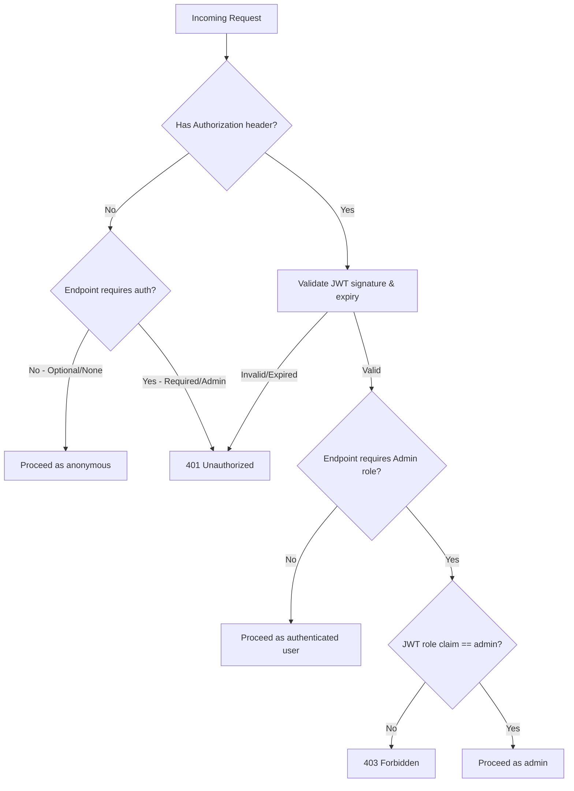

# 08 — API

**Document Version:** 1.0  
**Status:** Active  
**Last Updated:** 2025-06-22  
**Owner:** Engineering Lead  

---

## Purpose of This Document

This is the canonical reference for every REST API endpoint in Job Finder AI. Every endpoint built must match what's documented here; every endpoint documented here must exist in the codebase. If a frontend engineer or AI assistant needs to know an endpoint's exact request/response shape, this document is the answer — not the FastAPI auto-generated docs, which reflect the current code but not the intended contract during active development.

---

## API Conventions

### Base URL
```
Production:  https://api.jobfinderai.com
Staging:     https://api-staging.jobfinderai.com
Local:       http://localhost:8000
```

### Authentication
Protected endpoints require a JWT access token in the request header:
```
Authorization: Bearer {access_token}
```
Endpoints marked **Auth: Optional** return additional personalized fields when a valid token is present, but function for anonymous requests too.

### Standard Response Envelope

Success responses return the resource directly (no wrapper envelope) for simplicity:
```json
{ "id": "...", "field": "value" }
```

Error responses follow a consistent shape:
```json
{
  "error": {
    "code": "VALIDATION_ERROR",
    "message": "Email is already registered",
    "details": { "field": "email" }
  }
}
```

### Standard HTTP Status Codes Used

| Code | Meaning | Used For |
|---|---|---|
| 200 | OK | Successful GET, PUT, PATCH |
| 201 | Created | Successful POST that creates a resource |
| 204 | No Content | Successful DELETE |
| 400 | Bad Request | Validation failure |
| 401 | Unauthorized | Missing/invalid/expired auth token |
| 403 | Forbidden | Valid auth but insufficient permissions (role check) |
| 404 | Not Found | Resource doesn't exist |
| 409 | Conflict | Duplicate resource (e.g., email already registered) |
| 410 | Gone | Expired token/link |
| 429 | Too Many Requests | Rate limit exceeded |
| 500 | Internal Server Error | Unhandled server error |
| 503 | Service Unavailable | Upstream dependency (e.g., Google OAuth) down |

### Pagination Convention

List endpoints accept `page` (0-indexed) and `limit` (default 20, max 50) and return:
```json
{
  "items": [ ... ],
  "total": 247,
  "page": 0,
  "has_more": true
}
```

### Rate Limiting Convention

Rate limits are enforced per IP for unauthenticated endpoints and per user for authenticated ones, using the Redis-backed rate limiter described in `05_ARCHITECTURE.md` Section 9.2. Rate-limited responses include:
```
HTTP/1.1 429 Too Many Requests
Retry-After: 45
```

---

## Endpoint Index

| Method | Path | Purpose | Auth | Feature Ref |
|---|---|---|---|---|
| POST | `/api/auth/register` | Register with email/password | None | F-AUTH-01 |
| GET | `/api/auth/verify-email` | Verify email via token | None | F-AUTH-01 |
| POST | `/api/auth/resend-verification` | Resend verification email | None | F-AUTH-01 |
| GET | `/api/auth/oauth/google` | Initiate Google OAuth | None | F-AUTH-02 |
| GET | `/api/auth/oauth/google/callback` | Google OAuth callback | None | F-AUTH-02 |
| POST | `/api/auth/login` | Email/password login | None | F-AUTH-01/03 |
| POST | `/api/auth/refresh` | Refresh access token | Cookie | F-AUTH-03 |
| POST | `/api/auth/logout` | Logout, revoke refresh token | Required | F-AUTH-03 |
| POST | `/api/auth/forgot-password` | Request password reset | None | F-AUTH-04 |
| POST | `/api/auth/reset-password` | Complete password reset | None | F-AUTH-04 |
| DELETE | `/api/auth/account` | Initiate account deletion | Required | F-AUTH-05 |
| POST | `/api/auth/account/cancel-deletion` | Cancel pending deletion | Required | F-AUTH-05 |
| GET | `/api/skills` | Search canonical skills | None | F-PROF-01 |
| GET | `/api/profile/skills` | Get user's skills | Required | F-PROF-01 |
| PUT | `/api/profile/skills` | Update user's skills | Required | F-PROF-01 |
| GET | `/api/preferences/role-types` | List role type options | None | F-PROF-02 |
| GET | `/api/preferences/cities` | List city options | None | F-PROF-02 |
| GET | `/api/profile/preferences` | Get user's job preferences | Required | F-PROF-02 |
| PUT | `/api/profile/preferences` | Update job preferences | Required | F-PROF-02 |
| GET | `/api/profile/notification-preferences` | Get notification settings | Required | F-PROF-03 |
| PUT | `/api/profile/notification-preferences` | Update notification settings | Required | F-PROF-03 |
| POST | `/api/profile/resume` | Upload resume, trigger extraction | Required | F-PROF-04 |
| GET | `/api/profile/resume/status` | Poll resume extraction status | Required | F-PROF-04 |
| GET | `/api/jobs` | List/filter/search jobs | Optional | F-JOBS-01/02 |
| GET | `/api/jobs/{job_id}` | Get job detail | Optional | F-JOBS-03 |
| POST | `/api/saved-jobs` | Save a job | Required | F-TRACK-01 |
| DELETE | `/api/saved-jobs/{job_id}` | Unsave a job | Required | F-TRACK-01 |
| GET | `/api/saved-jobs` | List user's saved jobs | Required | F-TRACK-01/02 |
| PATCH | `/api/saved-jobs/{job_id}` | Update saved job status/notes | Required | F-TRACK-02 |
| GET | `/api/saved-jobs/stats` | Get saved jobs status counts | Required | F-TRACK-02 |
| POST | `/api/telegram/generate-link-code` | Generate Telegram link code | Required | F-NOTIF-01 |
| GET | `/api/profile/telegram-status` | Poll Telegram connection status | Required | F-NOTIF-01 |
| DELETE | `/api/profile/telegram` | Unlink Telegram | Required | F-NOTIF-01 |
| POST | `/api/webhooks/telegram` | Telegram bot webhook receiver | Telegram secret | F-NOTIF-01/02 |
| GET | `/api/admin/scraper-health` | Scraper health table | Admin | F-ADMN-01 |
| GET | `/api/admin/companies` | List all companies | Admin | F-ADMN-02 |
| POST | `/api/admin/companies` | Add a new company | Admin | F-ADMN-02 |
| PATCH | `/api/admin/companies/{id}` | Deactivate/update a company | Admin | F-ADMN-02 |
| POST | `/api/admin/companies/{id}/run-now` | Trigger manual scrape | Admin | F-ADMN-02 |
| GET | `/api/admin/review-queue` | List flagged jobs | Admin | F-ADMN-03 |
| POST | `/api/admin/review-queue/{job_id}/approve` | Approve flagged job | Admin | F-ADMN-03 |
| POST | `/api/admin/review-queue/{job_id}/reject` | Reject flagged job | Admin | F-ADMN-03 |
| GET | `/api/admin/users` | List/search users | Admin | F-ADMN-04 |
| GET | `/api/admin/users/{id}` | Get user detail | Admin | F-ADMN-04 |
| POST | `/api/admin/users/{id}/suspend` | Suspend a user | Admin | F-ADMN-04 |
| POST | `/api/admin/users/{id}/reactivate` | Reactivate a suspended user | Admin | F-ADMN-04 |
| GET | `/health` | Health check | None | `05_ARCHITECTURE.md` §11 |

---

## AUTHENTICATION ENDPOINTS

---

### POST /api/auth/register

**Purpose**  
Register a new user account with email and password. Account remains unverified until the user clicks the link in the verification email.

**Input**
```json
{
  "name": "Aarav Shah",
  "email": "aarav@example.com",
  "password": "SecurePass123"
}
```

**Validation**
| Field | Rules |
|---|---|
| `name` | Required, 1–255 chars |
| `email` | Required, valid email format, max 255 chars |
| `password` | Required, min 8 chars, must contain at least one letter and one number |

**Response — 201 Created**
```json
{ "message": "Verification email sent. Please check your inbox." }
```

**Errors**
| Status | Code | Condition |
|---|---|---|
| 400 | `VALIDATION_ERROR` | Missing/invalid field |
| 409 | `EMAIL_ALREADY_REGISTERED` | Email already exists (verified or unverified) |

**Auth:** None  
**Rate Limit:** 5 requests / hour / IP

**Example**
```bash
curl -X POST https://api.jobfinderai.com/api/auth/register \
  -H "Content-Type: application/json" \
  -d '{"name":"Aarav Shah","email":"aarav@example.com","password":"SecurePass123"}'
```

---

### GET /api/auth/verify-email

**Purpose**  
Activate a user's account using the token sent via email.

**Input**
```
Query: ?token={uuid}
```

**Response — 200 OK**
```json
{ "message": "Email verified successfully", "redirect": "/onboarding/step-1" }
```

**Errors**
| Status | Code | Condition |
|---|---|---|
| 400 | `INVALID_TOKEN` | Token doesn't exist or already used |
| 410 | `TOKEN_EXPIRED` | Token is older than 24 hours |

**Auth:** None  
**Rate Limit:** 20 requests / hour / IP

---

### POST /api/auth/resend-verification

**Purpose**  
Request a new verification email if the original expired or was lost.

**Input**
```json
{ "email": "aarav@example.com" }
```

**Response — 200 OK**
```json
{ "message": "If an account exists with this email, a verification link has been sent." }
```

**Errors**
| Status | Code | Condition |
|---|---|---|
| 400 | `VALIDATION_ERROR` | Invalid email format |

**Auth:** None  
**Rate Limit:** 3 requests / hour / email (not just IP, to prevent targeted spam to one inbox)

**Note:** Returns 200 regardless of whether the email exists, to prevent email enumeration.

---

### GET /api/auth/oauth/google

**Purpose**  
Initiates the Google OAuth consent flow by redirecting the browser to Google.

**Input:** None (browser navigation, not an XHR call)

**Response — 302 Redirect**  
Redirects to Google's OAuth consent screen with appropriate `client_id`, `redirect_uri`, `scope`, and a CSRF `state` parameter.

**Auth:** None  
**Rate Limit:** None (browser-navigated, not programmatically abusable in a meaningful way)

---

### GET /api/auth/oauth/google/callback

**Purpose**  
Receives Google's redirect after consent, exchanges the auth code for tokens, creates or logs in the user.

**Input**
```
Query: ?code={google_auth_code}&state={csrf_state}
```

**Response — 302 Redirect**  
On success, redirects to frontend with access token delivered via a secure mechanism (short-lived one-time code exchanged client-side, or set via secure cookie depending on final implementation — access token itself is never placed in a URL query string). Refresh token set as httpOnly cookie.

**Errors**
| Status | Code | Condition |
|---|---|---|
| 400 | `INVALID_STATE` | CSRF state mismatch |
| 503 | `GOOGLE_API_UNAVAILABLE` | Google's token endpoint failed |

**Auth:** None  
**Rate Limit:** None (Google-initiated redirect)

---

### POST /api/auth/login

**Purpose**  
Authenticate with email and password, issue JWT access + refresh tokens.

**Input**
```json
{
  "email": "aarav@example.com",
  "password": "SecurePass123"
}
```

**Validation**
| Field | Rules |
|---|---|
| `email` | Required, valid email format |
| `password` | Required |

**Response — 200 OK**
```json
{
  "access_token": "eyJhbGciOiJIUzI1NiIs...",
  "token_type": "bearer",
  "expires_in": 900,
  "user": {
    "id": "a1b2c3d4-...",
    "name": "Aarav Shah",
    "email": "aarav@example.com",
    "role": "student"
  }
}
```
*(Refresh token is set as an httpOnly, Secure, SameSite=Strict cookie — not present in the JSON body.)*

**Errors**
| Status | Code | Condition |
|---|---|---|
| 400 | `VALIDATION_ERROR` | Missing field |
| 401 | `INVALID_CREDENTIALS` | Wrong email or password (intentionally generic to avoid leaking which is incorrect) |
| 403 | `ACCOUNT_NOT_VERIFIED` | Email/password account not yet verified |
| 403 | `ACCOUNT_SUSPENDED` | Admin has suspended this account |

**Auth:** None  
**Rate Limit:** 5 requests / minute / IP (brute-force protection per NFR-SEC-03)

---

### POST /api/auth/refresh

**Purpose**  
Exchange a valid refresh token (from httpOnly cookie) for a new access token, rotating the refresh token.

**Input**
```
Cookie: refresh_token={uuid}
```
(No request body)

**Response — 200 OK**
```json
{
  "access_token": "eyJhbGciOiJIUzI1NiIs...",
  "token_type": "bearer",
  "expires_in": 900
}
```
*(New refresh token set via cookie; old one is invalidated.)*

**Errors**
| Status | Code | Condition |
|---|---|---|
| 401 | `INVALID_REFRESH_TOKEN` | Token missing, expired, or already used (rotation breach detected) |

**Auth:** Cookie-based (no Bearer header required for this endpoint)  
**Rate Limit:** 30 requests / hour / user

---

### POST /api/auth/logout

**Purpose**  
End the current session by revoking the refresh token.

**Input:** None

**Response — 200 OK**
```json
{ "message": "Logged out successfully" }
```

**Auth:** Required (Bearer token)  
**Rate Limit:** None

---

### POST /api/auth/forgot-password

**Purpose**  
Request a password reset email.

**Input**
```json
{ "email": "aarav@example.com" }
```

**Response — 200 OK**
```json
{ "message": "If an account exists with this email, a reset link has been sent." }
```

**Errors**
| Status | Code | Condition |
|---|---|---|
| 400 | `VALIDATION_ERROR` | Invalid email format |

**Auth:** None  
**Rate Limit:** 3 requests / hour / email

**Note:** Always returns 200 regardless of whether the email is registered (prevents enumeration, per F-AUTH-04 edge cases).

---

### POST /api/auth/reset-password

**Purpose**  
Complete a password reset using the emailed token.

**Input**
```json
{
  "token": "a1b2c3d4-...",
  "new_password": "NewSecurePass456"
}
```

**Validation**
| Field | Rules |
|---|---|
| `token` | Required, valid UUID |
| `new_password` | Required, min 8 chars, at least one letter and one number |

**Response — 200 OK**
```json
{ "message": "Password reset successfully. Please log in with your new password." }
```

**Errors**
| Status | Code | Condition |
|---|---|---|
| 400 | `INVALID_TOKEN` | Token doesn't exist or already used |
| 400 | `VALIDATION_ERROR` | Password doesn't meet requirements |
| 410 | `TOKEN_EXPIRED` | Token older than 1 hour |

**Auth:** None  
**Rate Limit:** 10 requests / hour / IP

**Side Effect:** All active refresh tokens for the user are revoked (forces re-login on all devices).

---

### DELETE /api/auth/account

**Purpose**  
Initiate account deletion (soft delete with 30-day grace period).

**Input**
```json
{ "confirm_email": "aarav@example.com" }
```

**Validation**
| Field | Rules |
|---|---|
| `confirm_email` | Required, must exactly match the authenticated user's email |

**Response — 200 OK**
```json
{
  "message": "Account scheduled for deletion. You have 30 days to cancel.",
  "deletion_date": "2025-07-22T00:00:00Z"
}
```

**Errors**
| Status | Code | Condition |
|---|---|---|
| 400 | `EMAIL_MISMATCH` | confirm_email doesn't match authenticated user |

**Auth:** Required  
**Rate Limit:** 3 requests / day / user

**Side Effects:** All sessions revoked immediately; confirmation email sent.

---

### POST /api/auth/account/cancel-deletion

**Purpose**  
Cancel a pending account deletion within the 30-day grace period.

**Input:** None

**Response — 200 OK**
```json
{ "message": "Account deletion cancelled. Welcome back!" }
```

**Errors**
| Status | Code | Condition |
|---|---|---|
| 400 | `NO_PENDING_DELETION` | Account is not currently scheduled for deletion |
| 410 | `DELETION_ALREADY_PROCESSED` | Grace period has already passed; account permanently deleted |

**Auth:** Required (this endpoint must be reachable even for an account in the grace period — login is still permitted during the 30 days specifically to allow this action)  
**Rate Limit:** 5 requests / day / user

---

## PROFILE ENDPOINTS

---

### GET /api/skills

**Purpose**  
Search the canonical skill list for the profile setup combobox.

**Input**
```
Query: ?q={search_term}
```

**Response — 200 OK**
```json
[
  { "id": 14, "name": "Python", "slug": "python", "category": "language" },
  { "id": 27, "name": "PyTorch", "slug": "pytorch", "category": "framework" }
]
```

**Auth:** None  
**Rate Limit:** 60 requests / minute / IP  
**Cache:** Redis, 1 hour TTL per query

---

### GET /api/profile/skills

**Purpose**  
Get the authenticated user's currently selected skills.

**Response — 200 OK**
```json
[
  { "id": 14, "name": "Python", "slug": "python", "category": "language" },
  { "id": 31, "name": "FastAPI", "slug": "fastapi", "category": "framework" }
]
```

**Auth:** Required  
**Rate Limit:** None (low-cost, frequently-needed read)

---

### PUT /api/profile/skills

**Purpose**  
Replace the user's full skill set (not an append operation).

**Input**
```json
{ "skill_ids": [14, 31, 45, 102] }
```

**Validation**
| Field | Rules |
|---|---|
| `skill_ids` | Required, array of integers, min length 1, all IDs must exist in `skills` table |

**Response — 200 OK**
```json
{
  "updated_skills": [
    { "id": 14, "name": "Python", "category": "language" },
    { "id": 31, "name": "FastAPI", "category": "framework" }
  ]
}
```

**Errors**
| Status | Code | Condition |
|---|---|---|
| 400 | `EMPTY_SKILLS` | `skill_ids` array is empty |
| 400 | `INVALID_SKILL_ID` | One or more IDs don't exist in the skills table |

**Auth:** Required  
**Rate Limit:** 30 requests / hour / user

---

### GET /api/preferences/role-types

**Purpose**  
List all available role types for the preferences multi-select dropdown.

**Response — 200 OK**
```json
[
  { "id": 1, "name": "Software Engineer", "slug": "software_engineer" },
  { "id": 2, "name": "Data Analyst", "slug": "data_analyst" }
]
```

**Auth:** None  
**Rate Limit:** None  
**Cache:** Redis, 24 hour TTL

---

### GET /api/preferences/cities

**Purpose**  
List all available cities for the location preference multi-select.

**Response — 200 OK**
```json
[
  { "id": 1, "name": "Bengaluru", "state": "Karnataka", "slug": "bengaluru" },
  { "id": 2, "name": "Remote", "state": null, "slug": "remote" }
]
```

**Auth:** None  
**Rate Limit:** None  
**Cache:** Redis, 24 hour TTL

---

### GET /api/profile/preferences

**Purpose**  
Get the user's job role, location, and experience preferences.

**Response — 200 OK**
```json
{
  "experience_level": "fresher",
  "open_to_remote": true,
  "open_to_relocation": false,
  "role_type_ids": [1, 7],
  "city_ids": [1, 2]
}
```

**Auth:** Required  
**Rate Limit:** None

---

### PUT /api/profile/preferences

**Purpose**  
Update the user's job preferences.

**Input**
```json
{
  "experience_level": "fresher",
  "open_to_remote": true,
  "open_to_relocation": false,
  "role_type_ids": [1, 7],
  "city_ids": [1, 2]
}
```

**Validation**
| Field | Rules |
|---|---|
| `experience_level` | Required, one of: `fresher`, `0-1yr`, `1-2yr`, `2-3yr`, `3-5yr`, `5+yr` |
| `open_to_remote` | Required, boolean |
| `open_to_relocation` | Required, boolean |
| `role_type_ids` | Required, array of integers, min length 1 |
| `city_ids` | Required if `open_to_remote` is false, array of integers |

**Response — 200 OK**
```json
{ "updated": true }
```

**Errors**
| Status | Code | Condition |
|---|---|---|
| 400 | `VALIDATION_ERROR` | Missing required field, or zero locations with `open_to_remote=false` |

**Auth:** Required  
**Rate Limit:** 30 requests / hour / user

---

### GET /api/profile/notification-preferences

**Purpose**  
Get the user's full notification configuration.

**Response — 200 OK**
```json
{
  "telegram_enabled": true,
  "email_enabled": true,
  "telegram_frequency": "all",
  "email_digest_frequency": "daily",
  "quiet_hours_enabled": true,
  "quiet_start": "09:00",
  "quiet_end": "19:00",
  "quiet_days": ["mon", "tue", "wed", "thu", "fri"],
  "timezone": "Asia/Kolkata"
}
```

**Auth:** Required  
**Rate Limit:** None

---

### PUT /api/profile/notification-preferences

**Purpose**  
Update notification channel, frequency, and quiet hours settings.

**Input**
```json
{
  "telegram_enabled": true,
  "email_enabled": false,
  "telegram_frequency": "exact_match",
  "email_digest_frequency": "off",
  "quiet_hours_enabled": true,
  "quiet_start": "21:00",
  "quiet_end": "08:00",
  "quiet_days": ["mon","tue","wed","thu","fri","sat","sun"],
  "timezone": "Asia/Kolkata"
}
```

**Validation**
| Field | Rules |
|---|---|
| `telegram_frequency` | One of: `all`, `exact_match` |
| `email_digest_frequency` | One of: `daily`, `weekly`, `off` |
| `quiet_start`, `quiet_end` | Valid `HH:MM` format if `quiet_hours_enabled` is true |
| `quiet_days` | Array of valid 3-letter day codes |
| `timezone` | Valid IANA timezone string |

**Response — 200 OK**
```json
{ "updated": true }
```

**Errors**
| Status | Code | Condition |
|---|---|---|
| 400 | `VALIDATION_ERROR` | Invalid time format or timezone string |
| 400 | `NO_CHANNEL_ENABLED` | Both `telegram_enabled` and `email_enabled` are false (warning returned, not blocked — see F-PROF-03 edge cases) |

**Auth:** Required  
**Rate Limit:** 30 requests / hour / user

---

### POST /api/profile/resume

**Purpose**  
Record an uploaded resume's storage path and trigger AI skill extraction.

**Input**
```json
{ "storage_path": "resumes/a1b2c3d4/resume_2025-06-22.pdf" }
```
*(The actual file is uploaded directly to object storage via a separately-issued signed URL, not through this endpoint — see Flow 10 in `04_USER_FLOWS.md`.)*

**Validation**
| Field | Rules |
|---|---|
| `storage_path` | Required, must reference a file that exists in the user's private storage prefix |

**Response — 202 Accepted**
```json
{ "extraction_status": "pending" }
```

**Errors**
| Status | Code | Condition |
|---|---|---|
| 400 | `FILE_NOT_FOUND` | storage_path doesn't correspond to an uploaded file |
| 400 | `INVALID_FILE_TYPE` | File is not a PDF |
| 400 | `FILE_TOO_LARGE` | File exceeds 5MB |

**Auth:** Required  
**Rate Limit:** 5 requests / hour / user

---

### GET /api/profile/resume/status

**Purpose**  
Poll the status of an in-progress resume skill extraction.

**Response — 200 OK**
```json
{
  "status": "done",
  "extracted_skills": [
    { "id": 14, "name": "Python" },
    { "id": 31, "name": "FastAPI" }
  ],
  "unmatched_terms": ["GraphQL Federation"]
}
```

**Auth:** Required  
**Rate Limit:** 60 requests / minute / user (polled frequently during extraction)

---

## JOBS ENDPOINTS

---

### GET /api/jobs

**Purpose**  
The main jobs feed — paginated, filterable, searchable list of active job listings.

**Input**
```
Query params:
  page=0
  limit=20
  role_type=software_engineer,data_analyst   (comma-separated)
  location=bengaluru,remote                  (comma-separated city slugs)
  experience_level=fresher
  is_remote=true
  q=backend python                            (full-text search)
```

**Validation**
| Field | Rules |
|---|---|
| `page` | Integer ≥ 0, default 0 |
| `limit` | Integer 1–50, default 20 |
| `role_type` | Comma-separated valid role_type slugs |
| `experience_level` | One of the valid enum values |

**Response — 200 OK**
```json
{
  "items": [
    {
      "id": "j1a2b3c4-...",
      "title": "Software Engineer — Backend",
      "company": { "name": "Razorpay", "logo_url": "https://..." },
      "location": "Bengaluru, Karnataka",
      "location_type": "hybrid",
      "company_posted_at": "2025-06-22T08:30:00Z",
      "posted_label": "23 minutes ago",
      "required_skills": ["Python", "FastAPI", "PostgreSQL"],
      "summary_preview": [
        "Build payment APIs used by 10M+ merchants",
        "0–2 years experience accepted"
      ],
      "apply_url": "https://boards.greenhouse.io/razorpay/jobs/12345"
    }
  ],
  "total": 247,
  "page": 0,
  "has_more": true
}
```

**Auth:** Optional — when authenticated, each job item additionally includes a `skill_match` object (matched/missing counts against the user's profile)

**Rate Limit:** 120 requests / minute / IP  
**Cache:** Redis, 2 minutes per unique filter combination

---

### GET /api/jobs/{job_id}

**Purpose**  
Full detail view for a single job.

**Response — 200 OK**
```json
{
  "id": "j1a2b3c4-...",
  "title": "Software Engineer — Backend",
  "company": {
    "name": "Razorpay",
    "logo_url": "https://...",
    "ats_type": "greenhouse"
  },
  "location": "Bengaluru, Karnataka",
  "location_type": "hybrid",
  "salary_range": "₹12–18 LPA",
  "deadline": "2025-07-15",
  "company_posted_at": "2025-06-22T08:30:00Z",
  "posted_label": "23 minutes ago",
  "summary": [
    "Build payment APIs used by 10M+ merchants across India and SEA",
    "Python and FastAPI required; 0–2 years experience accepted",
    "Hybrid role in Bengaluru — 3 days office, 2 days remote",
    "Competitive salary with ESOP — exact range not disclosed",
    "Small team of 6 engineers; direct ownership from day one"
  ],
  "required_skills": [
    { "name": "Python", "user_has_skill": true },
    { "name": "FastAPI", "user_has_skill": true },
    { "name": "Docker", "user_has_skill": false }
  ],
  "preferred_skills": [
    { "name": "Go", "user_has_skill": false }
  ],
  "degree_required": false,
  "role_type": "software_engineer",
  "experience_level": "0-1yr",
  "is_remote": false,
  "is_internship": false,
  "raw_description": "Full job description text...",
  "apply_url": "https://boards.greenhouse.io/razorpay/jobs/12345"
}
```

**Errors**
| Status | Code | Condition |
|---|---|---|
| 404 | `JOB_NOT_FOUND` | Job doesn't exist or `is_active = false` |

**Auth:** Optional — `user_has_skill` fields require authentication; omitted for anonymous requests  
**Rate Limit:** 120 requests / minute / IP  
**Cache:** Redis, 5 minutes per job_id

---

## SAVED JOBS / TRACKING ENDPOINTS

---

### POST /api/saved-jobs

**Purpose**  
Bookmark a job for later review/tracking.

**Input**
```json
{ "job_id": "j1a2b3c4-..." }
```

**Response — 201 Created**
```json
{
  "saved_job_id": "s9z8y7x6-...",
  "status": "saved",
  "saved_at": "2025-06-22T09:15:00Z"
}
```

**Errors**
| Status | Code | Condition |
|---|---|---|
| 404 | `JOB_NOT_FOUND` | job_id doesn't exist |
| 409 | `ALREADY_SAVED` | This job is already in the user's saved list |

**Auth:** Required  
**Rate Limit:** 60 requests / hour / user

---

### DELETE /api/saved-jobs/{job_id}

**Purpose**  
Remove a job from the user's saved list entirely.

**Response — 204 No Content**

**Errors**
| Status | Code | Condition |
|---|---|---|
| 404 | `NOT_SAVED` | This job isn't currently saved by the user |

**Auth:** Required  
**Rate Limit:** 60 requests / hour / user

---

### GET /api/saved-jobs

**Purpose**  
List the user's saved jobs, optionally filtered by status, for the My Jobs page.

**Input**
```
Query: ?status=saved,applied&page=0&limit=20
```

**Response — 200 OK**
```json
{
  "items": [
    {
      "saved_job_id": "s9z8y7x6-...",
      "status": "applied",
      "notes": "Recruiter said they'll respond by Friday",
      "saved_at": "2025-06-20T10:00:00Z",
      "status_updated_at": "2025-06-21T14:30:00Z",
      "job": {
        "id": "j1a2b3c4-...",
        "title": "Software Engineer — Backend",
        "company": { "name": "Razorpay", "logo_url": "https://..." },
        "deadline": "2025-07-15"
      }
    }
  ],
  "total": 12,
  "page": 0,
  "has_more": false
}
```

**Auth:** Required  
**Rate Limit:** None

---

### PATCH /api/saved-jobs/{job_id}

**Purpose**  
Update the status or notes of a saved/tracked job.

**Input**
```json
{
  "status": "interviewing",
  "notes": "Phone screen scheduled for next Tuesday"
}
```

**Validation**
| Field | Rules |
|---|---|
| `status` | One of: `saved`, `applied`, `interviewing`, `rejected`, `offer` |
| `notes` | Optional, max 500 chars |

**Response — 200 OK**
```json
{ "updated": true }
```

**Errors**
| Status | Code | Condition |
|---|---|---|
| 404 | `NOT_SAVED` | Job isn't in the user's saved list |
| 400 | `VALIDATION_ERROR` | Invalid status value |

**Auth:** Required  
**Rate Limit:** 60 requests / hour / user

---

### GET /api/saved-jobs/stats

**Purpose**  
Get aggregate counts by status for the My Jobs page header.

**Response — 200 OK**
```json
{
  "saved": 12,
  "applied": 8,
  "interviewing": 2,
  "offer": 1,
  "rejected": 5
}
```

**Auth:** Required  
**Rate Limit:** None

---

## TELEGRAM ENDPOINTS

---

### POST /api/telegram/generate-link-code

**Purpose**  
Generate a one-time code for linking the user's Telegram account.

**Response — 200 OK**
```json
{
  "code": "a1b2c3d4-...",
  "deep_link": "https://t.me/JobFinderAIBot?start=a1b2c3d4",
  "qr_code_url": "https://api.jobfinderai.com/api/telegram/qr/a1b2c3d4",
  "expires_at": "2025-06-22T09:25:00Z"
}
```

**Auth:** Required  
**Rate Limit:** 10 requests / hour / user

---

### GET /api/profile/telegram-status

**Purpose**  
Poll whether the user's Telegram account has been linked yet (used during the connection flow).

**Response — 200 OK**
```json
{ "connected": true, "linked_at": "2025-06-22T09:18:42Z" }
```

**Auth:** Required  
**Rate Limit:** None (designed for frequent polling, 3-second interval, during active linking)

---

### DELETE /api/profile/telegram

**Purpose**  
Unlink the user's Telegram account (e.g., switching to a new Telegram account, or disabling Telegram notifications entirely).

**Response — 200 OK**
```json
{ "message": "Telegram disconnected" }
```

**Auth:** Required  
**Rate Limit:** 10 requests / hour / user

---

### POST /api/webhooks/telegram

**Purpose**  
Receives all inbound messages and button-press callbacks from the Telegram Bot API. Internal endpoint — not called by the frontend.

**Input**  
Telegram's standard Update object (varies by message type — text command, callback_query, etc.)

**Response — 200 OK**
```json
{ "ok": true }
```
*(Telegram requires a fast 200 response regardless of internal processing outcome; errors are logged, not returned to Telegram.)*

**Auth:** Validated via Telegram's webhook secret token header (`X-Telegram-Bot-Api-Secret-Token`), not user JWT  
**Rate Limit:** None (trusted, Telegram-originated traffic only — IP-restricted to Telegram's published ranges where feasible)

---

## ADMIN ENDPOINTS

All endpoints in this section require `Auth: Admin` — a valid JWT with `role: admin`, enforced server-side per F-AUTH-07. Non-admin authenticated requests receive `403 Forbidden`.

---

### GET /api/admin/scraper-health

**Purpose**  
The data source for the Scraper Health dashboard (F-ADMN-01).

**Response — 200 OK**
```json
[
  {
    "company_id": 42,
    "company_name": "Razorpay",
    "ats_type": "greenhouse",
    "last_scraped_at": "2025-06-22T09:00:00Z",
    "consecutive_failures": 0,
    "jobs_found_24h": 8,
    "jobs_new_24h": 3,
    "last_error_message": null,
    "last_error_type": null,
    "status": "healthy"
  },
  {
    "company_id": 51,
    "company_name": "Freshworks",
    "ats_type": "greenhouse",
    "last_scraped_at": "2025-06-22T00:15:00Z",
    "consecutive_failures": 3,
    "jobs_found_24h": 0,
    "jobs_new_24h": 0,
    "last_error_message": "Job listing container not found — page layout may have changed",
    "last_error_type": "layout_change",
    "status": "failed"
  }
]
```

**Auth:** Admin  
**Rate Limit:** None  
**Cache:** Redis, 60 seconds (per `05_ARCHITECTURE.md` §9.2)

---

### GET /api/admin/companies

**Purpose**  
List all companies in the scrape list, including inactive ones.

**Input**
```
Query: ?active=true&page=0&limit=50
```

**Response — 200 OK**
```json
{
  "items": [
    {
      "id": 42,
      "name": "Razorpay",
      "career_page_url": "https://razorpay.com/jobs",
      "ats_type": "greenhouse",
      "active": true,
      "scrape_frequency_minutes": 15,
      "last_scraped_at": "2025-06-22T09:00:00Z"
    }
  ],
  "total": 87,
  "page": 0,
  "has_more": true
}
```

**Auth:** Admin  
**Rate Limit:** None

---

### POST /api/admin/companies

**Purpose**  
Add a new company to the scrape list, running ATS auto-detection.

**Input**
```json
{
  "name": "Groww",
  "career_page_url": "https://groww.in/careers",
  "ats_type": "auto"
}
```

**Validation**
| Field | Rules |
|---|---|
| `name` | Required, 1–255 chars |
| `career_page_url` | Required, valid URL, must be unique across companies |
| `ats_type` | Optional — `"auto"` (default) triggers detection; otherwise one of `workday`, `greenhouse`, `lever`, `icims`, `taleo`, `generic` |

**Response — 201 Created**
```json
{
  "id": 88,
  "name": "Groww",
  "career_page_url": "https://groww.in/careers",
  "ats_type": "greenhouse",
  "ats_detection_method": "html_signature",
  "active": true
}
```

**Errors**
| Status | Code | Condition |
|---|---|---|
| 400 | `VALIDATION_ERROR` | Invalid URL or missing name |
| 409 | `COMPANY_ALREADY_EXISTS` | career_page_url already in companies table |

**Auth:** Admin  
**Rate Limit:** 100 requests / hour / admin

---

### PATCH /api/admin/companies/{id}

**Purpose**  
Update a company's settings, most commonly to deactivate it.

**Input**
```json
{ "active": false }
```

**Response — 200 OK**
```json
{ "updated": true }
```

**Errors**
| Status | Code | Condition |
|---|---|---|
| 404 | `COMPANY_NOT_FOUND` | Invalid company ID |

**Auth:** Admin  
**Rate Limit:** 100 requests / hour / admin

---

### POST /api/admin/companies/{id}/run-now

**Purpose**  
Trigger an immediate manual scrape for a specific company, outside the regular 15-minute schedule.

**Response — 202 Accepted**
```json
{ "message": "Scrape queued", "scrape_run_id": "sr1a2b3c-..." }
```

**Errors**
| Status | Code | Condition |
|---|---|---|
| 404 | `COMPANY_NOT_FOUND` | Invalid company ID |
| 429 | `SCRAPE_IN_PROGRESS` | A scrape for this company is already running |

**Auth:** Admin  
**Rate Limit:** 10 requests / hour / admin (manual scrapes shouldn't be abused to bypass rate limiting on target sites)

---

### GET /api/admin/review-queue

**Purpose**  
List jobs flagged for manual review due to low extraction confidence or missing critical fields.

**Input**
```
Query: ?page=0&limit=10
```

**Response — 200 OK**
```json
{
  "items": [
    {
      "job_id": "j5f6g7h8-...",
      "company_name": "Razorpay",
      "raw_title": "SDE II - Backend (Payments Team) [Req#12345]",
      "extracted_title": "Software Engineer — Backend",
      "extraction_confidence": 0.68,
      "raw_apply_url": "https://boards.greenhouse.io/...",
      "extracted_location": "Bengaluru",
      "raw_description_excerpt": "...Remote / Bengaluru flexible...",
      "ai_summary": ["...", "..."],
      "required_skills": ["Python", "FastAPI", "PostgreSQL"]
    }
  ],
  "total": 8,
  "page": 0,
  "has_more": false
}
```

**Auth:** Admin  
**Rate Limit:** None

---

### POST /api/admin/review-queue/{job_id}/approve

**Purpose**  
Approve a flagged job, optionally correcting fields, making it visible to students.

**Input**
```json
{
  "edited_fields": {
    "location": "Remote / Bengaluru"
  }
}
```
*(`edited_fields` is optional — omit to approve as-is.)*

**Response — 200 OK**
```json
{ "approved": true, "is_active": true }
```

**Errors**
| Status | Code | Condition |
|---|---|---|
| 404 | `JOB_NOT_FOUND` | Invalid job_id |

**Auth:** Admin  
**Rate Limit:** None

---

### POST /api/admin/review-queue/{job_id}/reject

**Purpose**  
Reject a flagged job permanently — it will never be shown to students.

**Response — 200 OK**
```json
{ "rejected": true, "is_active": false }
```

**Errors**
| Status | Code | Condition |
|---|---|---|
| 404 | `JOB_NOT_FOUND` | Invalid job_id |

**Auth:** Admin  
**Rate Limit:** None

---

### GET /api/admin/users

**Purpose**  
Search and list registered users for the admin user management table.

**Input**
```
Query: ?search=aarav&status=active&page=0&limit=50
```

**Response — 200 OK**
```json
{
  "items": [
    {
      "id": "a1b2c3d4-...",
      "name": "Aarav Shah",
      "email": "aarav@example.com",
      "is_verified": true,
      "is_active": true,
      "telegram_linked": true,
      "created_at": "2025-06-19T10:00:00Z",
      "last_active_at": "2025-06-22T07:43:00Z"
    }
  ],
  "total": 347,
  "page": 0,
  "has_more": true
}
```

**Auth:** Admin  
**Rate Limit:** None

---

### GET /api/admin/users/{id}

**Purpose**  
Get full detail on a single user for admin review — profile, activity, saved jobs count.

**Response — 200 OK**
```json
{
  "id": "a1b2c3d4-...",
  "name": "Aarav Shah",
  "email": "aarav@example.com",
  "is_verified": true,
  "is_active": true,
  "role": "student",
  "telegram_linked": true,
  "skills_count": 7,
  "saved_jobs_count": 12,
  "notifications_received_30d": 18,
  "created_at": "2025-06-19T10:00:00Z"
}
```

**Errors**
| Status | Code | Condition |
|---|---|---|
| 404 | `USER_NOT_FOUND` | Invalid user ID |

**Auth:** Admin  
**Rate Limit:** None

---

### POST /api/admin/users/{id}/suspend

**Purpose**  
Suspend a user account, immediately revoking access.

**Response — 200 OK**
```json
{ "suspended": true }
```

**Errors**
| Status | Code | Condition |
|---|---|---|
| 404 | `USER_NOT_FOUND` | Invalid user ID |
| 400 | `CANNOT_SUSPEND_SELF` | Admin attempted to suspend their own account |

**Auth:** Admin  
**Rate Limit:** 50 requests / hour / admin

---

### POST /api/admin/users/{id}/reactivate

**Purpose**  
Reverse a suspension, restoring normal access.

**Response — 200 OK**
```json
{ "reactivated": true }
```

**Errors**
| Status | Code | Condition |
|---|---|---|
| 404 | `USER_NOT_FOUND` | Invalid user ID |

**Auth:** Admin  
**Rate Limit:** 50 requests / hour / admin

---

## SYSTEM ENDPOINTS

---

### GET /health

**Purpose**  
Liveness/readiness check used by the uptime monitor and deployment health checks.

**Response — 200 OK**
```json
{
  "status": "ok",
  "database": "connected",
  "redis": "connected",
  "timestamp": "2025-06-22T09:30:00Z"
}
```

**Response — 503 Service Unavailable** (if a dependency is down)
```json
{
  "status": "degraded",
  "database": "connected",
  "redis": "disconnected",
  "timestamp": "2025-06-22T09:30:00Z"
}
```

**Auth:** None  
**Rate Limit:** None

---

## Error Code Reference

Consolidated list of all error codes used across the API, for client-side error handling.

| Code | Typical Status | Meaning |
|---|---|---|
| `VALIDATION_ERROR` | 400 | Request body/params failed validation |
| `EMAIL_ALREADY_REGISTERED` | 409 | Email already has an account |
| `INVALID_TOKEN` | 400 | Token doesn't exist or already used |
| `TOKEN_EXPIRED` | 410 | Token past its expiry window |
| `INVALID_CREDENTIALS` | 401 | Wrong email/password combination |
| `ACCOUNT_NOT_VERIFIED` | 403 | Email verification required before login |
| `ACCOUNT_SUSPENDED` | 403 | Admin has suspended this account |
| `INVALID_REFRESH_TOKEN` | 401 | Refresh token invalid, expired, or reused |
| `INVALID_STATE` | 400 | OAuth CSRF state mismatch |
| `GOOGLE_API_UNAVAILABLE` | 503 | Google OAuth endpoint unreachable |
| `EMAIL_MISMATCH` | 400 | Confirmation email doesn't match account |
| `NO_PENDING_DELETION` | 400 | No deletion scheduled to cancel |
| `DELETION_ALREADY_PROCESSED` | 410 | Account already hard-deleted |
| `EMPTY_SKILLS` | 400 | Skill selection cannot be empty |
| `INVALID_SKILL_ID` | 400 | Skill ID doesn't exist |
| `JOB_NOT_FOUND` | 404 | Job doesn't exist or is inactive |
| `ALREADY_SAVED` | 409 | Job already in user's saved list |
| `NOT_SAVED` | 404 | Job not in user's saved list |
| `FILE_NOT_FOUND` | 400 | Referenced upload doesn't exist |
| `INVALID_FILE_TYPE` | 400 | File is not a PDF |
| `FILE_TOO_LARGE` | 400 | File exceeds 5MB |
| `COMPANY_ALREADY_EXISTS` | 409 | career_page_url already in use |
| `COMPANY_NOT_FOUND` | 404 | Invalid company ID |
| `SCRAPE_IN_PROGRESS` | 429 | Manual scrape already running for this company |
| `USER_NOT_FOUND` | 404 | Invalid user ID (admin context) |
| `CANNOT_SUSPEND_SELF` | 400 | Admin attempted self-suspension |

---

## Authentication & Authorization Summary



---

*This document is the binding contract for the API surface. Any endpoint added, removed, or changed in the backend must be reflected here in the same pull request. The FastAPI auto-generated OpenAPI docs are useful for interactive testing but this document, not the auto-generated docs, is the source of truth for intended behavior.*