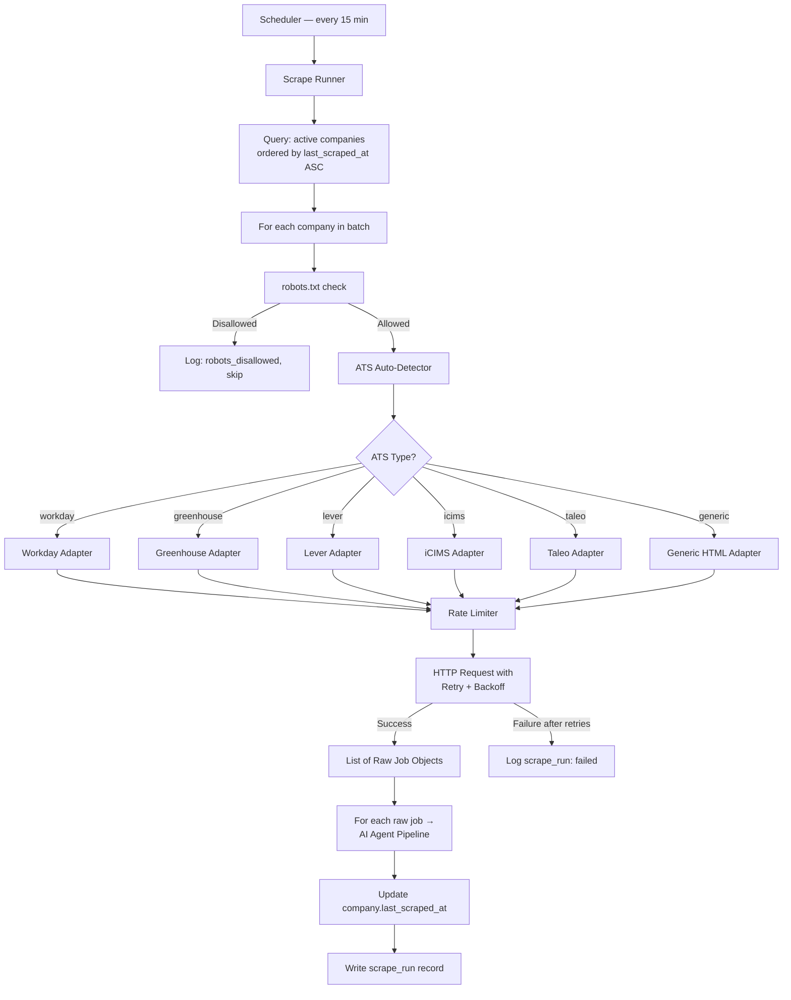
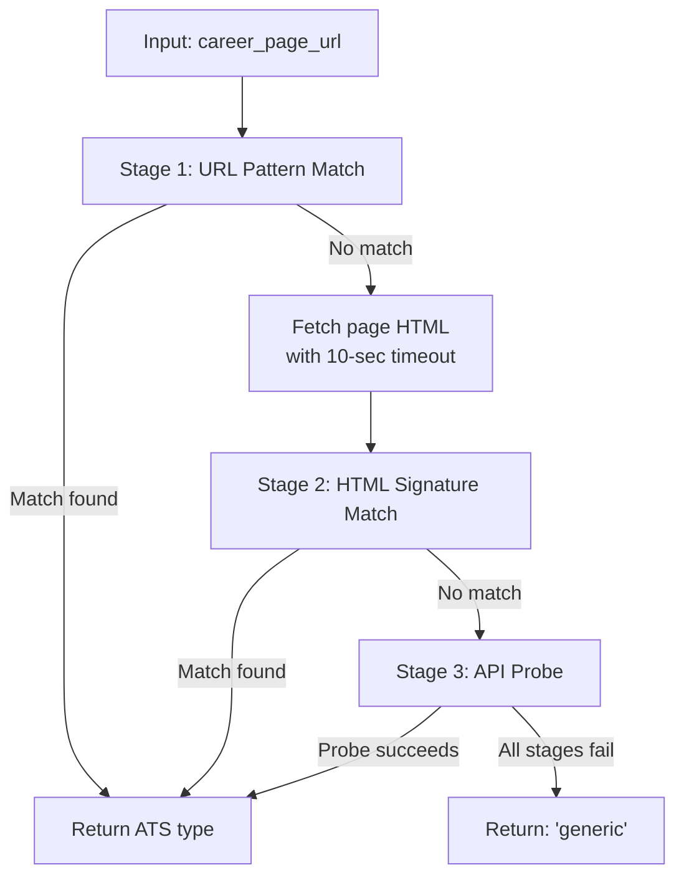
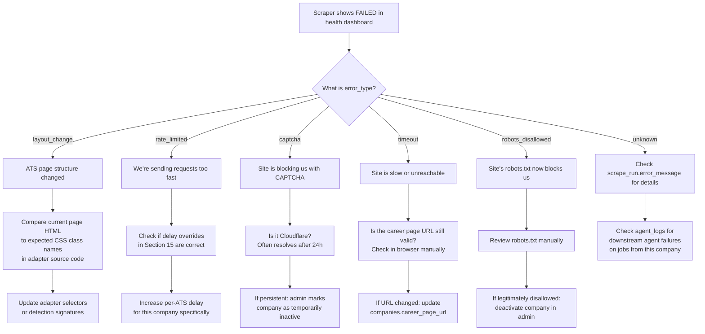

# 09 — Scraper

**Document Version:** 1.0  
**Status:** Active  
**Last Updated:** 2025-06-22  
**Owner:** Engineering Lead  

---

## Purpose of This Document

This document is the complete knowledge base for Job Finder AI's scraping infrastructure. Every adapter, every detection method, every retry strategy, every failure mode, and every output field is documented here. This is the reference an engineer reads before touching a scraper, and the reference a new adapter author reads before writing one. If a scraper behaves in a way not described here, that behavior is either a bug or this document needs updating — one or the other, never both.

---

## Table of Contents

1. [Scraper Architecture Overview](#1-scraper-architecture-overview)
2. [BaseScraper — Shared Infrastructure](#2-basescraper--shared-infrastructure)
3. [ATS Auto-Detector](#3-ats-auto-detector)
4. [Workday Adapter](#4-workday-adapter)
5. [Greenhouse Adapter](#5-greenhouse-adapter)
6. [Lever Adapter](#6-lever-adapter)
7. [iCIMS Adapter](#7-icims-adapter)
8. [Taleo Adapter](#8-taleo-adapter)
9. [Generic HTML Adapter](#9-generic-html-adapter)
10. [SmartRecruiters Adapter (Phase 2)](#10-smartrecruiters-adapter-phase-2)
11. [BreezyHR Adapter (Phase 2)](#11-breezyhr-adapter-phase-2)
12. [Ashby Adapter (Phase 2)](#12-ashby-adapter-phase-2)
13. [Scrape Runner — Orchestration](#13-scrape-runner--orchestration)
14. [Standard Output Schema](#14-standard-output-schema)
15. [Rate Limiting Strategy](#15-rate-limiting-strategy)
16. [Retry & Backoff Strategy](#16-retry--backoff-strategy)
17. [CAPTCHA Handling](#17-captcha-handling)
18. [robots.txt Compliance](#18-robotstxt-compliance)
19. [Common Failure Cases & Debugging](#19-common-failure-cases--debugging)
20. [Adding a New Adapter — Checklist](#20-adding-a-new-adapter--checklist)

---

## 1. Scraper Architecture Overview



### Module Structure

```
scrapers/
├── base_scraper.py          # Abstract base class — shared rate limit, retry, robots.txt
├── ats_detector.py          # Fingerprinting logic for all supported ATS types
├── runner.py                # Orchestrates batch: picks companies, calls adapters, sends to agents
└── adapters/
    ├── workday.py
    ├── greenhouse.py
    ├── lever.py
    ├── icims.py
    ├── taleo.py
    ├── generic.py
    ├── smartrecruiters.py   # Phase 2
    ├── breezyhr.py          # Phase 2
    └── ashby.py             # Phase 2
```

---

## 2. BaseScraper — Shared Infrastructure

Every adapter inherits from `BaseScraper`. This class provides rate limiting, retry logic, robots.txt compliance, user-agent rotation, CAPTCHA detection, and request logging. No adapter should implement these behaviours itself — all shared concerns live here.

### Class Interface

```python
# scrapers/base_scraper.py
from abc import ABC, abstractmethod

class BaseScraper(ABC):
    ats_type: str          # e.g. 'workday' — set by each adapter subclass
    
    @abstractmethod
    def get_job_list(self, company: Company) -> list[RawJobListing]:
        """
        Fetch the list of open positions from the company's ATS.
        Returns a list of RawJobListing objects — see Section 14.
        Must NOT call the AI agent pipeline or save to DB.
        """

    @abstractmethod  
    def get_job_detail(self, job_url: str) -> RawJobDetail:
        """
        Fetch full detail (description, deadline, salary) for a single job.
        Called after get_job_list for each listing returned.
        """

    # Inherited by all adapters — do not override unless necessary:
    def fetch(self, url: str, method="GET", **kwargs) -> httpx.Response:
        """Rate-limited, robot-checked, retry-wrapped HTTP request."""

    def is_allowed_by_robots(self, url: str) -> bool:
        """Check robots.txt for the given URL. Cached per domain for 1 hour."""

    def detect_captcha(self, response: httpx.Response) -> bool:
        """Returns True if the response is a CAPTCHA page."""
```

### User-Agent Pool

```python
USER_AGENTS = [
    "Mozilla/5.0 (Windows NT 10.0; Win64; x64) AppleWebKit/537.36 "
    "(KHTML, like Gecko) Chrome/125.0.0.0 Safari/537.36",

    "Mozilla/5.0 (Macintosh; Intel Mac OS X 10_15_7) AppleWebKit/537.36 "
    "(KHTML, like Gecko) Chrome/124.0.0.0 Safari/537.36",

    "Mozilla/5.0 (X11; Linux x86_64) AppleWebKit/537.36 "
    "(KHTML, like Gecko) Chrome/123.0.0.0 Safari/537.36",

    "Mozilla/5.0 (Windows NT 10.0; Win64; x64; rv:125.0) "
    "Gecko/20100101 Firefox/125.0",
]

def get_user_agent() -> str:
    return random.choice(USER_AGENTS)
```

Request headers sent with every fetch:
```python
DEFAULT_HEADERS = {
    "User-Agent": get_user_agent(),
    "Accept": "text/html,application/xhtml+xml,application/xml;q=0.9,*/*;q=0.8",
    "Accept-Language": "en-US,en;q=0.5",
    "Accept-Encoding": "gzip, deflate, br",
    "DNT": "1",
    "Connection": "keep-alive",
}
```

---

## 3. ATS Auto-Detector

**Source file:** `scrapers/ats_detector.py`  
**Feature reference:** F-SCRP-01

### Detection Algorithm

Detection runs in three stages, in order. The first stage to produce a confident match wins — later stages are skipped.



### Stage 1 — URL Pattern Match

Fast, no HTTP request required.

```python
URL_PATTERNS = {
    "workday":         [r"\.myworkdayjobs\.com", r"workday\.com/.*jobs"],
    "greenhouse":      [r"boards\.greenhouse\.io", r"app\.greenhouse\.io"],
    "lever":           [r"jobs\.lever\.co"],
    "icims":           [r"\.icims\.com"],
    "taleo":           [r"\.taleo\.net", r"oracle\.taleo\.net"],
    "smartrecruiters": [r"careers\.smartrecruiters\.com", r"jobs\.smartrecruiters\.com"],
    "breezyhr":        [r"\.breezy\.hr"],
    "ashby":           [r"jobs\.ashbyhq\.com"],
    "jazzhr":          [r"app\.jazz\.co"],
}
```

### Stage 2 — HTML Signature Match

Fetches the page and checks for unique identifiers in the HTML. Each check is a lightweight string search — no DOM parsing required.

| ATS | HTML Signals (any match wins) |
|---|---|
| Workday | `wd3-app.com` in script src, `data-automation-id="jobPostingPage"` |
| Greenhouse | `id="grnhse_app"`, `boards.greenhouse.io` in script src, `gh-header` class |
| Lever | `jobs.lever.co` in script src, `class="lever-job-listing"`, `lever-jobs-embed` |
| iCIMS | `class="iCIMS_Header"`, `iCIMS_Resumator` in script src, `icims.com` in any href |
| Taleo | `class="TaleoContainer"`, `taleo.net` in action attr, `oracleTaleo` in JS vars |
| SmartRecruiters | `class="smartrecruiters-widget"`, `smartrecruiters.com` in script src |
| BreezyHR | `breezy.hr` in script src, `class="breezy-jobs"` |
| Ashby | `jobs.ashbyhq.com` in any src or href, `ashby-application-form` |

```python
def match_html_signatures(html: str) -> str | None:
    for ats_type, signals in HTML_SIGNATURES.items():
        if any(signal in html for signal in signals):
            return ats_type
    return None
```

### Stage 3 — API Probe

Makes a targeted HTTP request to a known API endpoint for each ATS. Only attempted if URL pattern and HTML signature both fail.

| ATS | Probe URL | Success Condition |
|---|---|---|
| Greenhouse | `{base_url}/embed/job_board` | HTTP 200 with JSON body |
| Lever | `api.lever.co/v0/postings/{slug}` | HTTP 200 with JSON array |
| Ashby | `jobs.ashbyhq.com/{slug}` | HTTP 200 with `"jobPostings"` in body |

```python
def probe_api_endpoints(base_url: str) -> str | None:
    slug = extract_slug(base_url)  # guesses company slug from URL
    for ats_type, probe in API_PROBES.items():
        url = probe["url"].format(base_url=base_url, slug=slug)
        try:
            r = httpx.get(url, timeout=5)
            if r.status_code == 200 and probe["signal"] in r.text:
                return ats_type
        except httpx.RequestError:
            continue
    return None
```

### Detection Result Logging

Every detection result is written to the `scrape_runs` table:
```python
scrape_run.adapter_used = detected_ats_type  # or 'generic'
```

And if the admin manually overrides the detection for a company, that override is stored in `companies.ats_type` and respected on all future scrape runs without re-running detection.

---

## 4. Workday Adapter

**Source file:** `scrapers/adapters/workday.py`  
**Supported ATS:** Workday HCM  
**Companies using it (examples):** Infosys, Wipro, Adobe, Salesforce, Deloitte

### Detection Method

Primary: URL contains `.myworkdayjobs.com`  
Secondary: HTML contains `wd3-app.com` in script src

### How Workday Serves Job Data

Workday exposes a JSON API at a predictable path that is consumed by its own React frontend. We query this API directly — no HTML parsing needed.

```
Endpoint pattern:
https://{company}.wd{N}.myworkdayjobs.com/wday/cxs/{tenant}/jobs

Example:
https://infosys.wd3.myworkdayjobs.com/wday/cxs/Infosys_Careers/jobs
```

The tenant identifier is extracted from the career page URL or discovered by following redirects from the company's career page domain.

### Extraction Logic

```python
# scrapers/adapters/workday.py

class WorkdayAdapter(BaseScraper):
    ats_type = "workday"

    def get_job_list(self, company: Company) -> list[RawJobListing]:
        tenant, api_version = self._discover_tenant(company.career_page_url)
        jobs = []
        offset = 0
        limit = 20

        while True:
            payload = {
                "appliedFacets": {},
                "limit": limit,
                "offset": offset,
                "searchText": ""
            }
            response = self.fetch(
                f"https://{tenant}.wd{api_version}.myworkdayjobs.com"
                f"/wday/cxs/{tenant}/jobs",
                method="POST",
                json=payload
            )
            data = response.json()
            batch = data.get("jobPostings", [])
            if not batch:
                break
            for item in batch:
                jobs.append(RawJobListing(
                    title=item.get("title"),
                    job_url=item.get("externalPath"),
                    location=item.get("locationsText"),
                    company_posted_at=parse_workday_date(item.get("postedOn")),
                    source_ats="workday"
                ))
            offset += limit
            if offset >= data.get("total", 0):
                break
        return jobs

    def get_job_detail(self, job_url: str) -> RawJobDetail:
        # job_url is the externalPath — must be prefixed with base domain
        response = self.fetch(job_url)
        data = response.json()
        job_data = data.get("jobPostingInfo", {})
        return RawJobDetail(
            apply_url=job_data.get("startDate") and job_url,  # apply happens in-iframe
            raw_description=strip_html(job_data.get("jobDescription", "")),
            salary_range=job_data.get("salaryRange"),
            deadline=job_data.get("closingDate")
        )
```

### Pagination

| Field | Value |
|---|---|
| Strategy | Offset + limit in POST body |
| Page size | 20 (Workday's default) |
| Termination | When `offset >= total` from response |
| Max jobs cap | 50 per company per run (configurable via `MAX_JOBS_PER_COMPANY`) |

### Posted Date Parsing

Workday returns dates in the format `"Date_Posted_Range--From--"` or as an ISO string. The parser handles both:

```python
def parse_workday_date(raw: str | None) -> datetime | None:
    if not raw:
        return None
    # Try ISO format first
    try:
        return datetime.fromisoformat(raw.replace("Z", "+00:00"))
    except ValueError:
        pass
    # Try Workday's custom relative format
    # "Date_Posted_Range--From--30+" → approximate 30 days ago
    if "Date_Posted_Range" in raw:
        return None  # Cannot extract exact date; scraped_at used as fallback
    return None
```

### Output JSON Example

```json
{
  "title": "Senior Software Engineer",
  "company": "Infosys",
  "location": "Bengaluru, Karnataka",
  "apply_url": "https://infosys.wd3.myworkdayjobs.com/en-US/Infosys_Careers/job/Bengaluru/Senior-Software-Engineer_REQ-12345/apply",
  "raw_description": "We are looking for a Senior Software Engineer...",
  "company_posted_at": "2025-06-20T00:00:00Z",
  "salary_range": null,
  "deadline": null,
  "source_ats": "workday"
}
```

### Rate Limiting

| Setting | Value |
|---|---|
| Requests per second | Max 1 per 3 seconds per domain |
| Delay between detail page fetches | 2 seconds |
| Concurrent requests | None (sequential only) |

### Common Failure Cases

| Failure | Symptom | Error Type | Action |
|---|---|---|---|
| Tenant discovery fails | 404 on `/wday/cxs/` endpoint | `layout_change` | Log error, try fallback tenant slug |
| API returns empty `jobPostings` array | 0 jobs found | None (normal) | Record as success, jobs_found=0 |
| Workday deprecates API version | 404 on `/wd3/` path | `layout_change` | Try `/wd5/` version; alert admin |
| Company moves to a new Workday subdomain | 301 redirect to new URL | None | Follow redirect; update company.career_page_url |
| Rate limited (429) | HTTP 429 response | `rate_limited` | Back off 60 seconds, retry once |
| CAPTCHA / bot detection | HTML response with no JSON | `captcha` | Log, skip, alert admin |

---

## 5. Greenhouse Adapter

**Source file:** `scrapers/adapters/greenhouse.py`  
**Supported ATS:** Greenhouse (by Rippling)  
**Companies using it (examples):** Razorpay, Swiggy, Zepto, Airbnb, Dropbox

### Detection Method

Primary: URL contains `boards.greenhouse.io` or `app.greenhouse.io`  
Secondary: HTML contains `id="grnhse_app"` or `boards.greenhouse.io` in script src  
API Probe: `{base_url}/embed/job_board` returns valid JSON

### How Greenhouse Serves Job Data

Greenhouse provides a public JSON API specifically designed for job board embeds. This is the cleanest API of all the supported ATS platforms — it returns all jobs for a company in a single response, with no authentication required.

```
Endpoint pattern:
https://boards.greenhouse.io/embed/job_board/for/{company_slug}

Response: JSON with all open positions (no pagination — single request)
```

The `company_slug` is extracted from the career page URL or from the `data-token` attribute of the Greenhouse embed script tag:
```html
<script src="https://boards.greenhouse.io/embed/job_board/js?for={company_slug}"></script>
```

### Extraction Logic

```python
class GreenhouseAdapter(BaseScraper):
    ats_type = "greenhouse"

    def get_job_list(self, company: Company) -> list[RawJobListing]:
        slug = self._extract_slug(company.career_page_url)
        response = self.fetch(
            f"https://boards.greenhouse.io/embed/job_board/for/{slug}"
        )
        data = response.json()
        jobs = []
        for dept in data.get("departments", []):
            for job in dept.get("jobs", []):
                jobs.append(RawJobListing(
                    title=job.get("title"),
                    job_url=job.get("absolute_url"),
                    location=job.get("location", {}).get("name"),
                    company_posted_at=parse_iso(job.get("updated_at")),
                    source_ats="greenhouse"
                ))
        return jobs

    def get_job_detail(self, job_url: str) -> RawJobDetail:
        # Derive job ID from URL: .../jobs/{id}
        job_id = job_url.rstrip("/").split("/")[-1]
        slug = self._extract_slug_from_url(job_url)
        response = self.fetch(
            f"https://boards.greenhouse.io/embed/job_board/for/{slug}/jobs/{job_id}"
        )
        data = response.json()
        return RawJobDetail(
            apply_url=data.get("absolute_url"),
            raw_description=strip_html(data.get("content", "")),
            salary_range=None,  # Greenhouse does not expose salary in the embed API
            deadline=None       # Greenhouse does not expose deadline in the embed API
        )
```

### Pagination

Greenhouse returns all jobs in a single JSON response (no pagination). The response is structured by department:

```json
{
  "departments": [
    {
      "name": "Engineering",
      "jobs": [
        {
          "id": 12345,
          "title": "Backend Engineer",
          "absolute_url": "https://boards.greenhouse.io/razorpay/jobs/12345",
          "location": { "name": "Bengaluru, India" },
          "updated_at": "2025-06-20T10:30:00Z",
          "departments": [{ "name": "Engineering" }]
        }
      ]
    }
  ]
}
```

### Posted Date Note

Greenhouse's `updated_at` is not the original post date — it updates whenever the job description is edited. We store it as `company_posted_at` with an awareness that for Greenhouse jobs, this field represents "last modified" rather than "first posted." The `posted_label` shown to users will still say "X days ago" from this date.

### Output JSON Example

```json
{
  "title": "Backend Engineer",
  "company": "Razorpay",
  "location": "Bengaluru, India",
  "apply_url": "https://boards.greenhouse.io/razorpay/jobs/12345",
  "raw_description": "We are building the future of financial services...",
  "company_posted_at": "2025-06-20T10:30:00Z",
  "salary_range": null,
  "deadline": null,
  "source_ats": "greenhouse"
}
```

### Rate Limiting

| Setting | Value |
|---|---|
| Requests per second | Max 1 per 3 seconds per domain |
| Job list requests | 1 per company (entire list in one call) |
| Detail requests | 1 per job, with 2-second delay between |

### Common Failure Cases

| Failure | Symptom | Error Type | Action |
|---|---|---|---|
| Company slug changed | 404 on embed API | `layout_change` | Re-run slug extraction from career page HTML |
| Company leaves Greenhouse | 404 or redirect to non-Greenhouse page | `layout_change` | Re-run ATS detection; may need adapter change |
| Embed API down (rare) | 5xx response | `unknown` | Retry with backoff; alert after 3 failures |
| Response JSON has unexpected `departments` structure | Parse error | `layout_change` | Log raw response; alert admin |
| Job with null `absolute_url` | Missing apply link | None (field-level) | Skip that job; log missing_field |

---

## 6. Lever Adapter

**Source file:** `scrapers/adapters/lever.py`  
**Supported ATS:** Lever  
**Companies using it (examples):** Freshworks, Meesho, Zomato (some roles), various Series B/C startups

### Detection Method

Primary: URL contains `jobs.lever.co`  
Secondary: HTML contains `jobs.lever.co` in script src or `lever-jobs-embed` class

### How Lever Serves Job Data

Lever provides a JSON API at `api.lever.co/v0/postings/{company}` that returns all postings. Unlike Greenhouse, Lever uses cursor-based pagination for companies with many open roles.

```
Endpoint pattern:
https://api.lever.co/v0/postings/{company_slug}?mode=json
```

### Extraction Logic

```python
class LeverAdapter(BaseScraper):
    ats_type = "lever"

    def get_job_list(self, company: Company) -> list[RawJobListing]:
        slug = self._extract_slug(company.career_page_url)
        jobs = []
        next_cursor = None

        while True:
            params = {"mode": "json", "limit": 100}
            if next_cursor:
                params["offset"] = next_cursor

            response = self.fetch(
                f"https://api.lever.co/v0/postings/{slug}",
                params=params
            )
            data = response.json()

            # Lever returns a flat list (not department-grouped)
            for item in data:
                jobs.append(RawJobListing(
                    title=item.get("text"),
                    job_url=item.get("hostedUrl"),
                    location=item.get("categories", {}).get("location"),
                    company_posted_at=datetime.fromtimestamp(
                        item.get("createdAt", 0) / 1000, tz=timezone.utc
                    ),
                    source_ats="lever"
                ))

            # Lever pagination via Link header
            link_header = response.headers.get("Link", "")
            next_cursor = self._parse_link_header_next(link_header)
            if not next_cursor or not data:
                break

        return jobs

    def get_job_detail(self, job_url: str) -> RawJobDetail:
        response = self.fetch(job_url)
        soup = BeautifulSoup(response.text, "html.parser")

        description = soup.find("div", class_="section-wrapper")
        apply_link = soup.find("a", class_="template-btn-submit")

        return RawJobDetail(
            apply_url=apply_link["href"] if apply_link else job_url,
            raw_description=description.get_text(separator="\n") if description else "",
            salary_range=None,
            deadline=None
        )
```

### Pagination

| Field | Value |
|---|---|
| Strategy | Cursor via `Link` response header |
| Page size | 100 (max Lever allows) |
| Termination | No `Link: <...>; rel="next"` header in response |

The `Link` header format Lever uses:
```
Link: <https://api.lever.co/v0/postings/freshworks?offset=abc123&mode=json>; rel="next"
```

### Posted Date

Lever returns `createdAt` as a Unix timestamp in milliseconds. Converted to UTC datetime.

### Output JSON Example

```json
{
  "title": "Senior Frontend Engineer",
  "company": "Freshworks",
  "location": "Chennai, India",
  "apply_url": "https://jobs.lever.co/freshworks/a1b2c3/apply",
  "raw_description": "About the Role\n\nWe are looking for...",
  "company_posted_at": "2025-06-18T06:00:00Z",
  "salary_range": null,
  "deadline": null,
  "source_ats": "lever"
}
```

### Common Failure Cases

| Failure | Symptom | Error Type | Action |
|---|---|---|---|
| Company slug incorrect | 404 from api.lever.co | `layout_change` | Re-detect slug from career page |
| API returns empty array | 0 jobs | None (normal) | Record success, jobs_found=0 |
| `createdAt` field is 0 or missing | Invalid timestamp | None (field-level) | Set company_posted_at = null |
| Detail page layout change | `section-wrapper` class missing | `layout_change` | Log, send raw HTML to agent as fallback |
| Rate limited by Lever API | HTTP 429 | `rate_limited` | Back off 60 seconds, retry once |

---

## 7. iCIMS Adapter

**Source file:** `scrapers/adapters/icims.py`  
**Supported ATS:** iCIMS Talent Cloud  
**Companies using it (examples):** Infosys (some BUs), TCS, HCL, large enterprise companies

### Detection Method

Primary: URL contains `.icims.com`  
Secondary: HTML contains `class="iCIMS_Header"` or `iCIMS_Resumator` in script src

### How iCIMS Serves Job Data

iCIMS is the most complex adapter. It serves content via iFrames and requires HTML parsing of the embedded career portal pages. There is no clean JSON API like Greenhouse or Lever.

```
Endpoint pattern (varies by company):
https://{company}.icims.com/jobs/search
https://careers.{company}.com/icims/...  (custom domain pointing to iCIMS)
```

### Extraction Logic

```python
class ICIMSAdapter(BaseScraper):
    ats_type = "icims"

    def get_job_list(self, company: Company) -> list[RawJobListing]:
        jobs = []
        page = 1

        while True:
            response = self.fetch(
                company.career_page_url,
                params={"pr": page, "schemaId": 1}  # iCIMS pagination params
            )
            soup = BeautifulSoup(response.text, "html.parser")

            # iCIMS job cards sit in a consistent wrapper
            listings = soup.find_all("div", class_="iCIMS_JobsTable_Row")
            if not listings:
                break

            for row in listings:
                title_el = row.find("h2", class_="iCIMS_JobsTable_Title")
                link_el = row.find("a", class_="iCIMS_Anchor")
                location_el = row.find("span", class_="iCIMS_JobsTable_Location")
                date_el = row.find("span", class_="iCIMS_JobsTable_StartDate")

                if not (title_el and link_el):
                    continue

                jobs.append(RawJobListing(
                    title=title_el.get_text(strip=True),
                    job_url=urljoin(company.career_page_url, link_el["href"]),
                    location=location_el.get_text(strip=True) if location_el else None,
                    company_posted_at=parse_icims_date(date_el.get_text() if date_el else None),
                    source_ats="icims"
                ))
            page += 1

        return jobs

    def get_job_detail(self, job_url: str) -> RawJobDetail:
        response = self.fetch(job_url)
        soup = BeautifulSoup(response.text, "html.parser")

        desc = soup.find("div", class_="iCIMS_JobsTable_JobDescriptionContainer")
        apply_el = soup.find("a", class_="iCIMS_Button_Apply")

        return RawJobDetail(
            apply_url=apply_el["href"] if apply_el else job_url,
            raw_description=desc.get_text(separator="\n") if desc else "",
            salary_range=None,
            deadline=None
        )
```

### Pagination

| Field | Value |
|---|---|
| Strategy | Page number via `pr` query param |
| Termination | Response HTML contains no `iCIMS_JobsTable_Row` elements |
| Known issue | Some iCIMS implementations ignore `pr` and always show page 1 — detected by comparing successive pages and halting if identical |

### Playwright Fallback

iCIMS career pages that load listings via client-side JavaScript (increasingly common) cannot be scraped with httpx alone. The adapter automatically falls back to Playwright when the initial httpx response contains fewer than 3 job rows but the page has `iCIMS` signals suggesting jobs should exist:

```python
def get_job_list(self, company: Company) -> list[RawJobListing]:
    jobs = self._fetch_with_httpx(company)
    if len(jobs) < 3 and self._page_suggests_jobs_exist(company.career_page_url):
        jobs = self._fetch_with_playwright(company)
    return jobs
```

### Common Failure Cases

| Failure | Symptom | Error Type | Action |
|---|---|---|---|
| CSS class names changed | Zero rows found despite live jobs | `layout_change` | Log raw HTML excerpt; alert admin |
| iFrame source domain blocked | httpx gets iFrame shell, not job content | `layout_change` | Playwright fallback triggered |
| `pr` param ignored, infinite loop | Same jobs returned on every page | None | Duplicate detection halts loop |
| Extremely slow iCIMS instance | Timeout on detail page fetch | `timeout` | Retry once with 15-sec timeout |

---

## 8. Taleo Adapter

**Source file:** `scrapers/adapters/taleo.py`  
**Supported ATS:** Oracle Taleo Enterprise  
**Companies using it (examples):** TCS, Wipro, large enterprise and government-adjacent companies

### Detection Method

Primary: URL contains `.taleo.net` or `oracle.taleo.net`  
Secondary: HTML contains `class="TaleoContainer"` or `taleo.net` in form action attribute

### How Taleo Serves Job Data

Taleo exposes a REST API at a predictable path. The `careersection` identifier varies per company but is discoverable from the career page's source.

```
Endpoint pattern:
https://{tenant}.taleo.net/careersection/rest/jobboard/searchjobs
  ?multiLocationSearch=true
  &start=0
  &pageSize=25
  &lang=en&portal=RSS
```

### Extraction Logic

```python
class TaleoAdapter(BaseScraper):
    ats_type = "taleo"

    def get_job_list(self, company: Company) -> list[RawJobListing]:
        tenant = self._extract_tenant(company.career_page_url)
        careersection = self._discover_careersection(company.career_page_url)
        jobs = []
        start = 0
        page_size = 25

        while True:
            response = self.fetch(
                f"https://{tenant}.taleo.net/careersection/rest/jobboard/searchjobs",
                params={
                    "multiLocationSearch": "true",
                    "start": start,
                    "pageSize": page_size,
                    "lang": "en",
                    "portal": careersection
                }
            )
            data = response.json()
            req_list = data.get("requisitionList", [])
            if not req_list:
                break

            for item in req_list:
                jobs.append(RawJobListing(
                    title=item.get("title"),
                    job_url=self._build_job_url(tenant, careersection, item.get("contestNo")),
                    location=item.get("primaryLocation"),
                    company_posted_at=parse_taleo_date(item.get("referenceDate")),
                    source_ats="taleo"
                ))
            start += page_size
            if start >= data.get("totalCount", 0):
                break

        return jobs

    def get_job_detail(self, job_url: str) -> RawJobDetail:
        response = self.fetch(job_url)
        soup = BeautifulSoup(response.text, "html.parser")
        desc = soup.find("div", id="JD")
        apply_link = soup.find("a", id="ftlbtn")
        return RawJobDetail(
            apply_url=apply_link["href"] if apply_link else job_url,
            raw_description=desc.get_text(separator="\n") if desc else "",
            salary_range=None,
            deadline=None
        )
```

### Pagination

| Field | Value |
|---|---|
| Strategy | `start` offset + `pageSize` in query params |
| Page size | 25 |
| Termination | `start >= totalCount` from response |

### Common Failure Cases

| Failure | Symptom | Error Type | Action |
|---|---|---|---|
| `careersection` identifier not discoverable | 404 on API endpoint | `layout_change` | Try common defaults (`CX_1`, `RSS`); alert admin if all fail |
| Tenant subdomain changed | DNS failure | `unknown` | Alert admin; check company career page URL for redirect |
| `referenceDate` field missing | Null posted date | None (field-level) | Set company_posted_at = null |
| Taleo returns XML instead of JSON | Parse error | `layout_change` | Fall back to XML parser; log format change |

---

## 9. Generic HTML Adapter

**Source file:** `scrapers/adapters/generic.py`  
**Used when:** ATS detection returns `"generic"` — company uses a custom career page with no recognized ATS

### Purpose

A best-effort fallback that extracts job listings from arbitrary HTML using common patterns and heuristics. Expected accuracy is lower than ATS-specific adapters. All jobs extracted by this adapter are automatically flagged with `extraction_confidence` reduced by 0.15 (applied in the Job Extractor agent) to ensure admin review.

### Heuristics Applied

```python
class GenericAdapter(BaseScraper):
    ats_type = "generic"

    # Selectors tried in order until one returns results
    JOB_LIST_SELECTORS = [
        ("article", {}),
        ("div", {"class": re.compile(r"job.?(card|listing|item|posting)", re.I)}),
        ("li", {"class": re.compile(r"job|position|opening|vacancy", re.I)}),
        ("tr", {"class": re.compile(r"job|position", re.I)}),
    ]

    TITLE_SELECTORS = [
        ("h1", {}), ("h2", {}), ("h3", {}),
        ("a", {"class": re.compile(r"title|position|job.?name", re.I)}),
    ]

    LOCATION_SELECTORS = [
        ("span", {"class": re.compile(r"location|city|office", re.I)}),
        ("div", {"class": re.compile(r"location|city", re.I)}),
    ]
```

### When Playwright is Used

The generic adapter always uses Playwright (not httpx) since custom career pages are the most likely to be JS-rendered. The Playwright instance renders the page fully before passing HTML to BeautifulSoup:

```python
async def _render_page(self, url: str) -> str:
    async with async_playwright() as p:
        browser = await p.chromium.launch(headless=True)
        page = await browser.new_page()
        await page.set_extra_http_headers(DEFAULT_HEADERS)
        await page.goto(url, wait_until="networkidle", timeout=30000)
        content = await page.content()
        await browser.close()
        return content
```

### Output Confidence Penalty

All jobs from the generic adapter are written to the `jobs` table with `extraction_confidence` pre-reduced by 0.15, and `needs_review = true`, putting them in the admin review queue (F-ADMN-03).

---

## 10. SmartRecruiters Adapter (Phase 2)

**Source file:** `scrapers/adapters/smartrecruiters.py`  
**Priority:** P2 — Phase 2

### Overview

SmartRecruiters provides a public REST API: `api.smartrecruiters.com/v1/companies/{slug}/postings`. Returns JSON with all postings; no authentication required. Pagination via `offset` and `limit` params.

**Key fields:**
- `name` → title
- `location.city` + `location.country` → location
- `releasedDate` → company_posted_at (ISO format)
- `ref` → apply_url (the job's SmartRecruiters posting URL)

This adapter is straightforward once detection identifies the company slug. Implementation is deferred to Phase 2.

---

## 11. BreezyHR Adapter (Phase 2)

**Source file:** `scrapers/adapters/breezyhr.py`  
**Priority:** P2 — Phase 2

### Overview

BreezyHR exposes jobs at `{company}.breezy.hr/positions`. The page is a JS-rendered SPA but exposes a JSON data endpoint at `{company}.breezy.hr/positions?_data=routes%2F_positions` (an internal Remix-style route). Extracting from this JSON endpoint is preferred over full Playwright rendering for performance.

Implementation deferred to Phase 2.

---

## 12. Ashby Adapter (Phase 2)

**Source file:** `scrapers/adapters/ashby.py`  
**Priority:** P2 — Phase 2

### Overview

Ashby provides a GraphQL API at `jobs.ashbyhq.com/api/non-user-graphql` that powers their job listing pages. The query to fetch all postings for a company is:

```graphql
query ApiJobBoardWithTeams($organizationHostedJobsPageName: String!) {
  jobBoard: jobBoardWithTeams(
    organizationHostedJobsPageName: $organizationHostedJobsPageName
  ) {
    jobPostings {
      id
      title
      departmentName
      locationName
      employmentType
      publishedDate
      jobPostingState
    }
  }
}
```

This is increasingly common among Series A/B startups. Implementation deferred to Phase 2.

---

## 13. Scrape Runner — Orchestration

**Source file:** `scrapers/runner.py`

The runner is the coordinator between the scheduler, adapters, and the AI agent pipeline. It owns the batch selection logic and the per-company error handling that prevents one broken adapter from stopping the entire batch.

### Core Loop

```python
# scrapers/runner.py

async def run_scrape_batch():
    """Called by APScheduler every 15 minutes."""
    companies = await db.fetch_companies_due_for_scrape(
        batch_size=settings.SCRAPE_BATCH_SIZE  # default 20
    )

    for company in companies:
        run = ScapeRun(company_id=company.id, started_at=now())
        try:
            await _scrape_company(company, run)
        except ScraperFailure as e:
            run.status = "failed"
            run.error_message = e.human_message
            run.error_type = e.error_type
            await increment_consecutive_failures(company.id)
            await check_and_send_admin_alert(company.id)
        except Exception as e:
            run.status = "failed"
            run.error_message = f"Unexpected error: {type(e).__name__}"
            run.error_type = "unknown"
            log.exception(f"Unhandled error scraping {company.name}")
        finally:
            run.completed_at = now()
            run.duration_seconds = (run.completed_at - run.started_at).total_seconds()
            await db.save_scrape_run(run)
            await db.update_company_last_scraped(company.id)

async def _scrape_company(company: Company, run: ScrapeRun):
    # 1. robots.txt check
    if not is_allowed_by_robots(company.career_page_url):
        run.status = "success"
        run.error_type = "robots_disallowed"
        return

    # 2. Select adapter
    ats_type = company.ats_type or detect_ats(company.career_page_url)
    adapter = get_adapter(ats_type)
    run.adapter_used = ats_type

    # 3. Fetch job list
    raw_jobs = await adapter.get_job_list(company)
    run.jobs_found = len(raw_jobs)

    # 4. Process each job
    for raw_job in raw_jobs[:settings.MAX_JOBS_PER_COMPANY]:
        detail = await adapter.get_job_detail(raw_job.job_url)
        merged = merge(raw_job, detail, company)

        if is_duplicate(merged):
            run.jobs_duplicate += 1
            continue

        await enqueue_for_agents(merged)
        run.jobs_new += 1

    # 5. Reset consecutive failures on success
    await reset_consecutive_failures(company.id)
    run.status = "success" if run.jobs_new > 0 or run.jobs_found == 0 else "partial"
```

### Batch Selection Query

```sql
SELECT * FROM companies
WHERE active = true
ORDER BY last_scraped_at ASC NULLS FIRST
LIMIT $1;
```

Companies never scraped (`last_scraped_at IS NULL`) are prioritized via `NULLS FIRST`. Companies scraped least recently are prioritized next.

---

## 14. Standard Output Schema

Every adapter, regardless of ATS type, must produce job objects that conform to this schema before they are handed to the AI agent pipeline. Fields marked `required` will cause the job to be skipped if null.

```python
@dataclass
class RawJobListing:
    """Returned by get_job_list() — lightweight, one per listing on the ATS page."""
    title: str                          # required
    job_url: str                        # required — detail page URL
    location: str | None
    company_posted_at: datetime | None
    source_ats: str                     # required — e.g. 'greenhouse'

@dataclass
class RawJobDetail:
    """Returned by get_job_detail() — one per job URL fetched."""
    apply_url: str                      # required — ATS application form URL
    raw_description: str | None
    salary_range: str | None
    deadline: date | None

@dataclass
class MergedRawJob:
    """Produced by the runner after merging listing + detail. Sent to agents."""
    title: str
    company: str
    location: str | None
    job_url: str
    apply_url: str
    raw_description: str | None
    company_posted_at: datetime | None
    salary_range: str | None
    deadline: date | None
    source_ats: str
```

### JSON representation (for agent queue):

```json
{
  "title": "Backend Engineer",
  "company": "Razorpay",
  "location": "Bengaluru, India",
  "job_url": "https://boards.greenhouse.io/razorpay/jobs/12345",
  "apply_url": "https://boards.greenhouse.io/razorpay/jobs/12345",
  "raw_description": "Full job description...",
  "company_posted_at": "2025-06-20T10:30:00Z",
  "salary_range": null,
  "deadline": null,
  "source_ats": "greenhouse"
}
```

---

## 15. Rate Limiting Strategy

Rate limiting is applied at the `BaseScraper.fetch()` level — every adapter inherits it automatically. No adapter code should implement its own sleep/delay.

### Per-Domain Limiter

```python
# Redis key: ratelimit:scrape:{domain}
# Strategy: token bucket — 1 token per 3 seconds per domain

async def rate_limit(domain: str):
    key = f"ratelimit:scrape:{domain}"
    now = time.monotonic()
    last = float(await redis.get(key) or 0)
    wait = max(0.0, 3.0 - (now - last))
    if wait > 0:
        await asyncio.sleep(wait)
    await redis.set(key, now, ex=60)
```

### Per-ATS Delay Overrides

Some ATS platforms are more aggressive in detecting scraper traffic. Delay overrides are applied on top of the base 3-second rule:

| ATS | Delay Between Requests |
|---|---|
| Workday | 3 seconds (base) |
| Greenhouse | 2 seconds (more permissive JSON API) |
| Lever | 2 seconds (public API) |
| iCIMS | 5 seconds (stricter bot detection) |
| Taleo | 4 seconds (older infrastructure, slower) |
| Generic | 5 seconds (conservative, unknown infrastructure) |

### Between Detail-Page Fetches

After every job detail page fetch, an additional 2-second delay is applied regardless of domain — fetching 50 detail pages in rapid succession is the most common pattern that triggers bot detection:

```python
for raw_job in raw_jobs:
    detail = await adapter.get_job_detail(raw_job.job_url)
    await asyncio.sleep(2)  # always, regardless of rate limit
```

---

## 16. Retry & Backoff Strategy

Retry logic lives in `BaseScraper.fetch()`. It handles transient network failures, server errors, and temporary rate limits.

### Retry Rules

```python
RETRYABLE_STATUS_CODES = {429, 500, 502, 503, 504}
NON_RETRYABLE_STATUS_CODES = {400, 401, 403, 404, 410}
MAX_RETRIES = 3
BACKOFF_BASE = 2  # seconds

async def fetch(self, url: str, **kwargs) -> httpx.Response:
    for attempt in range(MAX_RETRIES):
        try:
            response = await self.client.request(
                method=kwargs.pop("method", "GET"),
                url=url,
                headers=DEFAULT_HEADERS,
                timeout=30,
                **kwargs
            )
            if response.status_code in NON_RETRYABLE_STATUS_CODES:
                raise ScraperFailure(
                    f"HTTP {response.status_code} — not retrying",
                    error_type="layout_change" if response.status_code == 404 else "unknown"
                )
            if response.status_code in RETRYABLE_STATUS_CODES:
                raise RetryableError(f"HTTP {response.status_code}")
            if self.detect_captcha(response):
                raise ScraperFailure("CAPTCHA detected", error_type="captcha")
            return response

        except (httpx.TimeoutException, httpx.ConnectError) as e:
            if attempt == MAX_RETRIES - 1:
                raise ScraperFailure(str(e), error_type="timeout")
        except RetryableError:
            if attempt == MAX_RETRIES - 1:
                raise ScraperFailure(f"Failed after {MAX_RETRIES} retries", error_type="rate_limited")

        backoff = BACKOFF_BASE ** (attempt + 1)  # 2s, 4s, 8s
        log.warning(f"Retry {attempt + 1}/{MAX_RETRIES} for {url} in {backoff}s")
        await asyncio.sleep(backoff)
```

### Retry Decision Table

| Condition | Retry? | Backoff | Error Type if All Fail |
|---|---|---|---|
| HTTP 429 Too Many Requests | ✅ Yes | 2s, 4s, 8s | `rate_limited` |
| HTTP 500/502/503/504 | ✅ Yes | 2s, 4s, 8s | `unknown` |
| HTTP 404 Not Found | ❌ No | — | `layout_change` |
| HTTP 403 Forbidden | ❌ No | — | `layout_change` |
| httpx.TimeoutException | ✅ Yes | 2s, 4s, 8s | `timeout` |
| httpx.ConnectError (DNS) | ✅ Yes | 2s, 4s, 8s | `unknown` |
| CAPTCHA detected | ❌ No | — | `captcha` |
| robots.txt disallowed | ❌ No (skip, not fail) | — | `robots_disallowed` |

---

## 17. CAPTCHA Handling

CAPTCHAs are detected but never bypassed. The platform does not use CAPTCHA-solving services.

### Detection Heuristics

```python
CAPTCHA_SIGNALS = [
    "captcha",
    "cf-challenge",           # Cloudflare Turnstile
    "hcaptcha",               # hCaptcha
    "recaptcha",              # Google reCAPTCHA
    "challenge-form",         # Cloudflare challenge
    "Please verify you are a human",
    "Access denied",
    "Bot detection",
]

def detect_captcha(self, response: httpx.Response) -> bool:
    if response.status_code in (403, 503):
        body_lower = response.text[:2000].lower()
        return any(signal.lower() in body_lower for signal in CAPTCHA_SIGNALS)
    return False
```

### Handling Flow

```
CAPTCHA detected
    ↓
ScraperFailure raised with error_type = 'captcha'
    ↓
Runner catches → scrape_run.status = 'failed', error_type = 'captcha'
    ↓
company.consecutive_failures += 1
    ↓
If consecutive_failures >= 3 → admin Telegram alert
    ↓
Company retried on next 15-minute cycle
    (CAPTCHAs are often transient — Cloudflare bot challenge, not permanent ban)
```

### What We Do NOT Do

- We do not use 2Captcha, Anti-Captcha, or any CAPTCHA-solving service
- We do not store or replay CAPTCHA tokens
- We do not attempt to disguise traffic as a specific browser beyond User-Agent rotation

---

## 18. robots.txt Compliance

robots.txt compliance is checked before the first request to any URL in a domain. The result is cached in Redis for 1 hour to avoid repeated fetches.

### Implementation

```python
from urllib.robotparser import RobotFileParser

ROBOTS_CACHE_TTL = 3600  # 1 hour

async def is_allowed_by_robots(url: str) -> bool:
    domain = extract_domain(url)
    cache_key = f"robots:{domain}"

    cached = await redis.get(cache_key)
    if cached is not None:
        rules = RobotFileParser()
        rules.parse(cached.splitlines())
    else:
        robots_url = f"https://{domain}/robots.txt"
        try:
            response = await httpx.get(robots_url, timeout=5)
            rules_text = response.text if response.status_code == 200 else ""
        except httpx.RequestError:
            rules_text = ""  # If robots.txt is unreachable, assume allowed
        await redis.set(cache_key, rules_text, ex=ROBOTS_CACHE_TTL)
        rules = RobotFileParser()
        rules.parse(rules_text.splitlines())

    return rules.can_fetch("JobFinderAI-Bot/1.0", url)
```

### Our Bot Identity

All requests identify as:
```
User-Agent: JobFinderAI-Bot/1.0
```
in the robots.txt check (even though actual HTTP requests rotate through realistic browser user-agents). This ensures we correctly respect any rules specifically targeting crawlers.

### Logging Disallowed Paths

When a URL is disallowed by robots.txt:
```python
scrape_run.status = "success"          # Not a failure — deliberate compliance
scrape_run.error_type = "robots_disallowed"
scrape_run.error_message = f"robots.txt disallows scraping {url}"
```
This is logged as a success (not failure) so it doesn't trigger the consecutive-failure alert. Karan can review it in the health dashboard as an informational entry.

---

## 19. Common Failure Cases & Debugging

This section is the first reference for diagnosing a failing scraper from the admin dashboard.

### Diagnosis Decision Tree



### Quick Debug Commands

```bash
# Test a specific company's scraper from the CLI (scripts/test_scraper.py)
python scripts/test_scraper.py --company-id 42

# Manually trigger a scrape run for one company
python scripts/test_scraper.py --company-id 42 --run-now

# Check the raw HTML a specific URL returns
python scripts/test_scraper.py --url "https://boards.greenhouse.io/razorpay"

# Show last 10 scrape_runs for a company
python scripts/test_scraper.py --company-id 42 --show-runs
```

---

## 20. Adding a New Adapter — Checklist

Use this checklist every time a new ATS adapter is added.

### Pre-Implementation

- [ ] Verify the ATS is in the Phase 2+ roadmap (check `16_ROADMAP.md`)
- [ ] Research the ATS's job listing mechanism: public JSON API, HTML parsing, or JS-rendered?
- [ ] Find 3 real companies using this ATS to test against
- [ ] Add detection signatures (URL pattern + HTML signals) to `ats_detector.py`
- [ ] Document the detection method in this file under a new section (copy the template from Section 4)

### Implementation

- [ ] Create `scrapers/adapters/{ats_name}.py`
- [ ] Subclass `BaseScraper` — do not duplicate retry, rate limit, or robots.txt logic
- [ ] Implement `get_job_list()` returning `list[RawJobListing]`
- [ ] Implement `get_job_detail()` returning `RawJobDetail`
- [ ] Ensure `apply_url` is always the direct ATS application URL, not the job posting overview page
- [ ] Ensure `company_posted_at` is in UTC; use `None` if genuinely unavailable (not `datetime.now()`)
- [ ] Register the adapter in `scrapers/runner.py`'s `get_adapter()` dispatch function

### Testing

- [ ] Unit test with 3 real company career pages (use `scripts/test_scraper.py`)
- [ ] Verify pagination works: a company with >1 page of results returns all jobs
- [ ] Verify the adapter handles `0 jobs found` gracefully (not an error)
- [ ] Verify CAPTCHA detection works (mock a CAPTCHA response in tests)
- [ ] Verify rate limiting applies (check Redis after a run)

### Documentation

- [ ] Add ATS to the detection signatures table in Section 3
- [ ] Write a full adapter section in this document (Sections 4–12 as template)
- [ ] Update the adapter list in `05_ARCHITECTURE.md` Section 2.4
- [ ] Update `03_FEATURES.md` adapter feature entry status to Active
- [ ] Add entry to `18_DECISIONS.md` if any architectural decision was made during implementation
- [ ] Update `22_CHANGELOG.md`

---

*This document is the team's knowledge base for everything scraping. When a scraper breaks in production, this document should be the first place an engineer looks — not the source code. If the answer isn't here, the fix must be accompanied by an update here so the next engineer benefits.*