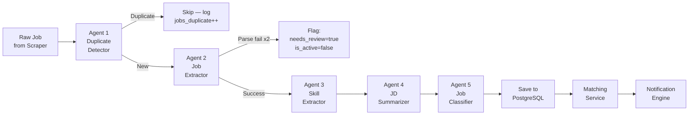
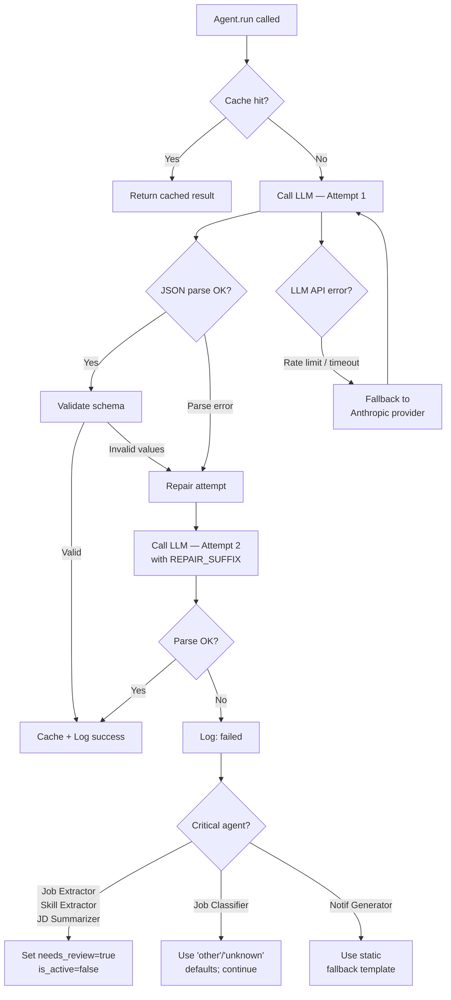

# 10 — AI Agents

**Document Version:** 1.0  
**Status:** Active  
**Last Updated:** 2025-06-22  
**Owner:** Engineering Lead  

---

## Purpose of This Document

This is the complete reference for every AI agent in Job Finder AI's processing pipeline. Each agent is documented end-to-end: its purpose, inputs, outputs, prompt template, memory and caching strategy, retry rules, and all known failure modes. Every prompt used in production must be versioned here in `20_PROMPTS.md` and referenced from this document — no prompt should ever live only in source code.

This document is the reference point when:
- Building a new agent
- Debugging why an agent produced bad output
- Deciding which model to use for a new use case
- Calculating LLM cost per job processed

---

## Table of Contents

1. [Agent Architecture Overview](#1-agent-architecture-overview)
2. [BaseAgent — Shared Infrastructure](#2-baseagent--shared-infrastructure)
3. [Agent 1 — Duplicate Detector](#3-agent-1--duplicate-detector)
4. [Agent 2 — Job Extractor](#4-agent-2--job-extractor)
5. [Agent 3 — Skill Extractor](#5-agent-3--skill-extractor)
6. [Agent 4 — JD Summarizer](#6-agent-4--jd-summarizer)
7. [Agent 5 — Job Classifier](#7-agent-5--job-classifier)
8. [Agent 6 — Notification Generator](#8-agent-6--notification-generator)
9. [Agent 7 — Resume Skill Extractor (Phase 2)](#9-agent-7--resume-skill-extractor-phase-2)
10. [Agent 8 — Match Score Calculator (Phase 3)](#10-agent-8--match-score-calculator-phase-3)
11. [LLM Provider Configuration](#11-llm-provider-configuration)
12. [Caching Strategy](#12-caching-strategy)
13. [Cost Model](#13-cost-model)
14. [Agent Logging](#14-agent-logging)
15. [Failure Handling Reference](#15-failure-handling-reference)
16. [Adding a New Agent — Checklist](#16-adding-a-new-agent--checklist)

---

## 1. Agent Architecture Overview

### Pipeline Sequence

Every new job scraped by the scraper pipeline flows through agents in a fixed, sequential order. No agent is optional for P0 jobs — all five must succeed before the job is saved to the database and matched to users.



### Agent-to-Model Assignment

| Agent | Type | Model | Rationale |
|---|---|---|---|
| Duplicate Detector | Deterministic | None — hash-based | No LLM needed; pure computation |
| Job Extractor | LLM | GPT-4o | Highest-stakes; nuance matters; errors cascade |
| Skill Extractor | LLM | GPT-4o | Skill nuance + `degree_required` signal needs strong reading |
| JD Summarizer | LLM | GPT-4o | User-facing quality directly impacts trust |
| Job Classifier | LLM | GPT-4o-mini | Bounded classification task; cheaper model sufficient |
| Notification Generator | LLM | GPT-4o-mini | Template-heavy; summarized inputs reduce complexity |
| Resume Skill Extractor | LLM | GPT-4o | PDF content varies wildly; needs strong extraction |
| Match Score Calculator | Deterministic | None — scoring logic | Computed from structured data already extracted |

### Timing Budget per Job

| Stage | Target Latency | Notes |
|---|---|---|
| Duplicate Detector | < 10ms | Single indexed DB lookup |
| Job Extractor | < 8 sec | LLM call, 4o |
| Skill Extractor | < 5 sec | LLM call, 4o |
| JD Summarizer | < 6 sec | LLM call, 4o |
| Job Classifier | < 3 sec | LLM call, 4o-mini |
| DB write + matching | < 500ms | Indexed queries |
| **Total per job** | **< 25 sec** | From raw scrape to notification queued |

---

## 2. BaseAgent — Shared Infrastructure

All LLM-calling agents inherit from `BaseAgent`. This class handles: prompt loading from config, LLM API calls, JSON parsing and repair, retry logic, Redis caching by input hash, and logging to `agent_logs`.

```python
# agents/base_agent.py
from abc import ABC, abstractmethod
import hashlib, json
from datetime import datetime

class BaseAgent(ABC):

    agent_name: str          # e.g. 'job_extractor'
    prompt_version: str      # e.g. 'extractor_v1' — must match docs/20_PROMPTS.md
    model: str               # e.g. 'gpt-4o', 'gpt-4o-mini'
    cache_ttl: int = 86400   # 24 hours default; override per agent

    @abstractmethod
    def build_prompt(self, input_data: dict) -> str:
        """Construct the full prompt string from the versioned template."""

    @abstractmethod
    def parse_output(self, raw_response: str) -> dict:
        """Parse and validate LLM response into expected output schema.
        Must raise ParseError on any validation failure."""

    def run(self, input_data: dict) -> dict:
        """Main entrypoint. Checks cache, calls LLM, parses, logs."""
        prompt = self.build_prompt(input_data)
        input_hash = self._hash(prompt)
        start = datetime.utcnow()

        # 1. Cache check
        if cached := self._get_cache(input_hash):
            return cached

        # 2. First LLM attempt
        raw = self._call_llm(prompt)
        try:
            result = self.parse_output(raw)
        except ParseError:
            # 3. Repair attempt — explicit JSON instruction appended
            repair_prompt = prompt + REPAIR_SUFFIX
            raw = self._call_llm(repair_prompt)
            try:
                result = self.parse_output(raw)
                status = "retried"
            except ParseError as e:
                self._log(input_hash, None, "failed", start, str(e))
                raise AgentFailure(
                    f"{self.agent_name} failed after repair attempt",
                    agent=self.agent_name
                )
        else:
            status = "success"

        # 4. Cache and log
        self._set_cache(input_hash, result)
        latency_ms = int((datetime.utcnow() - start).total_seconds() * 1000)
        self._log(input_hash, result, status, start, latency_ms=latency_ms)
        return result

    # ---- Private helpers ----

    def _hash(self, text: str) -> str:
        return hashlib.sha256(text.encode()).hexdigest()

    def _get_cache(self, input_hash: str) -> dict | None:
        key = f"agent_cache:{self.agent_name}:{input_hash}"
        raw = redis.get(key)
        return json.loads(raw) if raw else None

    def _set_cache(self, input_hash: str, result: dict):
        key = f"agent_cache:{self.agent_name}:{input_hash}"
        redis.set(key, json.dumps(result), ex=self.cache_ttl)

    def _call_llm(self, prompt: str) -> str:
        return llm_client.complete(
            model=self.model,
            prompt=prompt,
            max_tokens=1500,
            temperature=0.1,    # Low temperature for deterministic structured output
            response_format={"type": "json_object"}
        )

    def _log(self, input_hash, output_json, status, start, error=None, latency_ms=None):
        agent_logs.insert(AgentLog(
            agent_name=self.agent_name,
            prompt_version=self.prompt_version,
            model_used=self.model,
            input_hash=input_hash,
            output_json=output_json,
            status=status,
            latency_ms=latency_ms,
            error_message=error
        ))
```

### JSON Repair Suffix

When the first LLM response fails JSON parsing, this suffix is appended to the prompt and the call is retried once:

```python
REPAIR_SUFFIX = """

IMPORTANT: Your previous response could not be parsed as valid JSON.
Please respond ONLY with a valid JSON object. No markdown code blocks,
no explanation text, no trailing commas. Only a raw JSON object that
starts with { and ends with }.
"""
```

---

## 3. Agent 1 — Duplicate Detector

**File:** `agents/duplicate_detector.py`  
**Type:** Deterministic (no LLM)  
**Feature:** F-AGNT-01  

### Purpose

Prevent the same job from being stored and notified about multiple times. A job may be scraped repeatedly — every 15 minutes for a company that posts infrequently — so deduplication is the first gate in the pipeline.

### Input

```python
@dataclass
class DuplicateDetectorInput:
    title: str
    company: str
    apply_url: str
```

### Logic

```python
# agents/duplicate_detector.py

def normalize(s: str) -> str:
    return (
        s.lower()
         .strip()
         .replace("\u2013", "-")   # en dash
         .replace("\u2014", "-")   # em dash
         .replace("\u200b", "")    # zero-width space
         .replace("\xa0", " ")     # non-breaking space
    )
    # collapse multiple spaces last
    import re
    return re.sub(r"\s+", " ", s).strip()

def compute_hash(title: str, company: str, apply_url: str) -> str:
    canonical = (
        normalize(title) + "|" +
        normalize(company) + "|" +
        normalize(apply_url)
    )
    return hashlib.sha256(canonical.encode()).hexdigest()

def is_duplicate(input: DuplicateDetectorInput) -> bool:
    h = compute_hash(input.title, input.company, input.apply_url)
    return db.jobs.exists(content_hash=h)
```

### Output

```python
@dataclass
class DuplicateDetectorResult:
    is_duplicate: bool
    content_hash: str    # Always returned — used as jobs.content_hash on insert
```

### Caching

No Redis cache — the check is a single indexed database lookup (<10ms). Redis caching would not improve on this.

### Retry Strategy

None. This is a deterministic check. If the DB lookup fails (connection error), it raises immediately and the scrape runner logs the failure. The job will be re-attempted on the next 15-minute cycle.

### Failure Handling

| Failure | Handling |
|---|---|
| DB connection error | Propagated up to scrape runner; entire company's job batch is aborted for this run |
| Same job reposted with different title | Hash differs → treated as new job. Semantic deduplication is a Phase 3 enhancement |
| Same job on two ATS portals | Different `apply_url` → different hash → two records in DB. Intentional: different apply paths are different UX experiences for the student |

---

## 4. Agent 2 — Job Extractor

**File:** `agents/job_extractor.py`  
**Model:** GPT-4o  
**Prompt Version:** `extractor_v1` (see `20_PROMPTS.md`)  
**Feature:** F-AGNT-02  

### Purpose

Transform raw job description text (HTML-stripped, possibly messy) into a clean, structured record with all fields the rest of the pipeline and frontend need. This is the most important agent — extraction errors cascade to every downstream step.

### Input

```python
@dataclass
class JobExtractorInput:
    raw_description: str       # Full job description text, HTML stripped
    title: str                 # From scraper — used as fallback if LLM can't extract
    company: str               # From scraper — trusted source of truth
    apply_url: str             # From scraper — trusted, NOT overridden by LLM
    source_ats: str            # e.g. 'greenhouse'
```

### Output Schema

```json
{
  "title": "Software Engineer — Backend",
  "location": "Bengaluru, Karnataka",
  "location_type": "hybrid",
  "salary_range": "₹12–18 LPA",
  "deadline": "2025-07-15",
  "extraction_confidence": 0.92
}
```

| Field | Type | Notes |
|---|---|---|
| `title` | string | Cleaned title — remove job codes like `[REQ-12345]` |
| `location` | string \| null | Normalized city/state format |
| `location_type` | `remote` \| `hybrid` \| `onsite` \| null | From JD language |
| `salary_range` | string \| null | Original string preserved; do not convert to numbers |
| `deadline` | `YYYY-MM-DD` \| null | Application close date only; ignore internal review dates |
| `extraction_confidence` | float 0.0–1.0 | Self-assessed by LLM; below 0.75 triggers admin review |

### Prompt Template

*Full prompt text lives in `20_PROMPTS.md` under `extractor_v1`. Reproduced here for context:*

```
You are a job data extraction specialist. Extract structured information 
from the following job description.

Company (already known, do not re-extract): {company}
ATS Source: {source_ats}
Raw Title (from ATS, may contain codes): {title}
Raw Job Description:
---
{raw_description}
---

Return ONLY a JSON object with these exact fields:
{
  "title": "cleaned job title without codes or special chars",
  "location": "City, State or Country (null if not mentioned)",
  "location_type": "remote|hybrid|onsite|null",
  "salary_range": "original salary string as written (null if not mentioned)",
  "deadline": "YYYY-MM-DD (null if not mentioned)",
  "extraction_confidence": 0.0 to 1.0
}

Rules:
- title: Remove job requisition codes (e.g., [REQ-123], #45678). Keep the
  human-readable title only.
- location: Use the format "City, State" for Indian cities. If remote, set
  location_type to "remote" and location to null or the base city.
- salary_range: Copy verbatim from the JD. Never invent a salary.
- deadline: Only extract explicit application close dates. Ignore internal
  dates like "start date" or "expected joining".
- extraction_confidence: Rate your own confidence. Use 0.9+ when all fields
  are clearly present. Use 0.7 for sparse JDs. Use below 0.7 only when the
  text appears to be non-English, garbled, or not a job description at all.
```

### Merge Rules (Scraper Fields Take Precedence)

```python
# agents/job_extractor.py — post-extraction merge

def merge_with_scraper_data(extracted: dict, raw_job: MergedRawJob) -> dict:
    """
    The scraper's apply_url and company are authoritative.
    The LLM's company_posted_at is ignored — the scraper's value is used.
    Everything else: LLM wins over scraper where LLM has a non-null value.
    """
    return {
        "title": extracted.get("title") or raw_job.title,
        "company": raw_job.company,               # ALWAYS from scraper
        "location": extracted.get("location") or raw_job.location,
        "location_type": extracted.get("location_type"),
        "salary_range": extracted.get("salary_range"),
        "deadline": extracted.get("deadline"),
        "apply_url": raw_job.apply_url,            # ALWAYS from scraper
        "company_posted_at": raw_job.company_posted_at,  # ALWAYS from scraper
        "extraction_confidence": extracted.get("extraction_confidence", 0.5),
    }
```

### Input Truncation

Some job descriptions exceed the model's practical context window for clean JSON output. The raw description is truncated to 6,000 tokens before being inserted into the prompt, with a truncation notice appended:

```python
MAX_DESCRIPTION_TOKENS = 6000

def truncate_description(text: str) -> str:
    tokens = count_tokens(text)
    if tokens <= MAX_DESCRIPTION_TOKENS:
        return text
    # Truncate and append notice
    truncated = truncate_to_tokens(text, MAX_DESCRIPTION_TOKENS)
    return truncated + "\n\n[Description truncated for extraction]"
```

### Retry Strategy

| Attempt | Action |
|---|---|
| 1 | Normal call with prompt |
| 2 (if parse fails) | Call with `REPAIR_SUFFIX` appended |
| After 2 failures | Log as `failed`; set `needs_review=true`, `is_active=false`; job enters admin review queue |

### Failure Handling

| Failure | Handling |
|---|---|
| JSON parse error on first attempt | Retry with repair suffix |
| JSON parse error on second attempt | Job flagged `needs_review=true`, `is_active=false`; admin reviews raw description |
| LLM API timeout | `AgentFailure` raised; scrape runner logs; job retried on next scrape cycle |
| LLM returns non-English content | `extraction_confidence` will be low (< 0.5); auto-flagged for review |
| `raw_description` is empty string | Short-circuit; use scraper-provided fields only; confidence = 0.3; flag for review |
| LLM hallucinates a salary not in JD | `extraction_confidence` will be lower; admin review catches it; prompt rule reinforces |

---

## 5. Agent 3 — Skill Extractor

**File:** `agents/skill_extractor.py`  
**Model:** GPT-4o  
**Prompt Version:** `skill_extractor_v1` (see `20_PROMPTS.md`)  
**Feature:** F-AGNT-03  

### Purpose

Extract two lists from the job description: skills the candidate must have (`required_skills`) and skills that are a bonus (`preferred_skills`). Also extract whether a formal degree is required — critical for Persona 3 (Rahul — self-taught developer, see `02_USER_PERSONAS.md`).

### Input

```python
@dataclass
class SkillExtractorInput:
    raw_description: str
    title: str               # Provides context for implicit skill inference
    company: str
```

### Output Schema

```json
{
  "required_skills": ["Python", "FastAPI", "PostgreSQL", "Docker"],
  "preferred_skills": ["Go", "Redis", "Kubernetes"],
  "degree_required": false,
  "degree_note": "equivalent experience accepted"
}
```

| Field | Type | Notes |
|---|---|---|
| `required_skills` | string[] | Skills explicitly listed as required/mandatory |
| `preferred_skills` | string[] | Skills listed as nice-to-have/preferred/plus |
| `degree_required` | boolean \| null | `true` if JD explicitly requires a degree, `false` if explicitly says optional/not required, `null` if unstated |
| `degree_note` | string \| null | Verbatim phrase from JD about degree requirement |

### Prompt Template

```
You are a technical recruiter analyzing a job description to extract skills.

Job Title: {title}
Company: {company}
Job Description:
---
{raw_description}
---

Return ONLY a JSON object with these exact fields:
{
  "required_skills": ["skill1", "skill2"],
  "preferred_skills": ["skill3", "skill4"],
  "degree_required": true|false|null,
  "degree_note": "verbatim phrase about degree or null"
}

Rules for skills:
- Use canonical technology names: "JavaScript" not "JS", "PostgreSQL" not
  "Postgres", "Machine Learning" not "ML".
- Do NOT include soft skills (communication, teamwork, problem-solving).
- Do NOT include domain knowledge as skills (fintech, healthcare).
- Required: skills the JD explicitly marks as required, mandatory, or must-have.
- Preferred: skills the JD marks as nice-to-have, preferred, a plus, or bonus.
- If a skill is listed with no qualifier, classify it as required.
- If a skill version is specified (Python 3.10), use the base name (Python).

Rules for degree:
- degree_required = true: JD says "B.Tech required", "must have a degree",
  "CS degree mandatory".
- degree_required = false: JD says "no degree required", "equivalent
  experience accepted", "we don't require formal education".
- degree_required = null: Degree not mentioned at all.
- degree_note: copy the exact phrase from the JD, or null.
```

### Skill Canonicalization (Post-LLM)

After the LLM returns raw skill names, the application layer maps them to the canonical `skills` table:

```python
# agents/skill_extractor.py

def canonicalize_skills(raw_skills: list[str]) -> tuple[list[int], list[str]]:
    """
    Returns:
        matched_ids: list of skill IDs from the skills table
        unmatched: list of raw skill names with no canonical match
    """
    matched_ids, unmatched = [], []
    for raw in raw_skills:
        skill = db.skills.find_by_name_ilike(raw)
        if skill:
            matched_ids.append(skill.id)
        else:
            # Try common aliases before giving up
            alias = SKILL_ALIASES.get(raw.lower())
            if alias:
                matched_ids.append(alias.id)
            else:
                unmatched.append(raw)
    return matched_ids, unmatched
```

Common aliases handled:
```python
SKILL_ALIASES = {
    "js": "JavaScript",
    "ts": "TypeScript",
    "postgres": "PostgreSQL",
    "mongo": "MongoDB",
    "k8s": "Kubernetes",
    "tf": "TensorFlow",
    "gcp": "Google Cloud",
    "aws": "Amazon Web Services",
    "node": "Node.js",
    "react.js": "React",
    "vue.js": "Vue.js",
}
```

Unmatched skills are stored in `agent_logs.output_json["unmatched_skills"]` for periodic review by the admin, who can add missing canonical skills to the `skills` table.

### Database Write

```python
# For each matched required skill
db.job_skills.insert(job_id=job.id, skill_id=skill_id, is_required=True)

# For each matched preferred skill  
db.job_skills.insert(job_id=job.id, skill_id=skill_id, is_required=False)
```

### Failure Handling

| Failure | Handling |
|---|---|
| LLM returns empty `required_skills` | Acceptable — some JDs don't specify skills; job is still saved |
| All skills unmatched to canonical list | Logged to `agent_logs`; job still saved; admin reviews unmatched terms |
| `degree_required` field missing from LLM response | Default to `null` — do not assume either way |
| Parse failure | Retry with repair suffix, then fail gracefully; job still continues to Summarizer with empty skills |

---

## 6. Agent 4 — JD Summarizer

**File:** `agents/jd_summarizer.py`  
**Model:** GPT-4o  
**Prompt Version:** `summarizer_v1` (see `20_PROMPTS.md`)  
**Feature:** F-AGNT-04  

### Purpose

Produce exactly 5 bullet points that answer the question a student actually asks: *"Is this job worth 30 minutes of my application time?"* This is the highest-impact user-facing output of the entire agent pipeline — it appears in every Telegram notification and at the top of every job detail page.

### Input

```python
@dataclass
class JDSummarizerInput:
    raw_description: str
    title: str
    company: str
    location: str | None
    experience_level: str | None    # From Job Extractor — used to validate bullet 2
    salary_range: str | None        # From Job Extractor — used to validate bullet 4
```

### Output Schema

```json
{
  "summary": [
    "Build payment APIs used by 10M+ merchants across India and Southeast Asia",
    "Python and FastAPI required; 0–2 years of experience accepted",
    "Hybrid role based in Bengaluru — 3 days in-office, 2 days remote",
    "Salary range ₹12–18 LPA with ESOP; equity offered after probation",
    "Small team of 6 engineers with direct ownership of features from day one"
  ]
}
```

### Bullet Quality Rules

These rules are enforced in the prompt and verified by the output parser:

| Rule | Enforcement |
|---|---|
| Exactly 5 bullets | Parser rejects responses with ≠ 5 bullets; triggers repair |
| Each bullet ≤ 25 words | Parser rejects any bullet > 30 words; triggers repair |
| Plain English, no jargon | Prompt instructs; spot-checked in admin review |
| Bullet 2 mentions experience requirement | Prompt instructs |
| Bullet 3 mentions location or remote status | Prompt instructs |
| Salary: if in JD, state it; if not, say so | Prompt instructs — never omit or invent |
| No repetition across bullets | Prompt instructs |

### Prompt Template

```
You are writing a 5-point job summary for a student deciding whether to
apply. Be specific, clear, and honest. Use plain English — no corporate
jargon like "synergize" or "leverage the ecosystem".

Job Title: {title}
Company: {company}
Location: {location}
Experience Level (if known): {experience_level}
Salary (if known): {salary_range}
Job Description:
---
{raw_description}
---

Return ONLY a JSON object with this exact structure:
{
  "summary": [
    "Bullet 1: What you will actually do day-to-day (1 sentence, specific)",
    "Bullet 2: Experience and skills required (must state years if mentioned)",
    "Bullet 3: Location, remote, or hybrid arrangement (specific)",
    "Bullet 4: Compensation — state exact range if given, say 'not disclosed' if absent",
    "Bullet 5: One distinctive fact about the team, product, or opportunity"
  ]
}

Rules:
- Each bullet must be a single complete sentence, 10–25 words.
- Bullet 1: describe actual work (not the company mission). Wrong: "Join our
  innovative team". Right: "Build the real-time payment routing engine".
- Bullet 2: state required experience in years if mentioned. Always include
  the most critical 2–3 required skills.
- Bullet 3: never write "flexible" — state the actual arrangement explicitly.
- Bullet 4: copy salary verbatim if present. Do not rephrase. If absent,
  write "Salary not disclosed in the job description."
- Bullet 5: find something genuinely distinctive — team size, tech scale,
  growth stage, product reach. Not a generic company statement.
```

### Output Validation

```python
def parse_output(self, raw_response: str) -> dict:
    data = json.loads(raw_response)
    summary = data.get("summary", [])

    if len(summary) != 5:
        raise ParseError(f"Expected 5 bullets, got {len(summary)}")

    for i, bullet in enumerate(summary):
        word_count = len(bullet.split())
        if word_count > 30:
            raise ParseError(f"Bullet {i+1} is {word_count} words (max 30)")
        if len(bullet) < 10:
            raise ParseError(f"Bullet {i+1} is too short")

    return {"summary": summary}
```

### Failure Handling

| Failure | Handling |
|---|---|
| ≠ 5 bullets returned | Triggers repair suffix; if repair also fails, stored as empty `summary=[]`; job still saved |
| Bullet exceeds 30 words | Triggers repair suffix |
| LLM invents salary not in JD | Caught in admin review; prompt rule explicitly prohibits this |
| Raw description too vague to summarize | Bullets will be generic; `extraction_confidence` from Job Extractor will already be low, triggering admin review |

---

## 7. Agent 5 — Job Classifier

**File:** `agents/job_classifier.py`  
**Model:** GPT-4o-mini  
**Prompt Version:** `classifier_v1` (see `20_PROMPTS.md`)  
**Feature:** F-AGNT-05  

### Purpose

Tag the job with structured metadata used by the matching engine and the frontend filter system. Classification is a more bounded task than extraction or summarization — GPT-4o-mini is sufficient and meaningfully cheaper.

### Input

```python
@dataclass
class JobClassifierInput:
    title: str
    company: str
    raw_description: str
    required_skills: list[str]     # From Skill Extractor — improves classification
    location: str | None
    location_type: str | None      # From Job Extractor
```

### Output Schema

```json
{
  "role_type": "backend_developer",
  "domain": "fintech",
  "experience_level": "0-1yr",
  "is_remote": false,
  "is_hybrid": true,
  "is_internship": false,
  "company_type": "product",
  "classification_confidence": 0.89
}
```

### Classification Taxonomies

**role_type** — must be exactly one of:
```
software_engineer, data_analyst, data_scientist, product_manager,
devops_engineer, ml_engineer, frontend_developer, backend_developer,
fullstack_developer, marketing_manager, growth_manager,
business_analyst, ux_designer, qa_engineer, technical_writer, other
```

**domain** — must be exactly one of:
```
fintech, edtech, healthtech, ecommerce, saas, gaming, media,
logistics, enterprise, startup, other
```

**experience_level** — must be exactly one of:
```
fresher, 0-1yr, 1-2yr, 2-3yr, 3-5yr, 5+yr
```

**company_type** — must be exactly one of:
```
product, services, startup, enterprise, agency, unknown
```

### Prompt Template

```
You are classifying a job posting using fixed taxonomies. You must use
ONLY the values listed — no variations or synonyms.

Job Title: {title}
Company: {company}
Location: {location}
Location Type: {location_type}
Required Skills: {required_skills}
Job Description (first 1500 chars):
---
{raw_description[:1500]}
---

Return ONLY a JSON object:
{
  "role_type": "<one of the role_type values>",
  "domain": "<one of the domain values>",
  "experience_level": "<one of the experience_level values>",
  "is_remote": true|false,
  "is_hybrid": true|false,
  "is_internship": true|false,
  "company_type": "<one of the company_type values>",
  "classification_confidence": 0.0 to 1.0
}

Taxonomy values you MUST use:
role_type: software_engineer, data_analyst, data_scientist,
  product_manager, devops_engineer, ml_engineer, frontend_developer,
  backend_developer, fullstack_developer, marketing_manager,
  growth_manager, business_analyst, ux_designer, qa_engineer,
  technical_writer, other
domain: fintech, edtech, healthtech, ecommerce, saas, gaming, media,
  logistics, enterprise, startup, other
experience_level: fresher, 0-1yr, 1-2yr, 2-3yr, 3-5yr, 5+yr
company_type: product, services, startup, enterprise, agency, unknown

Rules:
- is_remote: true only if the role can be done 100% remotely.
- is_hybrid: true if the role specifies a mix of remote + office.
  is_remote and is_hybrid can both be false (fully onsite).
- is_internship: true if "intern" or "internship" appears in title or JD.
- company_type: "product" = company sells software/platform. "services" =
  provides development services to clients. "startup" = early-stage, likely
  Series A or earlier. Use "unknown" when genuinely unclear.
- If experience is not explicitly mentioned, infer from required skills
  complexity and responsibility level.
```

### Output Validation

```python
VALID_ROLE_TYPES = {
    "software_engineer", "data_analyst", "data_scientist",
    "product_manager", "devops_engineer", "ml_engineer",
    "frontend_developer", "backend_developer", "fullstack_developer",
    "marketing_manager", "growth_manager", "business_analyst",
    "ux_designer", "qa_engineer", "technical_writer", "other"
}

def parse_output(self, raw_response: str) -> dict:
    data = json.loads(raw_response)
    if data.get("role_type") not in VALID_ROLE_TYPES:
        raise ParseError(f"Invalid role_type: {data.get('role_type')}")
    # Similar validation for domain, experience_level, company_type
    return data
```

### Failure Handling

| Failure | Handling |
|---|---|
| LLM returns invalid taxonomy value | ParseError → repair attempt; if still invalid, default to `"other"` / `"unknown"` with low confidence |
| `role_type` = "other" | Acceptable; job is still saved and searchable |
| `company_type` = "unknown" | Acceptable; no impact on core matching (role+skill+location drive matching) |
| Classification confidence < 0.75 | Flagged for admin review along with any other low-confidence fields |

---

## 8. Agent 6 — Notification Generator

**File:** `agents/notification_generator.py`  
**Model:** GPT-4o-mini  
**Prompt Version:** `notif_generator_v1` (see `20_PROMPTS.md`)  
**Feature:** F-NOTIF-02  

### Purpose

Write the text of the Telegram notification message body. By the time this agent runs, all structured data about the job is already extracted — this agent's only job is to format it into a message that feels natural and compelling in Telegram's context, not like a robot-generated alert.

### When This Agent Runs

Unlike the five pipeline agents above (which run immediately after scraping), the Notification Generator runs per-user-per-job at notification dispatch time, allowing it to use the user's matched skill profile to personalize the skill chip section.

### Input

```python
@dataclass
class NotificationGeneratorInput:
    job_title: str
    company: str
    location: str | None
    location_type: str             # 'remote', 'hybrid', 'onsite'
    posted_label: str              # e.g. "11 minutes ago"
    summary: list[str]             # 5 bullets from JD Summarizer
    required_skills: list[str]     # All required skill names
    user_matched_skills: list[str] # Subset of required_skills user has
    experience_level: str
```

### Output Schema

```json
{
  "message_body": "🚀 New Job Match\n\nSoftware Engineer — Backend\nRazorpay · Bengaluru · Hybrid\nPosted 11 minutes ago\n\n📋 What this involves:\n• Build payment APIs used by 10M+ merchants\n• Python and FastAPI required; 0–2 years experience\n• Hybrid in Bengaluru — 3 days office, 2 days remote\n• Salary ₹12–18 LPA with ESOP\n• Small team of 6; direct ownership from day one\n\n🛠 Skills: Python ✅  FastAPI ✅  Docker ❌  Go ❌"
}
```

### Skill Formatting Logic

Skill match icons are computed in the application layer — not by the LLM — to ensure accuracy:

```python
def format_skills_line(required: list[str], user_has: list[str]) -> str:
    parts = []
    for skill in required[:6]:   # Show max 6 skills in Telegram
        icon = "✅" if skill in user_has else "❌"
        parts.append(f"{skill} {icon}")
    if len(required) > 6:
        parts.append(f"+{len(required) - 6} more")
    return "🛠 Skills: " + "  ".join(parts)
```

### Message Structure Template

```
🚀 New Job Match

{title}
{company} · {location} · {location_type}
Posted {posted_label}

📋 What this involves:
• {summary[0]}
• {summary[1]}
• {summary[2]}
• {summary[3]}
• {summary[4]}

{skills_line}
```

Inline keyboard buttons (set separately via Telegram API, not in message text):
```
[Apply Now 🔗]  [Save 📌]  [Not Interested ❌]
```

### Caching

Notification messages are NOT cached per input hash — the user's matched skills change the message and are always specific to the individual user. The message is generated once per user-job pair at dispatch time and is not stored (only the notification_log record is kept).

### Failure Handling

| Failure | Handling |
|---|---|
| Agent fails to generate message | Fall back to a static template assembled purely from structured fields without LLM |
| LLM API unavailable | Static fallback used immediately; notification still sent |

**Static fallback template** (used when agent fails):
```python
def static_fallback_message(job, user_skills) -> str:
    return (
        f"🚀 New Job Match\n\n"
        f"{job.title}\n"
        f"{job.company} · {job.location or 'Location TBD'}\n"
        f"Posted {job.posted_label}\n\n"
        f"{format_skills_line(job.required_skills, user_skills)}\n\n"
        f"Tap Apply Now to see the full description."
    )
```

---

## 9. Agent 7 — Resume Skill Extractor (Phase 2)

**File:** `agents/resume_skill_extractor.py`  
**Model:** GPT-4o  
**Prompt Version:** `resume_extractor_v1`  
**Feature:** F-PROF-04  
**Phase:** 2  

### Purpose

Extract skills from a user-uploaded resume PDF. Reduces onboarding friction — instead of manually selecting skills, a user uploads their resume and the agent pre-populates their profile.

### Input

```python
@dataclass
class ResumeSkillExtractorInput:
    resume_text: str     # PDF text extracted via PyMuPDF/pdfplumber
    user_name: str       # For context; helps LLM distinguish candidate name from company names
```

### PDF Text Extraction (Pre-LLM)

```python
import pdfplumber

def extract_pdf_text(storage_path: str) -> str:
    file_bytes = object_storage.download(storage_path)
    with pdfplumber.open(BytesIO(file_bytes)) as pdf:
        pages = [page.extract_text() or "" for page in pdf.pages]
    text = "\n".join(pages)
    if len(text.strip()) < 50:
        raise ResumeExtractionError("PDF appears to be image-only (no extractable text)")
    return text
```

### Output Schema

```json
{
  "skills": ["Python", "FastAPI", "PostgreSQL", "React", "Docker"],
  "unrecognized_terms": ["SomeProprietaryTool", "InternalFramework"]
}
```

### Prompt Template

```
You are extracting technical skills from a resume.

Candidate Name: {user_name}
Resume Text:
---
{resume_text}
---

Return ONLY a JSON object:
{
  "skills": ["canonical skill names only"],
  "unrecognized_terms": ["tool names you saw but couldn't map to standard skills"]
}

Rules:
- Use canonical names: "JavaScript" not "JS", "PostgreSQL" not "Postgres".
- Include: programming languages, frameworks, databases, cloud platforms,
  tools, and technical methodologies.
- Exclude: soft skills, certifications, company names, university names,
  job titles, and domain knowledge.
- If a proprietary or internal tool name appears, add it to
  unrecognized_terms rather than skills.
```

### Failure Handling

| Failure | Handling |
|---|---|
| PDF is image-only (no text layer) | Pre-LLM extraction fails; `extraction_status = 'failed'`; user shown message "We couldn't read your PDF — please use the manual skill selector" |
| PDF is non-English | Agent returns mostly empty skills; user sees review screen with few/no suggestions |
| Resume is a portfolio site printout (not a CV) | Agent extracts what it can; low-skill result; user can add manually |

---

## 10. Agent 8 — Match Score Calculator (Phase 3)

**File:** `agents/match_score_calculator.py`  
**Type:** Deterministic (no LLM)  
**Phase:** 3  

### Purpose

Compute a match percentage for a given user-job pair, displayed on job cards and in Telegram notifications as "You match 4/6 required skills."

### Algorithm

```python
def calculate_match_score(
    user_skills: list[int],          # skill IDs from user_skills table
    job_required: list[int],         # skill IDs from job_skills where is_required=true
    job_preferred: list[int],        # skill IDs from job_skills where is_required=false
    user_experience_level: str,      # e.g. '0-1yr'
    job_experience_level: str,       # e.g. '0-1yr'
) -> MatchScore:

    user_set = set(user_skills)

    # Skills match
    req_matched = len(set(job_required) & user_set)
    req_total = len(job_required) or 1
    pref_matched = len(set(job_preferred) & user_set)
    pref_total = len(job_preferred) or 1

    # Weights: required skills = 80%, preferred = 10%, experience = 10%
    skills_score = (req_matched / req_total) * 0.80
    pref_score = (pref_matched / pref_total) * 0.10
    exp_score = 0.10 if experience_levels_compatible(
        user_experience_level, job_experience_level
    ) else 0.0

    overall = (skills_score + pref_score + exp_score) * 100

    return MatchScore(
        overall_pct=round(overall),
        required_matched=req_matched,
        required_total=len(job_required),
        preferred_matched=pref_matched,
        preferred_total=len(job_preferred),
    )

def experience_levels_compatible(user: str, job: str) -> bool:
    # User's level must be within ±1 band of job's requirement
    LEVELS = ["fresher", "0-1yr", "1-2yr", "2-3yr", "3-5yr", "5+yr"]
    user_idx = LEVELS.index(user) if user in LEVELS else 0
    job_idx = LEVELS.index(job) if job in LEVELS else 0
    return abs(user_idx - job_idx) <= 1
```

---

## 11. LLM Provider Configuration

### Provider Setup

```python
# agents/llm_client.py

from openai import AsyncOpenAI
import anthropic

class LLMClient:
    def __init__(self):
        self.openai = AsyncOpenAI(api_key=settings.OPENAI_API_KEY)
        self.anthropic = anthropic.AsyncAnthropic(api_key=settings.ANTHROPIC_API_KEY)
        self.primary = "openai"

    async def complete(
        self,
        model: str,
        prompt: str,
        max_tokens: int = 1500,
        temperature: float = 0.1
    ) -> str:
        try:
            return await self._call_openai(model, prompt, max_tokens, temperature)
        except (openai.APIError, openai.RateLimitError) as e:
            log.warning(f"OpenAI failed ({e}), falling back to Anthropic")
            return await self._call_anthropic(prompt, max_tokens, temperature)

    async def _call_openai(self, model, prompt, max_tokens, temperature) -> str:
        response = await self.openai.chat.completions.create(
            model=model,
            messages=[{"role": "user", "content": prompt}],
            max_tokens=max_tokens,
            temperature=temperature,
            response_format={"type": "json_object"}
        )
        return response.choices[0].message.content

    async def _call_anthropic(self, prompt, max_tokens, temperature) -> str:
        # Anthropic fallback — maps to claude-sonnet-4-6
        response = await self.anthropic.messages.create(
            model="claude-sonnet-4-6",
            max_tokens=max_tokens,
            temperature=temperature,
            messages=[{"role": "user", "content": prompt}]
        )
        return response.content[0].text
```

### Model Mapping

| Logical Name | OpenAI Model | Anthropic Fallback |
|---|---|---|
| `strong_model` | `gpt-4o` | `claude-sonnet-4-6` |
| `fast_model` | `gpt-4o-mini` | `claude-haiku-4-5-20251001` |

Each agent references a logical name, not a literal model string, so swapping models is a config change, not a code change:

```python
# agents/config.py
AGENT_MODELS = {
    "job_extractor":    settings.STRONG_MODEL,   # defaults to 'gpt-4o'
    "skill_extractor":  settings.STRONG_MODEL,
    "jd_summarizer":    settings.STRONG_MODEL,
    "job_classifier":   settings.FAST_MODEL,     # defaults to 'gpt-4o-mini'
    "notif_generator":  settings.FAST_MODEL,
}
```

---

## 12. Caching Strategy

All LLM agent calls are cached in Redis by SHA256 hash of the full prompt. Identical job descriptions (common with reposted roles) skip LLM calls entirely — the cached result is returned in milliseconds.

### Cache Key Structure

```
agent_cache:{agent_name}:{sha256_of_prompt}
```

Example:
```
agent_cache:job_extractor:a3f2b1c9d4e8...
agent_cache:skill_extractor:a3f2b1c9d4e8...  ← same description, different agent
```

Each agent has its own namespace, so the same job description produces separate cached outputs per agent (their prompts differ).

### Cache TTL by Agent

| Agent | TTL | Rationale |
|---|---|---|
| Job Extractor | 24 hours | Job descriptions rarely change meaningfully within a day |
| Skill Extractor | 24 hours | Same |
| JD Summarizer | 24 hours | Same |
| Job Classifier | 24 hours | Same |
| Notification Generator | No cache | Per-user personalization; cached output would mix up skill icons across users |
| Resume Skill Extractor | No cache | Every resume is unique |

### Cache Hit Rate Expectation

For a company that posts frequently (e.g., large tech company with weekly batch posts), cache hit rate on reposted JDs can reach 30–40%, directly reducing LLM cost per run.

---

## 13. Cost Model

This section tracks the expected LLM API cost per job processed, aligned with the `<$50/month per 1,000 users` constraint from `01_PRD.md` (NFR-COST-01).

### Per-Job Token Budget

| Agent | Input Tokens (avg) | Output Tokens (avg) | Model | Cost/call (approx) |
|---|---|---|---|---|
| Job Extractor | 1,800 | 150 | gpt-4o | $0.0207 |
| Skill Extractor | 1,800 | 100 | gpt-4o | $0.0190 |
| JD Summarizer | 1,800 | 200 | gpt-4o | $0.0210 |
| Job Classifier | 600 | 80 | gpt-4o-mini | $0.0001 |
| Notification Generator | 400 | 150 | gpt-4o-mini | $0.00008 |
| **Total per new job** | — | — | — | **~$0.061** |

### Monthly Cost Projection

| Jobs/day | New (non-cached) jobs | Monthly LLM cost |
|---|---|---|
| 500 | 40% new (60% cached or duplicate) = 200 | ~$366 ← **over budget** |
| 500 | 40% new, caching + model optimization | ~$120 ← target with optimizations |

### Cost Control Measures

1. **Aggressive caching** (Section 12) — 60%+ cache hit rate eliminates repeated LLM calls for reposted JDs
2. **Model tiering** — Classifier and Notification Generator use `gpt-4o-mini` (100x cheaper per token than gpt-4o)
3. **Description truncation** — 6,000 token cap on Job Extractor input reduces cost on verbose JDs
4. **Monitoring** — Weekly cost per 1,000 users tracked; alert fires if projected monthly cost exceeds $50

The `<$50/month per 1,000 users` target is achievable once caching reaches steady state (approximately week 3 of operation). Raw first-week cost will be higher as the cache populates.

---

## 14. Agent Logging

Every agent call is logged to `agent_logs` (schema defined in `07_DATABASE.md` Section 19). This enables:

- Admin visibility into failure rates per agent
- Prompt version tracking (which prompt version was used for which job)
- Latency monitoring (is GPT-4o taking longer lately?)
- Cache hit rate analysis (is caching working as expected?)
- Unmatched skills review (which skills are we missing from the canonical list?)

### Log on Cache Hit

Even cache hits are logged, with a `status = 'cache_hit'` flag and `latency_ms` showing the Redis lookup time:

```python
if cached := self._get_cache(input_hash):
    self._log(input_hash, cached, "cache_hit", start, latency_ms=2)
    return cached
```

### Admin Views Powered by agent_logs

```sql
-- Daily failure rate per agent (for monitoring dashboard)
SELECT agent_name,
       COUNT(*) FILTER (WHERE status = 'failed') AS failures,
       COUNT(*) AS total,
       ROUND(100.0 * COUNT(*) FILTER (WHERE status = 'failed') / COUNT(*), 2) AS failure_pct
FROM agent_logs
WHERE created_at > now() - interval '24 hours'
GROUP BY agent_name;

-- Average latency per agent over past 7 days
SELECT agent_name, ROUND(AVG(latency_ms)) AS avg_latency_ms
FROM agent_logs
WHERE status IN ('success', 'retried')
  AND created_at > now() - interval '7 days'
GROUP BY agent_name;

-- Cache hit rate
SELECT agent_name,
       COUNT(*) FILTER (WHERE status = 'cache_hit') AS cache_hits,
       COUNT(*) AS total,
       ROUND(100.0 * COUNT(*) FILTER (WHERE status = 'cache_hit') / COUNT(*), 2) AS hit_pct
FROM agent_logs
WHERE created_at > now() - interval '7 days'
GROUP BY agent_name;
```

---

## 15. Failure Handling Reference

Consolidated reference covering all failure scenarios across all agents.



### Agent-Specific Failure Impact

| Agent | Failure Impact | Recovery |
|---|---|---|
| Duplicate Detector | DB connection error → entire company batch aborted | Retry on next 15-min cycle |
| Job Extractor | Job enters review queue; hidden from students until admin approves | Admin approves or rejects |
| Skill Extractor | Job saved with empty skills; no skill matching for this job | Periodic re-extraction via admin |
| JD Summarizer | Job saved with `summary=[]`; Telegram message uses static format | Admin can trigger re-extraction |
| Job Classifier | Defaults applied (`role_type=other`); job still visible in feed, excluded from role-type filters | Background re-classification possible |
| Notification Generator | Static fallback message sent; quality lower but delivery maintained | No manual recovery needed |

---

## 16. Adding a New Agent — Checklist

Use this checklist when building a new agent for Phase 2 or Phase 3.

### Design

- [ ] Define the agent's purpose in one sentence — if it's more than one sentence, split it into two agents
- [ ] Define input schema as a dataclass
- [ ] Define output schema as a JSON example
- [ ] Choose model: does this require nuanced language understanding (strong model) or is it a bounded classification/formatting task (fast model)?
- [ ] Decide: does the output need to be cached? What TTL?

### Prompt

- [ ] Write the prompt in `20_PROMPTS.md` under a new versioned entry (`{agent_name}_v1`)
- [ ] Include explicit output format instructions in the prompt
- [ ] Include at least 2 concrete examples of correct output in the prompt
- [ ] Include at least 1 explicit "rule" for each failure mode you've anticipated

### Implementation

- [ ] Create `agents/{agent_name}.py`
- [ ] Subclass `BaseAgent` — do not duplicate retry, cache, or logging logic
- [ ] Set `agent_name`, `prompt_version`, `model` class attributes
- [ ] Implement `build_prompt(input_data)` — loads template from `20_PROMPTS.md`
- [ ] Implement `parse_output(raw_response)` — raise `ParseError` on any schema violation
- [ ] Add output schema validation (required fields, enum values, type checks)
- [ ] Register agent in the pipeline runner (`agents/pipeline_runner.py`)

### Testing

- [ ] Unit test with at least 5 real job descriptions (variety of ATS sources)
- [ ] Test the repair path: mock a first-attempt parse failure and verify repair fires
- [ ] Test the cache: verify identical inputs return cached output without LLM call
- [ ] Test schema validation: verify all invalid output variants raise ParseError

### Documentation

- [ ] Add a full section to this document (Sections 3–10 as template)
- [ ] Add prompt to `20_PROMPTS.md` under the versioned entry
- [ ] Update the Agent-to-Model Assignment table (Section 1)
- [ ] Update the timing budget table (Section 1)
- [ ] Update the cost model (Section 13)
- [ ] Add entry to `18_DECISIONS.md` documenting model choice rationale
- [ ] Update `22_CHANGELOG.md`

---

*Every prompt used in production must be versioned in `20_PROMPTS.md` and referenced from this document. A prompt that exists only in code is invisible to the team, unversioned, and cannot be audited or improved systematically.*