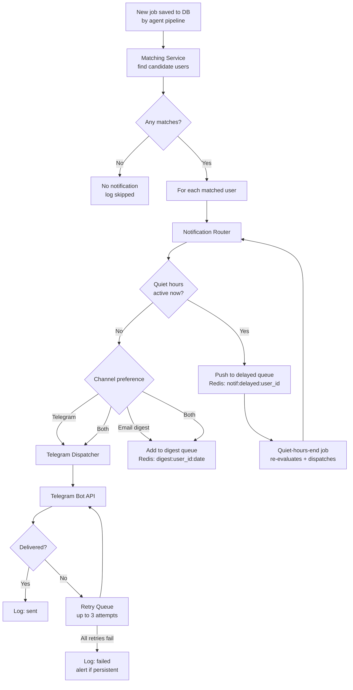
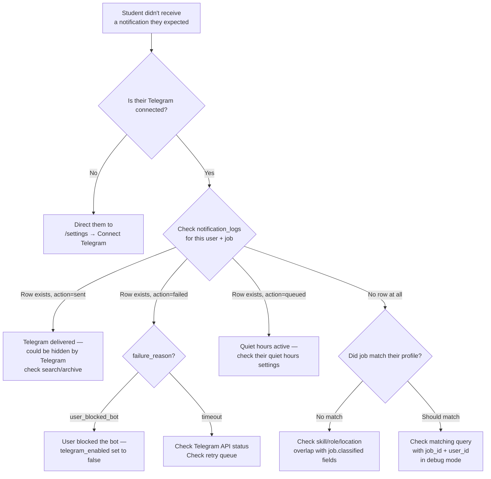

# 11 — Notification System

**Document Version:** 1.0  
**Status:** Active  
**Last Updated:** 2025-06-22  
**Owner:** Engineering Lead  

---

## Purpose of This Document

This document is the complete reference for Job Finder AI's notification infrastructure. It covers every channel (Telegram, email), every notification type (instant alert, daily digest, weekly summary, deadline reminder), every template, the scheduling logic, retry handling, delivery logging, and user preference enforcement. Engineers building notification features, AI assistants writing related code, and admins diagnosing delivery failures should all start here.

---

## Table of Contents

1. [Notification System Overview](#1-notification-system-overview)
2. [Module Structure](#2-module-structure)
3. [Notification Router](#3-notification-router)
4. [Matching Service](#4-matching-service)
5. [Telegram Channel](#5-telegram-channel)
6. [Email Channel](#6-email-channel)
7. [Notification Types](#7-notification-types)
8. [Templates](#8-templates)
9. [Scheduling & Dispatch](#9-scheduling--dispatch)
10. [Retry Logic](#10-retry-logic)
11. [Delivery Logging](#11-delivery-logging)
12. [User Preference Enforcement](#12-user-preference-enforcement)
13. [Quiet Hours Implementation](#13-quiet-hours-implementation)
14. [Telegram Bot Commands](#14-telegram-bot-commands)
15. [Webhook Handler](#15-webhook-handler)
16. [Admin Alerts](#16-admin-alerts)
17. [Common Failure Cases & Debugging](#17-common-failure-cases--debugging)

---

## 1. Notification System Overview



### Design Principles

| Principle | What It Means |
|---|---|
| **No dropped notifications** | Every notification attempt — including failures — is logged. Failed ones enter a retry queue. Nothing is silently discarded. |
| **No duplicate notifications** | The `UNIQUE(user_id, job_id, channel)` constraint on `notification_logs` prevents a user ever receiving the same job alert twice on the same channel. |
| **Quiet hours are hard — not advisory** | Notifications during quiet hours are queued and sent after the window closes, never sent early and never dropped. |
| **Channel preference is respected** | Users who choose email-only never get Telegram messages, even if they have telegram_id set. The router enforces this. |
| **Telegram is primary, email is secondary** | Telegram delivers in seconds; email digest is for users who prefer batched review. Both are first-class. |
| **Static fallback always works** | If the AI Notification Generator agent fails, a static template fires so the delivery succeeds even if quality is slightly lower. |

---

## 2. Module Structure

```
notifications/
├── router.py                    # Central decision point: who gets what, when, via what channel
├── matching_service.py          # Finds users whose profile matches a given job
│
├── telegram/
│   ├── bot.py                   # python-telegram-bot setup, application config, startup
│   ├── dispatcher.py            # Sends formatted messages, manages inline keyboards
│   ├── templates.py             # Message format functions for each notification type
│   └── commands.py              # /start, /pause, /resume, /settings, /unlink, /help handlers
│
├── email/
│   ├── client.py                # Resend/SendGrid API wrapper — provider-agnostic interface
│   ├── digest.py                # Compiles daily/weekly digest per user from queued jobs
│   ├── scheduler.py             # Triggers digest compilation at the right time per timezone
│   └── templates/
│       ├── base.html            # Base HTML layout (header, footer, unsubscribe link)
│       ├── digest.html          # Daily/weekly digest job card grid
│       ├── deadline_reminder.html
│       └── welcome.html         # Sent on registration to confirm email
│
└── retry_worker.py              # Reads retry queue from Redis, re-dispatches failed notifications
```

---

## 3. Notification Router

**File:** `notifications/router.py`

The router is the single decision point for every notification. It answers three questions for each user-job pair:
1. Should this user receive this notification?
2. On which channel(s)?
3. Now, or after their quiet hours end?

```python
# notifications/router.py

async def route_notification(job: Job, user: User) -> None:
    """
    Called once per matched user per new job.
    All channel and timing decisions are made here.
    """
    prefs = await db.get_notification_preferences(user.id)

    # Guard: check for existing notification (dedup)
    # The DB UNIQUE constraint is the ultimate guard, but this avoids
    # even attempting dispatch for known duplicates
    if await already_notified(user.id, job.id):
        return

    # Guard: check quiet hours
    if prefs.quiet_hours_enabled and is_quiet_now(prefs):
        await queue_for_after_quiet_hours(user.id, job.id, prefs)
        await log_notification(user.id, job.id, channel="all", action="queued",
                               reason="quiet_hours")
        return

    # Dispatch per channel preference
    dispatched = False

    if prefs.telegram_enabled and user.telegram_id:
        if should_telegram_notify(prefs, job):
            await telegram_dispatcher.send_job_alert(user, job)
            dispatched = True

    if prefs.email_enabled:
        await enqueue_for_digest(user.id, job.id)
        dispatched = True

    if not dispatched:
        await log_notification(user.id, job.id, channel="none", action="skipped",
                               reason="no_active_channel")

def should_telegram_notify(prefs: NotificationPreferences, job: Job) -> bool:
    """
    Enforces the 'exact_match' Telegram frequency mode.
    In 'exact_match' mode, all three criteria must match
    (role_type + location + experience_level), not just skill overlap.
    In 'all' mode (default), the matching service already ensured
    minimum criteria — send it.
    """
    if prefs.telegram_frequency == "all":
        return True
    # 'exact_match' mode: verified upstream — if we got here, all 3 match
    return True  # matching_service only sends exact matches when mode = 'exact_match'
```

### Router Decision Table

| Telegram enabled | Email enabled | Quiet hours | Action |
|---|---|---|---|
| ✅ | ✅ | No | Send Telegram now + add to digest queue |
| ✅ | ❌ | No | Send Telegram now only |
| ❌ | ✅ | No | Add to digest queue only |
| ✅ | ✅ | Yes | Queue both; dispatch after quiet hours end |
| ❌ | ❌ | — | Log as `skipped` / `no_active_channel` |

---

## 4. Matching Service

**File:** `notifications/matching_service.py`

Runs immediately after a new job is saved to the database. Finds all users whose preference profile overlaps with the job's classified attributes.

### Matching Algorithm

A user matches a job when **all four** conditions are true:

```python
# notifications/matching_service.py

async def find_matching_users(job: Job) -> list[User]:
    """
    Matching conditions (all must be true):
    1. experience_level: user's level within ±1 band of job's level
    2. role_type: at least 1 user preferred role matches job.role_type
    3. location: at least 1 user preferred city matches job city slug
                 OR (user.open_to_remote = true AND job.is_remote = true)
    4. skills: at least 1 user skill matches job.required_skills

    Additional guards (filtered at query level):
    - user.is_active = true AND user.is_deleted = false
    - user has at least one active notification channel
    """
    results = await db.execute(MATCHING_QUERY, {
        "job_id": job.id,
        "role_type": job.role_type,
        "experience_level": job.experience_level,
        "is_remote": job.is_remote,
        "city_slug": extract_city_slug(job.location),
    })
    return results
```

### Core Matching SQL Query

```sql
SELECT DISTINCT
    u.id,
    u.name,
    u.telegram_id,
    np.telegram_enabled,
    np.email_enabled,
    np.telegram_frequency,
    np.quiet_hours_enabled,
    np.quiet_start,
    np.quiet_end,
    np.quiet_days,
    np.timezone
FROM users u
JOIN user_preferences up ON up.user_id = u.id
JOIN notification_preferences np ON np.user_id = u.id
-- Role type match
JOIN user_preferred_roles upr ON upr.user_id = u.id
JOIN role_types rt ON rt.id = upr.role_type_id AND rt.slug = :role_type
-- Skill match (at least one)
JOIN user_skills us ON us.user_id = u.id
JOIN job_skills js ON js.skill_id = us.skill_id
    AND js.job_id = :job_id AND js.is_required = true
-- Experience level match (±1 band)
WHERE u.is_active = true
  AND u.is_deleted = false
  AND (np.telegram_enabled = true OR np.email_enabled = true)
  AND ABS(
      ARRAY_POSITION(
          ARRAY['fresher','0-1yr','1-2yr','2-3yr','3-5yr','5+yr'],
          up.experience_level
      ) -
      ARRAY_POSITION(
          ARRAY['fresher','0-1yr','1-2yr','2-3yr','3-5yr','5+yr'],
          :experience_level::varchar
      )
  ) <= 1
  -- Location match (city OR remote)
  AND (
      (up.open_to_remote = true AND :is_remote = true)
      OR EXISTS (
          SELECT 1 FROM user_preferred_locations upl
          JOIN cities c ON c.id = upl.city_id
          WHERE upl.user_id = u.id AND c.slug = :city_slug
      )
  );
```

### Matching in `exact_match` Mode

When a user has `telegram_frequency = 'exact_match'`, all three preference types must align (role + location + experience), not just any two. The query above already enforces this — it uses AND logic throughout, not OR. The `exact_match` mode simply skips Telegram dispatch when `should_telegram_notify()` is called, while the email digest still runs normally.

### Performance

This query runs once per new job against the full active user base. With proper indexes (see `07_DATABASE.md`), it completes in <100ms for up to 50,000 users. The indexes that make this fast:

```sql
-- user_preferred_roles → role match
CREATE INDEX idx_user_pref_roles_role_type_id ON user_preferred_roles(role_type_id);

-- user_skills + job_skills → skill match join
CREATE INDEX idx_user_skills_skill_id ON user_skills(skill_id);
CREATE INDEX idx_job_skills_job_id ON job_skills(job_id);

-- user_preferences → experience level filter
CREATE INDEX idx_user_prefs_experience_level ON user_preferences(experience_level);
```

---

## 5. Telegram Channel

### Bot Setup

**File:** `notifications/telegram/bot.py`

```python
# notifications/telegram/bot.py
from telegram.ext import Application, CommandHandler, CallbackQueryHandler, MessageHandler

def create_application() -> Application:
    app = (
        Application.builder()
        .token(settings.TELEGRAM_BOT_TOKEN)
        .build()
    )

    # Command handlers
    app.add_handler(CommandHandler("start", handle_start))
    app.add_handler(CommandHandler("pause", handle_pause))
    app.add_handler(CommandHandler("resume", handle_resume))
    app.add_handler(CommandHandler("settings", handle_settings))
    app.add_handler(CommandHandler("unlink", handle_unlink))
    app.add_handler(CommandHandler("help", handle_help))

    # Inline button callbacks (Apply, Save, Not Interested)
    app.add_handler(CallbackQueryHandler(handle_callback))

    return app

# Webhook mode in production (not polling)
async def setup_webhook(app: Application):
    await app.bot.set_webhook(
        url=f"{settings.API_BASE_URL}/api/webhooks/telegram",
        secret_token=settings.TELEGRAM_WEBHOOK_SECRET,
        allowed_updates=["message", "callback_query"]
    )
```

### Dispatcher

**File:** `notifications/telegram/dispatcher.py`

```python
# notifications/telegram/dispatcher.py
from telegram import Bot, InlineKeyboardMarkup, InlineKeyboardButton
from telegram.error import Forbidden, BadRequest, TimedOut

bot = Bot(token=settings.TELEGRAM_BOT_TOKEN)

async def send_job_alert(user: User, job: Job) -> bool:
    """
    Sends a job alert with inline action buttons.
    Returns True on success, False on failure.
    Raises no exceptions — all errors logged internally.
    """
    # Generate message body (via Notification Generator agent or static fallback)
    message_body = await build_message_body(user, job)

    # Build inline keyboard
    keyboard = InlineKeyboardMarkup([
        [
            InlineKeyboardButton("Apply Now 🔗", url=job.apply_url),
            InlineKeyboardButton("Save 📌",
                callback_data=f"save:{job.id}"),
            InlineKeyboardButton("Not Interested ❌",
                callback_data=f"dismiss:{job.id}"),
        ]
    ])

    try:
        await bot.send_message(
            chat_id=user.telegram_id,
            text=message_body,
            parse_mode="HTML",
            reply_markup=keyboard,
            disable_web_page_preview=True
        )
        await log_notification(user.id, job.id, "telegram", "sent")
        return True

    except Forbidden:
        # User blocked the bot
        await handle_bot_blocked(user)
        await log_notification(user.id, job.id, "telegram", "failed",
                               reason="user_blocked_bot")
        return False

    except BadRequest as e:
        await log_notification(user.id, job.id, "telegram", "failed",
                               reason=f"bad_request: {e}")
        return False

    except TimedOut:
        # Will be retried by retry_worker
        await log_notification(user.id, job.id, "telegram", "failed",
                               reason="timeout")
        await enqueue_retry("telegram", user.id, job.id)
        return False

    except Exception as e:
        log.error(f"Unexpected Telegram error for user {user.id}: {e}")
        await log_notification(user.id, job.id, "telegram", "failed",
                               reason=str(type(e).__name__))
        return False

async def handle_bot_blocked(user: User):
    """
    When a user blocks the bot, disable Telegram notifications
    and optionally send an email letting them know.
    """
    await db.update_notification_preferences(
        user.id, telegram_enabled=False
    )
    log.info(f"Disabled Telegram for user {user.id} — bot was blocked")
```

### Telegram Rate Limits

The Telegram Bot API enforces rate limits that we must respect:

| Limit | Value | Our Handling |
|---|---|---|
| Messages per second (global) | 30/sec | Dispatch queue with 35ms delay between sends |
| Messages per chat per second | 1/sec | No burst sending to one user |
| Messages per group per minute | 20/min | Not applicable (we use private chats only) |
| Broadcast limit (same message to many chats) | No hard limit, but monitored | Staggered dispatch over the batch window |

```python
# Dispatcher rate limiter for bulk sends
TELEGRAM_SEND_DELAY = 0.035  # seconds between sends (≈28/sec, safely under 30 limit)

async def send_batch(user_job_pairs: list[tuple[User, Job]]):
    for user, job in user_job_pairs:
        await send_job_alert(user, job)
        await asyncio.sleep(TELEGRAM_SEND_DELAY)
```

---

## 6. Email Channel

### Email Client

**File:** `notifications/email/client.py`

The client is a thin, provider-agnostic wrapper. Switching from Resend to SendGrid (or vice versa) requires changing only this file — no other notification code changes.

```python
# notifications/email/client.py
import resend  # or sendgrid — swap here only

class EmailClient:
    def __init__(self):
        resend.api_key = settings.RESEND_API_KEY

    async def send(
        self,
        to: str,
        subject: str,
        html_body: str,
        from_name: str = "Job Finder AI",
        from_email: str = "alerts@jobfinderai.com",
        reply_to: str | None = None,
        unsubscribe_url: str | None = None
    ) -> bool:
        """Returns True on success, False on failure."""
        headers = {}
        if unsubscribe_url:
            headers["List-Unsubscribe"] = f"<{unsubscribe_url}>"
            headers["List-Unsubscribe-Post"] = "List-Unsubscribe=One-Click"

        try:
            result = resend.Emails.send({
                "from": f"{from_name} <{from_email}>",
                "to": to,
                "subject": subject,
                "html": html_body,
                "headers": headers,
                "reply_to": reply_to or from_email,
            })
            return bool(result.get("id"))
        except Exception as e:
            log.error(f"Email send failed to {to}: {e}")
            return False
```

### Unsubscribe Handling

Every email sent includes a one-click unsubscribe link per RFC 8058, enforced in `email/client.py`. The unsubscribe URL:

```
https://jobfinderai.com/unsubscribe?token={one_time_token}
```

The one-time token is generated per user per email send and stored with a 90-day TTL. On click:
```
GET /unsubscribe?token={token}
→ Validates token
→ Sets notification_preferences.email_enabled = false
→ Shows "You've been unsubscribed" page
```

---

## 7. Notification Types

| Type | Channel | Trigger | Priority |
|---|---|---|---|
| Instant Job Alert | Telegram | New matched job saved | P0 |
| Daily Email Digest | Email | Scheduler, daily 8 AM local | P1 |
| Weekly Email Summary | Email | Scheduler, Monday 8 AM local | P2 |
| Deadline Reminder | Telegram + Email | 48h before saved job deadline | P2 |
| Welcome Email | Email | User registration | P1 |
| Admin Scraper Alert | Telegram (admin channel) | 3 consecutive scrape failures | P1 |

---

## 8. Templates

### 8.1 Telegram — Instant Job Alert

**File:** `notifications/telegram/templates.py`

```python
def job_alert_message(
    title: str,
    company: str,
    location: str | None,
    location_type: str,
    posted_label: str,
    summary: list[str],
    required_skills: list[str],
    user_matched_skills: list[str],
    salary_range: str | None = None,
) -> str:

    location_str = location or "Location TBD"
    mode_emoji = {"remote": "🌍", "hybrid": "🏢🏠", "onsite": "🏢"}.get(location_type, "📍")

    # Skill match line
    skill_parts = []
    for skill in required_skills[:6]:
        icon = "✅" if skill in user_matched_skills else "❌"
        skill_parts.append(f"{skill} {icon}")
    if len(required_skills) > 6:
        skill_parts.append(f"+{len(required_skills) - 6} more")
    skills_line = "🛠 Skills: " + "  ".join(skill_parts)

    # Summary bullets
    bullets = "\n".join(f"• {b}" for b in summary[:5])

    return (
        f"🚀 <b>New Job Match</b>\n\n"
        f"<b>{title}</b>\n"
        f"{company} · {location_str} · {mode_emoji}\n"
        f"📅 Posted {posted_label}\n\n"
        f"📋 <b>What this involves:</b>\n"
        f"{bullets}\n\n"
        f"{skills_line}"
    )
```

**Rendered example:**
```
🚀 New Job Match

Software Engineer — Backend
Razorpay · Bengaluru · 🏢🏠
📅 Posted 11 minutes ago

📋 What this involves:
• Build payment APIs used by 10M+ merchants across India
• Python and FastAPI required; 0–2 years experience accepted
• Hybrid role in Bengaluru — 3 days office, 2 days remote
• Salary ₹12–18 LPA with ESOP after probation
• Small team of 6 engineers; direct feature ownership from day one

🛠 Skills: Python ✅  FastAPI ✅  PostgreSQL ✅  Docker ❌  Go ❌
```

**Inline keyboard:**
```
[Apply Now 🔗]  [Save 📌]  [Not Interested ❌]
```

### 8.2 Telegram — Deadline Reminder

```python
def deadline_reminder_message(
    title: str,
    company: str,
    hours_remaining: int
) -> str:
    urgency = "⏰" if hours_remaining > 12 else "🔴"
    return (
        f"{urgency} <b>Closing Soon — Don't Miss This</b>\n\n"
        f"<b>{title}</b> at {company}\n"
        f"Application closes in <b>{hours_remaining} hours</b>"
    )
```

**Inline keyboard:**
```
[Apply Now 🔗]  [Mark Applied ✅]  [Remove from Saved 🗑]
```

### 8.3 Telegram — Bot Connected Confirmation

```python
CONNECTED_MESSAGE = (
    "✅ <b>Your Job Finder AI account is connected!</b>\n\n"
    "You'll now receive job alerts here as soon as matching roles are posted.\n\n"
    "Commands you can use:\n"
    "• /pause — pause all notifications\n"
    "• /resume — resume notifications\n"
    "• /settings — view your current preferences\n"
    "• /help — see all commands\n\n"
    "🎯 Your first match could arrive within the next few hours."
)
```

### 8.4 Email — Daily Digest

**File:** `notifications/email/templates/digest.html`

Structure (Jinja2 HTML template):

```html
<!-- digest.html — simplified structure -->



<h1>Your Daily Job Digest</h1>
<p>Good morning, {{ user.name }}. Here are your {{ jobs|length }} new matches.</p>


<div class="job-card">
  <div class="job-header">
    
    
    
    <div>
      <h2>{{ job.title }}</h2>
      <p>{{ job.company.name }} · {{ job.location or 'Remote' }}</p>
      <p class="meta">Posted {{ job.posted_label }}
         · Closes {{ job.deadline|format_date }}
      </p>
    </div>
  </div>

  <div class="summary">
    <ul>
      
      <li>{{ bullet }}</li>
      
    </ul>
  </div>

  <div class="skills">
    
    <span class="skill-chip matched">
      {{ skill }}
    </span>
    
  </div>

  <a href="{{ job.apply_url }}" class="btn-apply">Apply Now →</a>
</div>


<p><a href="{{ web_url }}/jobs">View all matches on the web →</a></p>

```

### 8.5 Email — Welcome

Sent on successful registration (not on OAuth since Google-linked accounts are immediately verified).

```
Subject: Welcome to Job Finder AI 🚀

Hi {name},

Your account is ready. Here's how to get the most out of it:

1. Complete your profile → Set your skills and preferred roles
   [Complete Profile →]

2. Connect Telegram → Get instant alerts within minutes of posting
   [Connect Telegram →]

3. That's it. We'll start finding jobs for you.

Questions? Reply to this email.

The Job Finder AI Team
```

### 8.6 Email — Deadline Reminder

```
Subject: ⏰ Closing Soon: {job_title} at {company} — {hours} hours left

Hi {name},

A job you saved is closing soon:

{job_title}
{company} · {location}
Deadline: {deadline_date}

[Apply Now →]  [Mark as Applied]  [Remove from Saved]

If you've already applied, mark it in your tracker so you don't get
another reminder.

The Job Finder AI Team
```

---

## 9. Scheduling & Dispatch

**File:** `notifications/email/scheduler.py`

### Daily Digest Schedule

The digest scheduler runs at a fixed UTC time and computes per-user send windows based on stored timezone:

```python
# scheduler/jobs/daily_digest.py

async def run_daily_digest():
    """
    Runs at 02:30 UTC daily (= 08:00 IST for most users).
    For users in other timezones, their 8 AM is computed separately.
    MVP: all users treated as IST. Timezone-aware scheduling is Phase 2.
    """
    users = await db.fetch_users_for_digest(frequency="daily")

    for user in users:
        # Fetch jobs queued for this user since last digest
        queued_job_ids = await redis.lrange(
            f"digest:{user.id}:{today()}", 0, -1
        )
        if not queued_job_ids:
            continue  # No matches today — skip silently

        jobs = await db.fetch_jobs_by_ids(queued_job_ids[:10])  # max 10 per digest
        html = render_digest_template(user, jobs)

        success = await email_client.send(
            to=user.email,
            subject=f"Your Daily Job Digest — {len(jobs)} New Matches",
            html_body=html,
            unsubscribe_url=generate_unsubscribe_url(user.id)
        )

        for job_id in queued_job_ids[:10]:
            await log_notification(user.id, job_id, "email",
                                   "sent" if success else "failed")

        # Clear queue for today
        await redis.delete(f"digest:{user.id}:{today()}")
```

### Digest Queue

When the router sends a job to the digest channel, it pushes the job ID to a Redis list:

```python
async def enqueue_for_digest(user_id: UUID, job_id: UUID):
    key = f"digest:{user_id}:{today()}"
    await redis.rpush(key, str(job_id))
    await redis.expire(key, 86400 * 2)  # 48h TTL — covers timezone edge cases
```

### Deadline Reminder Schedule

```python
# scheduler/jobs/deadline_reminder.py

async def run_deadline_reminders():
    """Runs daily at 09:00 IST."""
    candidates = await db.execute("""
        SELECT usj.user_id, usj.job_id, j.title, c.name as company_name,
               j.deadline,
               EXTRACT(EPOCH FROM (j.deadline::timestamptz - now())) / 3600
                   AS hours_remaining
        FROM user_saved_jobs usj
        JOIN jobs j ON j.id = usj.job_id
        JOIN companies c ON c.id = j.company_id
        WHERE usj.status = 'saved'
          AND usj.reminder_sent_at IS NULL
          AND j.deadline IS NOT NULL
          AND j.deadline::timestamptz BETWEEN now() AND now() + interval '48 hours'
    """)

    for row in candidates:
        user = await db.get_user(row.user_id)
        prefs = await db.get_notification_preferences(row.user_id)
        hours = int(row.hours_remaining)

        if prefs.telegram_enabled and user.telegram_id:
            msg = deadline_reminder_message(row.title, row.company_name, hours)
            keyboard = deadline_reminder_keyboard(row.job_id, row.apply_url)
            await bot.send_message(user.telegram_id, msg, reply_markup=keyboard)

        if prefs.email_enabled:
            html = render_deadline_reminder_template(user, row, hours)
            await email_client.send(
                to=user.email,
                subject=f"⏰ Closing Soon: {row.title} at {row.company_name}",
                html_body=html,
                unsubscribe_url=generate_unsubscribe_url(user.id)
            )

        # Mark as reminded — prevents duplicate reminders
        await db.execute("""
            UPDATE user_saved_jobs SET reminder_sent_at = now()
            WHERE user_id = $1 AND job_id = $2
        """, row.user_id, row.job_id)
```

---

## 10. Retry Logic

**File:** `notifications/retry_worker.py`

Failed notifications enter a Redis retry queue and are re-attempted up to 3 times with exponential backoff.

### Retry Queue Structure

```
Redis key: notif:retry
Type: Sorted Set (ZSET)
Score: Unix timestamp of when to retry
Member: JSON payload {user_id, job_id, channel, attempt}
```

### Enqueue for Retry

```python
async def enqueue_retry(
    channel: str,
    user_id: UUID,
    job_id: UUID,
    attempt: int = 1
):
    if attempt > 3:
        await log_notification(user_id, job_id, channel, "failed",
                               reason=f"exhausted_retries")
        return

    delay_seconds = {1: 30, 2: 120, 3: 600}[attempt]  # 30s, 2m, 10m
    retry_at = time.time() + delay_seconds

    payload = json.dumps({
        "user_id": str(user_id),
        "job_id": str(job_id),
        "channel": channel,
        "attempt": attempt
    })
    await redis.zadd("notif:retry", {payload: retry_at})
```

### Retry Worker Loop

```python
# notifications/retry_worker.py

async def retry_worker():
    """Runs continuously as a background task."""
    while True:
        now = time.time()

        # Fetch all items due for retry (score <= now)
        due = await redis.zrangebyscore("notif:retry", 0, now)

        for payload_str in due:
            await redis.zrem("notif:retry", payload_str)
            payload = json.loads(payload_str)

            user = await db.get_user(UUID(payload["user_id"]))
            job = await db.get_job(UUID(payload["job_id"]))
            attempt = payload["attempt"]

            if payload["channel"] == "telegram":
                success = await telegram_dispatcher.send_job_alert(user, job)
            else:
                # Email retry — re-add to today's digest queue
                await enqueue_for_digest(user.id, job.id)
                success = True  # Email will be picked up by next digest run

            if not success:
                await enqueue_retry(
                    payload["channel"], user.id, job.id, attempt + 1
                )

        await asyncio.sleep(10)  # Poll every 10 seconds
```

### Retry Schedule

| Attempt | Delay | Cumulative Wait |
|---|---|---|
| 1st retry | 30 seconds | 0:30 |
| 2nd retry | 2 minutes | 2:30 |
| 3rd retry | 10 minutes | 12:30 |
| After 3rd failure | Log as permanently failed | — |

---

## 11. Delivery Logging

Every notification attempt — success, failure, queued, or skipped — creates a row in `notification_logs`. See `07_DATABASE.md` Section 20 for the full schema.

### Log Actions

| Action | Meaning |
|---|---|
| `sent` | Successfully delivered to Telegram or email service |
| `failed` | All retry attempts exhausted |
| `queued` | Held for quiet-hours-end dispatch |
| `skipped` | Not sent because user has no active channel |

### Deduplication via UNIQUE Constraint

```sql
-- From 07_DATABASE.md Section 20
UNIQUE(user_id, job_id, channel)
```

On every insert into `notification_logs`, the application uses `ON CONFLICT DO NOTHING`:

```python
await db.execute("""
    INSERT INTO notification_logs
        (user_id, job_id, channel, action, sent_at, failure_reason)
    VALUES ($1, $2, $3, $4, now(), $5)
    ON CONFLICT (user_id, job_id, channel) DO NOTHING
""", user_id, job_id, channel, action, failure_reason)
```

This means if a bug somehow tries to send the same notification twice, the second attempt is silently ignored at the database level — the user never receives a duplicate.

### Useful Log Queries

```sql
-- Notification delivery rate (last 24h)
SELECT
    channel,
    COUNT(*) FILTER (WHERE action = 'sent') AS sent,
    COUNT(*) FILTER (WHERE action = 'failed') AS failed,
    COUNT(*) AS total,
    ROUND(100.0 * COUNT(*) FILTER (WHERE action = 'sent') / COUNT(*), 2)
        AS delivery_pct
FROM notification_logs
WHERE created_at > now() - interval '24 hours'
GROUP BY channel;

-- Users who have Telegram disabled (bot blocked)
SELECT u.id, u.email
FROM users u
JOIN notification_preferences np ON np.user_id = u.id
WHERE np.telegram_enabled = false
  AND u.telegram_id IS NOT NULL;  -- had it linked but it got disabled

-- Most-notified jobs (spike detector)
SELECT job_id, COUNT(*) as notification_count
FROM notification_logs
WHERE created_at > now() - interval '1 hour'
GROUP BY job_id
ORDER BY notification_count DESC
LIMIT 10;
```

---

## 12. User Preference Enforcement

The router enforces all notification preferences before dispatching. This is the single point of enforcement — no channel-specific dispatcher needs to re-check preferences.

### Enforcement Checklist (per dispatch decision)

```python
async def should_dispatch(user: User, job: Job, channel: str) -> bool:
    prefs = await db.get_notification_preferences(user.id)

    # 1. Channel enabled?
    if channel == "telegram" and not prefs.telegram_enabled:
        return False
    if channel == "email" and not prefs.email_enabled:
        return False

    # 2. Telegram: channel exists?
    if channel == "telegram" and not user.telegram_id:
        return False

    # 3. Already notified via this channel?
    if await already_notified(user.id, job.id, channel):
        return False

    # 4. Quiet hours? (handled at router level before this is called)
    # Not rechecked here — router already gates on quiet hours

    # 5. Telegram frequency mode: exact_match requires all 3 to match
    if channel == "telegram" and prefs.telegram_frequency == "exact_match":
        if not is_exact_match(user, job):
            return False

    return True
```

---

## 13. Quiet Hours Implementation

**File:** `notifications/router.py` (shared function)

### Time Check

```python
from datetime import datetime, time
import pytz

DAY_MAP = {"mon": 0, "tue": 1, "wed": 2, "thu": 3, "fri": 4, "sat": 5, "sun": 6}

def is_quiet_now(prefs: NotificationPreferences) -> bool:
    if not prefs.quiet_hours_enabled:
        return False

    tz = pytz.timezone(prefs.timezone)
    user_now = datetime.now(tz)
    current_day = ["mon","tue","wed","thu","fri","sat","sun"][user_now.weekday()]

    if current_day not in (prefs.quiet_days or []):
        return False  # Not a quiet day

    current_time = user_now.time()
    start = prefs.quiet_start
    end = prefs.quiet_end

    # Normal range (e.g. 09:00 – 19:00)
    if start <= end:
        return start <= current_time <= end

    # Overnight range (e.g. 23:00 – 07:00)
    return current_time >= start or current_time <= end
```

### Delayed Queue

When a notification is held for quiet hours:

```python
async def queue_for_after_quiet_hours(
    user_id: UUID,
    job_id: UUID,
    prefs: NotificationPreferences
):
    # Calculate when to release
    tz = pytz.timezone(prefs.timezone)
    user_now = datetime.now(tz)
    quiet_end_today = datetime.combine(user_now.date(), prefs.quiet_end, tzinfo=tz)

    if quiet_end_today < user_now:
        # quiet_end already passed today (overnight range) → release tomorrow
        quiet_end_today += timedelta(days=1)

    release_at = quiet_end_today.timestamp()

    payload = json.dumps({"user_id": str(user_id), "job_id": str(job_id)})
    await redis.zadd("notif:delayed", {payload: release_at})
```

### Quiet-Hours-End Worker

```python
async def quiet_hours_release_worker():
    """Runs every 60 seconds. Dispatches held notifications whose window has ended."""
    while True:
        now = time.time()
        due = await redis.zrangebyscore("notif:delayed", 0, now)

        for payload_str in due:
            await redis.zrem("notif:delayed", payload_str)
            payload = json.loads(payload_str)
            user = await db.get_user(UUID(payload["user_id"]))
            job = await db.get_job(UUID(payload["job_id"]))

            # Re-route: prefs may have changed since the notification was queued
            await route_notification(job, user)

        await asyncio.sleep(60)
```

---

## 14. Telegram Bot Commands

**File:** `notifications/telegram/commands.py`

### /start

```python
async def handle_start(update: Update, context: ContextTypes.DEFAULT_TYPE):
    args = context.args
    if args:
        code = args[0]
        await link_account(update, code)
    else:
        await update.message.reply_text(WELCOME_MESSAGE)

async def link_account(update: Update, code: str):
    telegram_id = update.effective_user.id
    result = await db.validate_link_code(code, telegram_id)

    match result:
        case "success":
            await db.link_telegram(result.user_id, telegram_id)
            await update.message.reply_text(CONNECTED_MESSAGE, parse_mode="HTML")
        case "expired":
            await update.message.reply_text(
                "❌ This link has expired. Please generate a new one from the website."
            )
        case "already_used":
            await update.message.reply_text(
                "❌ This link has already been used."
            )
        case "already_linked":
            await update.message.reply_text(
                "⚠️ This Telegram account is already linked to another Job Finder AI account."
            )
```

### /pause

```python
async def handle_pause(update: Update, context: ContextTypes.DEFAULT_TYPE):
    user = await db.get_user_by_telegram_id(update.effective_user.id)
    if not user:
        await update.message.reply_text("Account not linked. Use /start to connect.")
        return

    await db.update_notification_preferences(user.id, telegram_enabled=False)
    await update.message.reply_text(
        "⏸ Notifications paused.\n\n"
        "Send /resume when you're ready to receive job alerts again."
    )
```

### /resume

```python
async def handle_resume(update: Update, context: ContextTypes.DEFAULT_TYPE):
    user = await db.get_user_by_telegram_id(update.effective_user.id)
    if not user:
        await update.message.reply_text("Account not linked. Use /start to connect.")
        return

    await db.update_notification_preferences(user.id, telegram_enabled=True)
    await update.message.reply_text(
        "▶️ Notifications resumed! You'll receive job alerts here again.\n\n"
        "Use /settings to review your preferences."
    )
```

### /settings

```python
async def handle_settings(update: Update, context: ContextTypes.DEFAULT_TYPE):
    user = await db.get_user_by_telegram_id(update.effective_user.id)
    prefs = await db.get_notification_preferences(user.id)
    up = await db.get_user_preferences(user.id)

    quiet_str = "Off"
    if prefs.quiet_hours_enabled:
        quiet_str = f"{prefs.quiet_start.strftime('%H:%M')} – {prefs.quiet_end.strftime('%H:%M')}"
        quiet_str += f" ({', '.join(prefs.quiet_days or [])})"

    text = (
        f"⚙️ <b>Your Notification Settings</b>\n\n"
        f"📱 Telegram: {'On' if prefs.telegram_enabled else 'Paused'}\n"
        f"📧 Email digest: {prefs.email_digest_frequency.capitalize()}\n"
        f"🔔 Telegram frequency: {prefs.telegram_frequency.replace('_', ' ').title()}\n"
        f"🌙 Quiet hours: {quiet_str}\n"
        f"🎯 Experience level: {up.experience_level}\n\n"
        f"To update your settings, visit:\n"
        f"jobfinderai.com/settings"
    )
    await update.message.reply_text(text, parse_mode="HTML")
```

### /unlink

```python
async def handle_unlink(update: Update, context: ContextTypes.DEFAULT_TYPE):
    user = await db.get_user_by_telegram_id(update.effective_user.id)
    if not user:
        await update.message.reply_text("No account linked to this Telegram.")
        return

    await db.unlink_telegram(user.id)
    await update.message.reply_text(
        "✅ Telegram unlinked from your Job Finder AI account.\n\n"
        "You can reconnect anytime from jobfinderai.com/settings."
    )
```

### /help

```python
HELP_MESSAGE = (
    "🤖 <b>Job Finder AI Bot — Commands</b>\n\n"
    "/start — Link your account or see welcome info\n"
    "/pause — Pause all Telegram job alerts\n"
    "/resume — Resume job alerts\n"
    "/settings — View your current preferences\n"
    "/unlink — Disconnect this Telegram account\n"
    "/help — Show this message\n\n"
    "To update skills, role preferences, or quiet hours:\n"
    "👉 jobfinderai.com/settings"
)
```

---

## 15. Webhook Handler

**File:** `backend/api/webhooks/telegram.py`

The Telegram webhook handler receives all inbound events (messages and button callbacks) and routes them to the appropriate handler.

```python
# backend/api/webhooks/telegram.py
from fastapi import APIRouter, Request, HTTPException, Header
from telegram import Update

router = APIRouter()

@router.post("/api/webhooks/telegram")
async def telegram_webhook(
    request: Request,
    x_telegram_bot_api_secret_token: str = Header(None)
):
    # Validate secret token — reject anything not from Telegram
    if x_telegram_bot_api_secret_token != settings.TELEGRAM_WEBHOOK_SECRET:
        raise HTTPException(status_code=403)

    body = await request.json()
    update = Update.de_json(body, bot_application.bot)

    # Process asynchronously — Telegram requires fast 200 response
    asyncio.create_task(bot_application.process_update(update))

    return {"ok": True}
```

### Inline Button Callback Handler

```python
# notifications/telegram/commands.py

async def handle_callback(update: Update, context: ContextTypes.DEFAULT_TYPE):
    query = update.callback_query
    await query.answer()  # Acknowledge the button press immediately

    data = query.data
    telegram_id = update.effective_user.id
    user = await db.get_user_by_telegram_id(telegram_id)

    if not user:
        await query.answer("Account not linked.", show_alert=True)
        return

    if data.startswith("save:"):
        job_id = UUID(data.split(":")[1])
        await db.save_job(user.id, job_id)
        await query.answer("✅ Job saved! View in My Jobs on the website.")

    elif data.startswith("dismiss:"):
        job_id = UUID(data.split(":")[1])
        # Log not-interested signal — future matching improvement signal
        await db.log_job_feedback(user.id, job_id, feedback="not_interested")
        await query.answer("Noted — we'll use this to improve your matches.")

    elif data.startswith("applied:"):
        job_id = UUID(data.split(":")[1])
        await db.update_saved_job_status(user.id, job_id, "applied")
        await query.answer("✅ Marked as applied.")
```

---

## 16. Admin Alerts

**File:** `notifications/telegram/dispatcher.py`

Admin alerts are sent to a dedicated Telegram channel or group, separate from the user-facing bot. The `ADMIN_TELEGRAM_CHAT_ID` environment variable controls the destination.

```python
ADMIN_ALERT_TEMPLATES = {
    "scraper_failure": (
        "⚠️ <b>SCRAPER FAILURE ALERT</b>\n\n"
        "Company: {company_name}\n"
        "ATS Type: {ats_type}\n"
        "Consecutive failures: {consecutive_failures}\n"
        "Last error: {error_message}\n"
        "Last successful run: {last_success_label}\n\n"
        "<a href='{dashboard_url}'>View in Dashboard →</a>"
    ),
    "agent_failure_spike": (
        "⚠️ <b>AGENT FAILURE SPIKE</b>\n\n"
        "Agent: {agent_name}\n"
        "Failure rate: {failure_pct}% (last hour)\n"
        "Normal baseline: <5%\n\n"
        "Action: Check agent_logs for common error pattern."
    ),
    "notification_delivery_low": (
        "⚠️ <b>NOTIFICATION DELIVERY DROP</b>\n\n"
        "Channel: {channel}\n"
        "Delivery rate: {delivery_pct}% (last hour)\n"
        "Expected: >99%\n\n"
        "Action: Check {channel} service status."
    ),
}

async def send_admin_alert(alert_type: str, **kwargs):
    template = ADMIN_ALERT_TEMPLATES.get(alert_type)
    if not template:
        return
    message = template.format(**kwargs)
    await bot.send_message(
        chat_id=settings.ADMIN_TELEGRAM_CHAT_ID,
        text=message,
        parse_mode="HTML",
        disable_web_page_preview=False
    )
```

### Alert Deduplication

Admin alerts are deduplicated using `admin_alert_logs` (see `07_DATABASE.md` Section 23) — at most 1 alert per company per 24 hours per alert type:

```python
async def check_and_send_admin_alert(company_id: int, alert_type: str, **kwargs):
    already_sent = await db.execute("""
        SELECT 1 FROM admin_alert_logs
        WHERE company_id = $1
          AND alert_type = $2
          AND sent_at > now() - interval '24 hours'
        LIMIT 1
    """, company_id, alert_type)

    if already_sent:
        return  # Already alerted today

    await send_admin_alert(alert_type, **kwargs)
    await db.execute("""
        INSERT INTO admin_alert_logs (company_id, alert_type, message)
        VALUES ($1, $2, $3)
    """, company_id, alert_type, str(kwargs))
```

---

## 17. Common Failure Cases & Debugging

### Diagnosis Decision Tree



### Common Issues & Fixes

| Symptom | Likely Cause | Fix |
|---|---|---|
| User gets no notifications | Bot not connected, or telegram_enabled=false | Check `users.telegram_id` and `notification_preferences.telegram_enabled` |
| User gets duplicate notifications | UNIQUE constraint violation handled — shouldn't happen; check `notification_logs` | If seen, check for race condition in router; add advisory lock |
| Notification delivered but silent (no sound) | Telegram app notification settings | Out of platform control |
| Digest email in spam | SPF/DKIM not configured on send domain | Configure DNS records for sending domain in email service |
| User says job is stale when they receive it | `company_posted_at` fallback to `scraped_at` | Check scraper adapter's date extraction for that ATS |
| Admin alert not firing for failed scraper | Alert already sent today (dedup) | Check `admin_alert_logs`; wait for 24h window or manually send |
| Quiet hours notifications not releasing | `quiet_hours_release_worker` not running | Check scheduler process; verify `notif:delayed` ZSET in Redis |

---

*The notification system is the last mile of everything the scraper and agent pipeline produces. A job that is scraped, extracted, classified, and matched perfectly but not delivered is worthless. This document governs that final mile — treat it with the same care as the pipeline documentation.*