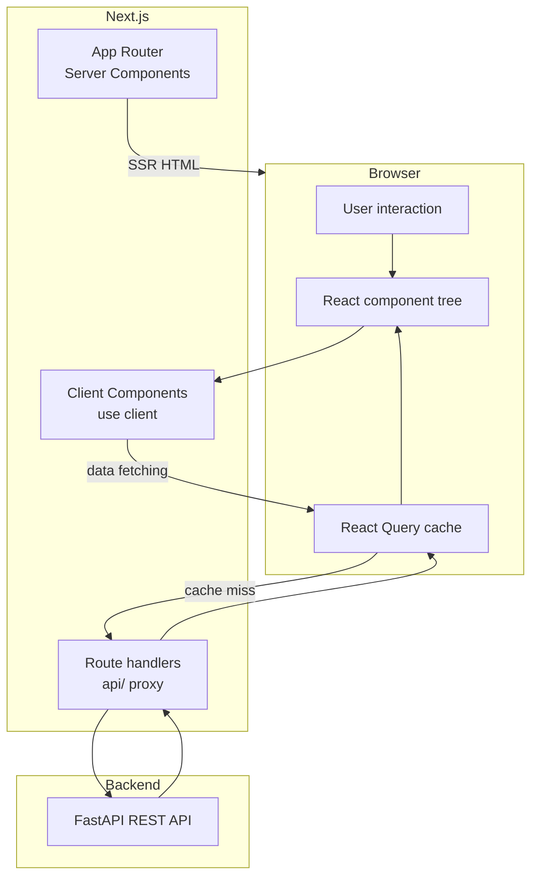

# 12 — Frontend

**Document Version:** 1.0  
**Status:** Active  
**Last Updated:** 2025-06-22  
**Owner:** Engineering Lead  

---

## Purpose of This Document

This document is the complete reference for Job Finder AI's Next.js frontend. It covers every page, every major component, every custom hook, state management patterns, theming, accessibility requirements, performance targets, animation conventions, and SEO strategy. Engineers writing frontend code must read this document first. Nothing described here should be contradicted by the implementation — if it is, either the code or this document is wrong.

---

## Table of Contents

1. [Frontend Architecture Overview](#1-frontend-architecture-overview)
2. [Directory Structure](#2-directory-structure)
3. [Pages](#3-pages)
4. [Components](#4-components)
5. [Hooks](#5-hooks)
6. [State Management](#6-state-management)
7. [API Client](#7-api-client)
8. [Authentication](#8-authentication)
9. [Theme & Design System](#9-theme--design-system)
10. [Accessibility](#10-accessibility)
11. [Performance](#11-performance)
12. [Animations](#12-animations)
13. [SEO](#13-seo)
14. [TypeScript Types](#14-typescript-types)
15. [Error Handling](#15-error-handling)
16. [Testing](#16-testing)

---

## 1. Frontend Architecture Overview



### Server vs. Client Component Strategy

| Component Type | Rendered On | When to Use |
|---|---|---|
| **Server Component** (default) | Server | Static layouts, metadata, initial HTML for SEO, fetching data that doesn't change on interaction |
| **Client Component** (`"use client"`) | Browser | Anything with `useState`, `useEffect`, event handlers, browser APIs, React Query hooks |

**Rule:** Default to Server Components. Add `"use client"` only when the component genuinely requires interactivity or browser APIs. Every unnecessary `"use client"` increases the client bundle size.

```
App Router boundary examples:

app/jobs/page.tsx          → Server Component (static layout + SSR job list)
  └── JobFeed.tsx          → Client Component (infinite scroll, filter state)
       └── JobCard.tsx     → Server Component (pure display, no interaction)
            └── SaveButton → Client Component (toggles saved state)
```

---

## 2. Directory Structure

```
frontend/
│
├── app/                              # Next.js App Router
│   ├── layout.tsx                    # Root layout — html, body, providers
│   ├── globals.css                   # Global styles + Tailwind base
│   ├── not-found.tsx                 # 404 page
│   ├── error.tsx                     # Global error boundary
│   │
│   ├── (auth)/                       # Route group — no shared layout
│   │   ├── login/
│   │   │   └── page.tsx
│   │   ├── register/
│   │   │   └── page.tsx
│   │   └── verify-email/
│   │       └── page.tsx
│   │
│   ├── (onboarding)/                 # Route group — onboarding layout
│   │   ├── layout.tsx                # Progress bar, step indicator
│   │   └── onboarding/
│   │       └── [step]/
│   │           └── page.tsx          # step = 1|2|3|4
│   │
│   ├── (dashboard)/                  # Route group — main app layout
│   │   ├── layout.tsx                # Navbar + sidebar
│   │   ├── page.tsx                  # / → redirect to /jobs
│   │   ├── jobs/
│   │   │   ├── page.tsx              # Jobs feed
│   │   │   └── [id]/
│   │   │       └── page.tsx          # Job detail
│   │   ├── my-jobs/
│   │   │   └── page.tsx              # Application tracker
│   │   └── settings/
│   │       └── page.tsx              # Profile + notifications
│   │
│   └── (admin)/                      # Route group — admin layout
│       ├── layout.tsx                # Admin sidebar nav
│       └── admin/
│           ├── companies/
│           │   └── page.tsx
│           ├── scraper-health/
│           │   └── page.tsx
│           ├── review-queue/
│           │   └── page.tsx
│           └── users/
│               └── page.tsx
│
├── components/
│   ├── ui/                           # shadcn/ui primitives (copied in, owned by us)
│   │   ├── button.tsx
│   │   ├── badge.tsx
│   │   ├── card.tsx
│   │   ├── dialog.tsx
│   │   ├── dropdown-menu.tsx
│   │   ├── input.tsx
│   │   ├── label.tsx
│   │   ├── select.tsx
│   │   ├── sheet.tsx                 # Mobile drawer
│   │   ├── skeleton.tsx
│   │   ├── tabs.tsx
│   │   └── toast.tsx
│   │
│   ├── jobs/
│   │   ├── JobFeed.tsx               # Client — infinite scroll list
│   │   ├── JobCard.tsx               # Individual job listing card
│   │   ├── JobDetail.tsx             # Full job detail view
│   │   ├── FilterBar.tsx             # Client — filter controls
│   │   ├── SkillMatchChips.tsx       # Skill chips with match highlighting
│   │   ├── PostedLabel.tsx           # "Posted X minutes ago"
│   │   └── EmptyFeed.tsx             # Zero results state
│   │
│   ├── onboarding/
│   │   ├── StepIndicator.tsx
│   │   ├── SkillPicker.tsx           # Searchable multi-select chips
│   │   ├── RolePicker.tsx
│   │   ├── LocationPicker.tsx
│   │   └── TelegramConnect.tsx       # QR code + link + polling
│   │
│   ├── my-jobs/
│   │   ├── JobPipeline.tsx           # Status tabs + job rows
│   │   ├── SavedJobRow.tsx
│   │   └── StatsBar.tsx              # Saved/Applied/Offer counts
│   │
│   ├── settings/
│   │   ├── SkillSettings.tsx
│   │   ├── PreferenceSettings.tsx
│   │   ├── NotificationSettings.tsx
│   │   └── DangerZone.tsx            # Account deletion
│   │
│   ├── admin/
│   │   ├── ScraperHealthTable.tsx
│   │   ├── ReviewQueueCard.tsx
│   │   ├── CompanyForm.tsx
│   │   └── UserTable.tsx
│   │
│   └── shared/
│       ├── Navbar.tsx
│       ├── Sidebar.tsx
│       ├── PageHeader.tsx
│       ├── LoadingState.tsx
│       ├── ErrorState.tsx
│       └── ConfirmDialog.tsx
│
├── hooks/
│   ├── useJobs.ts
│   ├── useSavedJobs.ts
│   ├── useProfile.ts
│   ├── useSkills.ts
│   ├── useTelegramStatus.ts
│   ├── useAdminHealth.ts
│   └── useToast.ts
│
├── lib/
│   ├── api.ts                        # Axios instance + base config
│   ├── auth.ts                       # NextAuth config
│   ├── utils.ts                      # cn(), formatDate(), formatPostedAt()
│   └── constants.ts                  # EXPERIENCE_LEVELS, ROLE_TYPES, etc.
│
├── types/
│   └── index.ts                      # All shared TypeScript types
│
├── middleware.ts                     # Route protection (auth redirects)
├── next.config.ts
├── tailwind.config.ts
└── tsconfig.json
```

---

## 3. Pages

### 3.1 `/login` — Login Page

**Route group:** `(auth)`  
**Auth:** Redirects to `/jobs` if already authenticated  
**Rendering:** Server Component shell, Client Component form

**What it contains:**
- Email/password form with client-side validation
- "Continue with Google" OAuth button
- Link to `/register`
- Link to `/forgot-password`

```tsx
// app/(auth)/login/page.tsx
import { LoginForm } from "@/components/auth/LoginForm"

export const metadata = {
  title: "Login — Job Finder AI",
}

export default function LoginPage() {
  return (
    <div className="min-h-screen flex items-center justify-center bg-background">
      <div className="w-full max-w-md space-y-6 px-6">
        <div className="text-center">
          <h1 className="text-2xl font-bold">Welcome back</h1>
          <p className="text-muted-foreground mt-1">Sign in to your account</p>
        </div>
        <LoginForm />
      </div>
    </div>
  )
}
```

---

### 3.2 `/register` — Registration Page

**Auth:** Redirects to `/jobs` if already authenticated

**What it contains:**
- Name, email, password, confirm password fields
- Password strength indicator
- "Continue with Google" OAuth button
- Link to `/login`
- On success: "Check your email" confirmation screen replaces the form

---

### 3.3 `/onboarding/[step]` — Onboarding Flow

**Route group:** `(onboarding)`  
**Auth:** Required — redirects to `/login` if not authenticated  
**Steps:** 1 (Skills) → 2 (Job Preferences) → 3 (Notifications) → 4 (Complete)

```tsx
// app/(onboarding)/layout.tsx
"use client"
import { StepIndicator } from "@/components/onboarding/StepIndicator"

export default function OnboardingLayout({ children }: { children: React.ReactNode }) {
  return (
    <div className="min-h-screen bg-background">
      <div className="max-w-lg mx-auto px-6 py-12">
        <div className="mb-8">
          <h1 className="text-xl font-semibold">Set up your profile</h1>
          <StepIndicator totalSteps={4} />
        </div>
        {children}
      </div>
    </div>
  )
}
```

**Step 1 — Skills (`/onboarding/1`):**  
`SkillPicker` component — searchable combobox, selected skills as removable chips, minimum 1 required.

**Step 2 — Job Preferences (`/onboarding/2`):**  
`RolePicker` (multi-select), `LocationPicker` (city search + Remote toggle), experience level single-select.

**Step 3 — Notifications (`/onboarding/3`):**  
`TelegramConnect` component (QR + deep link + polling for connection), email digest toggle.

**Step 4 — Complete (`/onboarding/4`):**  
Celebration state, summary of what was set up, "Go to Jobs Feed" CTA.

---

### 3.4 `/jobs` — Jobs Feed (Main Page)

**Route group:** `(dashboard)`  
**Auth:** Optional — unauthenticated users see jobs but not skill match overlay  
**Rendering:** Server Component page shell, Client Component feed

```tsx
// app/(dashboard)/jobs/page.tsx
import { Suspense } from "react"
import { FilterBar } from "@/components/jobs/FilterBar"
import { JobFeed } from "@/components/jobs/JobFeed"
import { LoadingState } from "@/components/shared/LoadingState"

export const metadata = {
  title: "Jobs — Job Finder AI",
  description: "Find matching software engineering, data, and product jobs — posted minutes ago.",
}

export default function JobsPage({
  searchParams,
}: {
  searchParams: { [key: string]: string | undefined }
}) {
  return (
    <div className="container mx-auto px-4 py-6">
      <FilterBar initialParams={searchParams} />
      <Suspense fallback={<LoadingState variant="feed" />}>
        <JobFeed initialParams={searchParams} />
      </Suspense>
    </div>
  )
}
```

**What the page renders:**
- `FilterBar` — sticky, role/location/experience/remote filters
- `JobFeed` — paginated job cards with infinite scroll
- Zero-state (`EmptyFeed`) when no results match filters

---

### 3.5 `/jobs/[id]` — Job Detail

**Auth:** Optional (skill match overlay requires auth)  
**Rendering:** SSR with `generateMetadata` for SEO — job title and company in `<title>`

```tsx
// app/(dashboard)/jobs/[id]/page.tsx
import { api } from "@/lib/api"

export async function generateMetadata({ params }: { params: { id: string } }) {
  const job = await api.jobs.getById(params.id)
  return {
    title: `${job.title} at ${job.company.name} — Job Finder AI`,
    description: job.summary?.[0] ?? `${job.title} at ${job.company.name}`,
    openGraph: {
      title: `${job.title} at ${job.company.name}`,
      description: job.summary?.[0],
    },
  }
}

export default async function JobDetailPage({ params }: { params: { id: string } }) {
  const job = await api.jobs.getById(params.id)
  return <JobDetail job={job} />
}
```

**What the page renders (in order, mobile-first):**

1. Back button → `/jobs`
2. Company logo + name + ATS type badge
3. Job title (h1)
4. Location · Work mode · Experience level · Posted label
5. **AI Summary** — 5 bullet points, prominently styled, above the fold
6. Skill match overlay (authenticated) — required/preferred chips, green/grey
7. `[Apply Now →]` button — large, primary, opens ATS URL in new tab
8. `[Save Job]` and `[Mark Applied]` secondary actions
9. Full job description — collapsible section below CTA
10. Other open roles at this company (up to 3)

---

### 3.6 `/my-jobs` — Application Tracker

**Auth:** Required  
**What it contains:**
- Stats bar: count per status (Saved / Applied / Interviewing / Offer / Rejected)
- Tabs: All · Saved · Applied · Interviewing · Offer · Rejected
- Each job row: company logo, title, location, status badge, deadline (if set), notes preview
- Status update dropdown per row
- "Closing Soon" badge when deadline ≤ 48 hours away

---

### 3.7 `/settings` — Profile & Notification Settings

**Auth:** Required  
**Tab structure:**

| Tab | Components |
|---|---|
| Profile | `SkillSettings`, `PreferenceSettings` (roles, locations, experience) |
| Notifications | `NotificationSettings` (channels, frequency, quiet hours), `TelegramConnect` status |
| Resume | Upload widget, extraction status, extracted skills review (Phase 2) |
| Account | Change password, `DangerZone` (account deletion) |

---

### 3.8 Admin Pages

All admin pages require `role === "admin"` — enforced in `middleware.ts`. Non-admins are redirected to `/jobs`.

| Path | Page | Key Component |
|---|---|---|
| `/admin/scraper-health` | Scraper Health | `ScraperHealthTable` — status badges, error messages, Run Now button |
| `/admin/companies` | Company List | `CompanyForm` modal, company table with active/inactive toggle |
| `/admin/review-queue` | Review Queue | `ReviewQueueCard` — raw vs. extracted side-by-side, approve/reject |
| `/admin/users` | User Management | `UserTable` — search, status filter, suspend/reactivate |

---

## 4. Components

### 4.1 JobCard

**File:** `components/jobs/JobCard.tsx`  
**Rendering:** Server Component (no interaction on the card itself)  
**Props:** `job: JobListItem`, `isAuthenticated: boolean`, `userSkills?: string[]`

```tsx
// components/jobs/JobCard.tsx
import { PostedLabel } from "./PostedLabel"
import { SkillMatchChips } from "./SkillMatchChips"
import { Badge } from "@/components/ui/badge"
import { Button } from "@/components/ui/button"
import Link from "next/link"
import Image from "next/image"

interface JobCardProps {
  job: JobListItem
  isAuthenticated: boolean
  userSkills?: string[]
}

export function JobCard({ job, isAuthenticated, userSkills = [] }: JobCardProps) {
  return (
    <article className="bg-card border border-border rounded-lg p-4 hover:border-primary/40 transition-colors">
      {/* Header */}
      <div className="flex items-start gap-3">
        {job.company.logo_url && (
          <Image
            src={job.company.logo_url}
            alt={job.company.name}
            width={40}
            height={40}
            className="rounded-md flex-shrink-0"
          />
        )}
        <div className="flex-1 min-w-0">
          <Link
            href={`/jobs/${job.id}`}
            className="font-semibold text-foreground hover:text-primary line-clamp-1"
          >
            {job.title}
          </Link>
          <p className="text-sm text-muted-foreground">
            {job.company.name} · {job.location ?? "Remote"}
          </p>
        </div>
        <PostedLabel postedAt={job.company_posted_at} />
      </div>

      {/* Badges */}
      <div className="flex gap-2 mt-3">
        {job.location_type === "remote" && (
          <Badge variant="secondary">Remote</Badge>
        )}
        {job.location_type === "hybrid" && (
          <Badge variant="outline">Hybrid</Badge>
        )}
        {job.is_internship && (
          <Badge variant="secondary">Internship</Badge>
        )}
        {job.experience_level && (
          <Badge variant="outline">{job.experience_level}</Badge>
        )}
      </div>

      {/* Summary preview */}
      {job.summary_preview && (
        <p className="mt-2 text-sm text-muted-foreground line-clamp-2">
          {job.summary_preview[0]}
        </p>
      )}

      {/* Skills */}
      <SkillMatchChips
        requiredSkills={job.required_skills}
        userSkills={isAuthenticated ? userSkills : []}
        maxVisible={4}
        className="mt-3"
      />

      {/* Actions */}
      <div className="flex gap-2 mt-4">
        <Button asChild size="sm" className="flex-1">
          <a href={job.apply_url} target="_blank" rel="noopener noreferrer">
            Apply Now
          </a>
        </Button>
        <SaveButton jobId={job.id} />
      </div>
    </article>
  )
}
```

---

### 4.2 JobFeed

**File:** `components/jobs/JobFeed.tsx`  
**Rendering:** `"use client"` — manages filter state and infinite scroll  

```tsx
"use client"
import { useJobs } from "@/hooks/useJobs"
import { JobCard } from "./JobCard"
import { EmptyFeed } from "./EmptyFeed"
import { useInView } from "react-intersection-observer"
import { useEffect } from "react"

export function JobFeed({ initialParams }: { initialParams: JobFilters }) {
  const { data, isLoading, fetchNextPage, hasNextPage, isFetchingNextPage } =
    useJobs(initialParams)

  const { ref, inView } = useInView()

  useEffect(() => {
    if (inView && hasNextPage) fetchNextPage()
  }, [inView, hasNextPage, fetchNextPage])

  const jobs = data?.pages.flatMap((p) => p.items) ?? []

  if (isLoading) return <FeedSkeleton />
  if (!jobs.length) return <EmptyFeed />

  return (
    <div className="space-y-3 mt-4">
      {jobs.map((job) => (
        <JobCard key={job.id} job={job} isAuthenticated={!!session} />
      ))}

      {/* Infinite scroll sentinel */}
      <div ref={ref} className="py-4 text-center text-sm text-muted-foreground">
        {isFetchingNextPage ? "Loading more..." : hasNextPage ? "" : "All caught up."}
      </div>
    </div>
  )
}
```

---

### 4.3 FilterBar

**File:** `components/jobs/FilterBar.tsx`  
**Rendering:** `"use client"` — manages filter state, syncs to URL

```tsx
"use client"
import { useRouter, useSearchParams } from "next/navigation"
import { useCallback } from "react"

export function FilterBar() {
  const router = useRouter()
  const searchParams = useSearchParams()

  const updateFilter = useCallback((key: string, value: string | null) => {
    const params = new URLSearchParams(searchParams.toString())
    if (value) {
      params.set(key, value)
    } else {
      params.delete(key)
    }
    // Replace (not push) so browser back button skips filter changes
    router.replace(`/jobs?${params.toString()}`, { scroll: false })
  }, [router, searchParams])

  return (
    <div className="flex flex-wrap gap-2 sticky top-0 bg-background/80 backdrop-blur-sm py-3 z-10">
      <RoleTypeFilter
        value={searchParams.get("role_type")}
        onChange={(v) => updateFilter("role_type", v)}
      />
      <LocationFilter
        value={searchParams.get("location")}
        onChange={(v) => updateFilter("location", v)}
      />
      <ExperienceFilter
        value={searchParams.get("experience_level")}
        onChange={(v) => updateFilter("experience_level", v)}
      />
      <RemoteToggle
        checked={searchParams.get("is_remote") === "true"}
        onChange={(v) => updateFilter("is_remote", v ? "true" : null)}
      />
      {hasActiveFilters(searchParams) && (
        <button
          onClick={() => router.replace("/jobs", { scroll: false })}
          className="text-sm text-muted-foreground hover:text-foreground"
        >
          Clear all
        </button>
      )}
    </div>
  )
}
```

Filter state is stored in URL query params — this means:
- Filters survive page refresh
- Filters are shareable as links
- Browser back/forward navigate filter history correctly

---

### 4.4 SkillMatchChips

**File:** `components/jobs/SkillMatchChips.tsx`

```tsx
interface SkillMatchChipsProps {
  requiredSkills: string[]
  userSkills: string[]      // empty for anonymous users
  maxVisible?: number
  className?: string
}

export function SkillMatchChips({
  requiredSkills,
  userSkills,
  maxVisible = 4,
  className,
}: SkillMatchChipsProps) {
  const visible = requiredSkills.slice(0, maxVisible)
  const hidden = requiredSkills.length - maxVisible
  const userSkillSet = new Set(userSkills)

  return (
    <div className={cn("flex flex-wrap gap-1.5", className)}>
      {visible.map((skill) => {
        const matched = userSkillSet.has(skill)
        return (
          <span
            key={skill}
            className={cn(
              "inline-flex items-center px-2 py-0.5 rounded text-xs font-medium",
              matched
                ? "bg-emerald-500/10 text-emerald-600 dark:text-emerald-400"
                : "bg-muted text-muted-foreground"
            )}
          >
            {skill}
            {userSkills.length > 0 && (
              <span className="ml-1">{matched ? "✓" : ""}</span>
            )}
          </span>
        )
      })}
      {hidden > 0 && (
        <span className="text-xs text-muted-foreground self-center">
          +{hidden} more
        </span>
      )}
    </div>
  )
}
```

---

### 4.5 SkillPicker

**File:** `components/onboarding/SkillPicker.tsx`  
**Rendering:** `"use client"` — manages search state and selected skills

```tsx
"use client"
import { useState, useCallback } from "react"
import { useSkillSearch } from "@/hooks/useSkills"
import { Command, CommandInput, CommandList, CommandItem } from "@/components/ui/command"
import { Badge } from "@/components/ui/badge"
import { X } from "lucide-react"

interface SkillPickerProps {
  value: number[]
  onChange: (ids: number[]) => void
}

export function SkillPicker({ value, onChange }: SkillPickerProps) {
  const [query, setQuery] = useState("")
  const { skills, isLoading } = useSkillSearch(query)

  const selectedIds = new Set(value)

  const toggleSkill = useCallback((skillId: number) => {
    if (selectedIds.has(skillId)) {
      onChange(value.filter((id) => id !== skillId))
    } else {
      onChange([...value, skillId])
    }
  }, [value, onChange, selectedIds])

  // Fetch full skill objects for selected IDs (for display)
  const { selectedSkills } = useSelectedSkills(value)

  return (
    <div className="space-y-3">
      {/* Selected chips */}
      <div className="flex flex-wrap gap-2 min-h-[2rem]">
        {selectedSkills.map((skill) => (
          <Badge key={skill.id} variant="secondary" className="gap-1">
            {skill.name}
            <button
              onClick={() => toggleSkill(skill.id)}
              className="hover:text-destructive"
              aria-label={`Remove ${skill.name}`}
            >
              <X size={12} />
            </button>
          </Badge>
        ))}
      </div>

      {/* Search combobox */}
      <Command className="border border-input rounded-md">
        <CommandInput
          placeholder="Search skills (Python, React, SQL...)"
          value={query}
          onValueChange={setQuery}
        />
        <CommandList className="max-h-52">
          {isLoading && <CommandItem disabled>Searching...</CommandItem>}
          {skills?.map((skill) => (
            <CommandItem
              key={skill.id}
              onSelect={() => toggleSkill(skill.id)}
              className="flex items-center justify-between"
            >
              <span>{skill.name}</span>
              <span className="text-xs text-muted-foreground">{skill.category}</span>
              {selectedIds.has(skill.id) && (
                <span className="ml-auto text-primary text-xs">✓</span>
              )}
            </CommandItem>
          ))}
        </CommandList>
      </Command>

      <p className="text-xs text-muted-foreground">
        {value.length} skill{value.length !== 1 ? "s" : ""} selected
        {value.length === 0 && " — select at least 1 to continue"}
      </p>
    </div>
  )
}
```

---

### 4.6 TelegramConnect

**File:** `components/onboarding/TelegramConnect.tsx`  
**Rendering:** `"use client"` — polls for connection status after code generation

```tsx
"use client"
import { useState } from "react"
import { useTelegramStatus } from "@/hooks/useTelegramStatus"
import { api } from "@/lib/api"
import QRCode from "react-qr-code"

export function TelegramConnect() {
  const [linkCode, setLinkCode] = useState<string | null>(null)
  const [deepLink, setDeepLink] = useState<string | null>(null)
  const { connected } = useTelegramStatus({ enabled: !!linkCode })

  const generateCode = async () => {
    const data = await api.telegram.generateLinkCode()
    setLinkCode(data.code)
    setDeepLink(data.deep_link)
  }

  if (connected) {
    return (
      <div className="text-center py-8">
        <div className="text-4xl mb-2">✅</div>
        <p className="font-semibold">Telegram Connected!</p>
        <p className="text-sm text-muted-foreground mt-1">
          You'll receive job alerts directly in Telegram.
        </p>
      </div>
    )
  }

  return (
    <div className="space-y-4">
      {!linkCode ? (
        <button onClick={generateCode} className="btn-primary w-full">
          Connect Telegram
        </button>
      ) : (
        <div className="space-y-4 text-center">
          <p className="text-sm text-muted-foreground">
            Scan with your phone camera or tap the link:
          </p>
          <div className="flex justify-center">
            <QRCode value={deepLink!} size={180} />
          </div>
          <a
            href={deepLink!}
            target="_blank"
            rel="noopener noreferrer"
            className="block text-primary underline text-sm"
          >
            Open in Telegram →
          </a>
          <p className="text-xs text-muted-foreground animate-pulse">
            Waiting for connection...
          </p>
        </div>
      )}
    </div>
  )
}
```

---

### 4.7 PostedLabel

**File:** `components/jobs/PostedLabel.tsx`

```tsx
import { formatPostedAt } from "@/lib/utils"

interface PostedLabelProps {
  postedAt: string | null   // ISO datetime string from company_posted_at
  className?: string
}

export function PostedLabel({ postedAt, className }: PostedLabelProps) {
  const label = postedAt ? formatPostedAt(postedAt) : "Posted recently"
  const isVeryRecent = postedAt
    ? Date.now() - new Date(postedAt).getTime() < 3600 * 1000
    : false

  return (
    <span
      className={cn(
        "text-xs shrink-0",
        isVeryRecent
          ? "text-emerald-600 dark:text-emerald-400 font-medium"
          : "text-muted-foreground",
        className
      )}
    >
      {label}
    </span>
  )
}
```

Jobs posted within the last hour receive green text — a deliberate visual signal of urgency to motivate early applicants (core insight from `02_USER_PERSONAS.md`, Persona 1 — Aarav).

---

### 4.8 ScraperHealthTable (Admin)

**File:** `components/admin/ScraperHealthTable.tsx`  
**Rendering:** `"use client"` — auto-refreshes every 60 seconds

```tsx
"use client"
import { useAdminHealth } from "@/hooks/useAdminHealth"

const STATUS_CONFIG = {
  healthy: { label: "Healthy", className: "text-emerald-600", icon: "✅" },
  warning: { label: "Warning", className: "text-amber-500", icon: "⚠️" },
  failed:  { label: "Failed",  className: "text-destructive", icon: "❌" },
}

export function ScraperHealthTable() {
  const { data, isLoading, refetch } = useAdminHealth()

  return (
    <div>
      <div className="flex items-center justify-between mb-4">
        <div className="flex gap-4 text-sm">
          <span className="text-emerald-600">
            ✅ {data?.filter(c => c.status === "healthy").length ?? 0} Healthy
          </span>
          <span className="text-amber-500">
            ⚠️ {data?.filter(c => c.status === "warning").length ?? 0} Warning
          </span>
          <span className="text-destructive">
            ❌ {data?.filter(c => c.status === "failed").length ?? 0} Failed
          </span>
        </div>
        <button onClick={() => refetch()} className="text-sm text-muted-foreground hover:text-foreground">
          Refresh
        </button>
      </div>

      <table className="w-full text-sm">
        <thead>
          <tr className="border-b text-muted-foreground text-left">
            <th className="py-2">Company</th>
            <th>ATS</th>
            <th>Last Run</th>
            <th>Status</th>
            <th>Jobs (24h)</th>
            <th>Actions</th>
          </tr>
        </thead>
        <tbody>
          {data?.map((company) => {
            const status = STATUS_CONFIG[company.status]
            return (
              <tr key={company.company_id} className="border-b hover:bg-muted/30">
                <td className="py-3 font-medium">{company.company_name}</td>
                <td className="text-muted-foreground capitalize">{company.ats_type}</td>
                <td className="text-muted-foreground">
                  {formatRelativeTime(company.last_scraped_at)}
                </td>
                <td className={cn("font-medium", status.className)}>
                  {status.icon} {status.label}
                </td>
                <td>{company.jobs_new_24h ?? 0} new</td>
                <td>
                  <RunNowButton companyId={company.company_id} />
                  {company.status !== "healthy" && (
                    <ErrorDetailsButton company={company} />
                  )}
                </td>
              </tr>
            )
          })}
        </tbody>
      </table>
    </div>
  )
}
```

---

## 5. Hooks

### 5.1 useJobs

```typescript
// hooks/useJobs.ts
import { useInfiniteQuery } from "@tanstack/react-query"
import { api } from "@/lib/api"

export function useJobs(filters: JobFilters) {
  return useInfiniteQuery({
    queryKey: ["jobs", filters],
    queryFn: ({ pageParam = 0 }) =>
      api.jobs.list({ ...filters, page: pageParam }),
    getNextPageParam: (lastPage) =>
      lastPage.has_more ? lastPage.page + 1 : undefined,
    staleTime: 2 * 60 * 1000,       // 2 minutes — matches API cache TTL
    gcTime: 10 * 60 * 1000,
  })
}
```

### 5.2 useSavedJobs

```typescript
// hooks/useSavedJobs.ts
import { useMutation, useQuery, useQueryClient } from "@tanstack/react-query"

export function useSavedJobs(status?: SavedJobStatus[]) {
  return useQuery({
    queryKey: ["saved-jobs", status],
    queryFn: () => api.savedJobs.list({ status }),
  })
}

export function useSaveJob() {
  const qc = useQueryClient()
  return useMutation({
    mutationFn: (jobId: string) => api.savedJobs.save(jobId),
    onSuccess: () => {
      qc.invalidateQueries({ queryKey: ["saved-jobs"] })
      qc.invalidateQueries({ queryKey: ["saved-jobs-stats"] })
    },
  })
}

export function useUpdateJobStatus() {
  const qc = useQueryClient()
  return useMutation({
    mutationFn: ({ jobId, status, notes }: UpdateStatusArgs) =>
      api.savedJobs.updateStatus(jobId, status, notes),
    onSuccess: () => {
      qc.invalidateQueries({ queryKey: ["saved-jobs"] })
      qc.invalidateQueries({ queryKey: ["saved-jobs-stats"] })
    },
  })
}
```

### 5.3 useProfile

```typescript
// hooks/useProfile.ts
export function useProfile() {
  return useQuery({
    queryKey: ["profile"],
    queryFn: api.profile.get,
    staleTime: Infinity,  // Profile data doesn't change without explicit user action
  })
}

export function useUpdateSkills() {
  const qc = useQueryClient()
  return useMutation({
    mutationFn: (skillIds: number[]) => api.profile.updateSkills(skillIds),
    onSuccess: () => {
      qc.invalidateQueries({ queryKey: ["profile"] })
      // Also invalidate job list — skill match overlays will need refreshing
      qc.invalidateQueries({ queryKey: ["jobs"] })
    },
  })
}
```

### 5.4 useSkills (Search)

```typescript
// hooks/useSkills.ts
import { useQuery } from "@tanstack/react-query"

export function useSkillSearch(query: string) {
  return useQuery({
    queryKey: ["skills", "search", query],
    queryFn: () => api.skills.search(query),
    enabled: query.length >= 1,
    staleTime: 60 * 60 * 1000,   // 1 hour — canonical list rarely changes
    placeholderData: (prev) => prev,  // Keep showing previous results while searching
  })
}
```

### 5.5 useTelegramStatus

```typescript
// hooks/useTelegramStatus.ts
export function useTelegramStatus({ enabled }: { enabled: boolean }) {
  const { data } = useQuery({
    queryKey: ["telegram-status"],
    queryFn: api.telegram.getStatus,
    enabled,
    refetchInterval: 3000,   // Poll every 3 seconds while waiting for connection
    refetchIntervalInBackground: false,
  })
  return { connected: data?.connected ?? false }
}
```

### 5.6 useAdminHealth

```typescript
// hooks/useAdminHealth.ts
export function useAdminHealth() {
  return useQuery({
    queryKey: ["admin", "scraper-health"],
    queryFn: api.admin.getScraperHealth,
    refetchInterval: 60 * 1000,   // Auto-refresh every 60 seconds
    staleTime: 55 * 1000,
  })
}
```

---

## 6. State Management

### Rule: Server State vs. UI State

| State Type | Tool | Examples |
|---|---|---|
| **Server state** | React Query | Jobs list, user profile, saved jobs, admin data |
| **UI / local state** | `useState` | Filter dropdown open/closed, modal visible, form field values |
| **URL state** | `useSearchParams` + `router.replace` | Active filters, current page, search query |
| **Global client state** | None needed (yet) | — |

There is no global state library (Redux, Zustand, Jotai). React Query handles all server-derived state, and URL params handle shareable UI state. If a state need arises that cannot be covered by these two patterns, document the case in `18_DECISIONS.md` before adding a library.

### Query Key Convention

```typescript
// Hierarchical query keys for targeted invalidation:
["jobs"]                           // All jobs queries
["jobs", { role_type: "swe" }]    // Specific filtered queries
["jobs", "detail", jobId]          // Single job detail

["saved-jobs"]                     // All saved jobs queries
["saved-jobs", ["applied"]]        // Status-filtered queries
["saved-jobs-stats"]               // Stats summary

["profile"]
["profile", "skills"]
["profile", "preferences"]

["admin", "scraper-health"]
["admin", "review-queue"]
```

---

## 7. API Client

**File:** `lib/api.ts`

```typescript
// lib/api.ts
import axios from "axios"

const apiClient = axios.create({
  baseURL: process.env.NEXT_PUBLIC_API_URL ?? "http://localhost:8000",
  withCredentials: true,   // Required for httpOnly cookie (refresh token)
})

// Request interceptor — attach access token
apiClient.interceptors.request.use((config) => {
  const token = getAccessToken()  // stored in memory, not localStorage
  if (token) {
    config.headers.Authorization = `Bearer ${token}`
  }
  return config
})

// Response interceptor — handle token refresh on 401
apiClient.interceptors.response.use(
  (response) => response,
  async (error) => {
    const original = error.config
    if (error.response?.status === 401 && !original._retry) {
      original._retry = true
      try {
        const { data } = await apiClient.post("/api/auth/refresh")
        setAccessToken(data.access_token)
        return apiClient(original)   // Retry the original request
      } catch {
        clearAccessToken()
        window.location.href = "/login"
      }
    }
    return Promise.reject(error)
  }
)

// Domain-grouped API functions
export const api = {
  jobs: {
    list: (params: JobFilters) =>
      apiClient.get<PaginatedResponse<JobListItem>>("/api/jobs", { params }).then(r => r.data),
    getById: (id: string) =>
      apiClient.get<JobDetail>(`/api/jobs/${id}`).then(r => r.data),
  },
  savedJobs: {
    list: (params?: { status?: string[] }) =>
      apiClient.get("/api/saved-jobs", { params }).then(r => r.data),
    save: (jobId: string) =>
      apiClient.post("/api/saved-jobs", { job_id: jobId }).then(r => r.data),
    unsave: (jobId: string) =>
      apiClient.delete(`/api/saved-jobs/${jobId}`).then(r => r.data),
    updateStatus: (jobId: string, status: string, notes?: string) =>
      apiClient.patch(`/api/saved-jobs/${jobId}`, { status, notes }).then(r => r.data),
    getStats: () =>
      apiClient.get("/api/saved-jobs/stats").then(r => r.data),
  },
  profile: {
    get: () => apiClient.get("/api/profile/preferences").then(r => r.data),
    updateSkills: (skill_ids: number[]) =>
      apiClient.put("/api/profile/skills", { skill_ids }).then(r => r.data),
    updatePreferences: (data: PreferencesUpdate) =>
      apiClient.put("/api/profile/preferences", data).then(r => r.data),
  },
  skills: {
    search: (q: string) =>
      apiClient.get<Skill[]>("/api/skills", { params: { q } }).then(r => r.data),
  },
  telegram: {
    generateLinkCode: () =>
      apiClient.post("/api/telegram/generate-link-code").then(r => r.data),
    getStatus: () =>
      apiClient.get("/api/profile/telegram-status").then(r => r.data),
  },
  admin: {
    getScraperHealth: () =>
      apiClient.get("/api/admin/scraper-health").then(r => r.data),
    addCompany: (data: NewCompany) =>
      apiClient.post("/api/admin/companies", data).then(r => r.data),
    runNow: (companyId: number) =>
      apiClient.post(`/api/admin/companies/${companyId}/run-now`).then(r => r.data),
    getReviewQueue: () =>
      apiClient.get("/api/admin/review-queue").then(r => r.data),
    approveJob: (jobId: string, edits?: Partial<JobDetail>) =>
      apiClient.post(`/api/admin/review-queue/${jobId}/approve`, { edited_fields: edits }).then(r => r.data),
    rejectJob: (jobId: string) =>
      apiClient.post(`/api/admin/review-queue/${jobId}/reject`).then(r => r.data),
  },
}
```

### Access Token Storage

Access tokens are stored in memory (a module-level variable), never in `localStorage` or `sessionStorage` — both are accessible to JavaScript and vulnerable to XSS. The refresh token lives in an httpOnly cookie managed by the browser:

```typescript
// lib/auth.ts — token memory store
let accessToken: string | null = null

export const getAccessToken = () => accessToken
export const setAccessToken = (token: string) => { accessToken = token }
export const clearAccessToken = () => { accessToken = null }
```

Trade-off: the access token is lost on page refresh and the interceptor uses the refresh-token cookie to silently get a new one. This is intentional — the cost is one additional API call on page refresh; the benefit is XSS cannot steal the access token.

---

## 8. Authentication

**File:** `middleware.ts` — route protection

```typescript
// middleware.ts
import { NextResponse } from "next/server"
import type { NextRequest } from "next/server"

const PUBLIC_PATHS = ["/login", "/register", "/verify-email", "/unsubscribe"]
const ADMIN_PATHS = ["/admin"]
const ONBOARDING_PATHS = ["/onboarding"]

export function middleware(request: NextRequest) {
  const { pathname } = request.nextUrl
  const hasRefreshToken = request.cookies.has("refresh_token")

  // Public paths — allow unauthenticated
  if (PUBLIC_PATHS.some(p => pathname.startsWith(p))) {
    if (hasRefreshToken) {
      // Already logged in → redirect to jobs
      return NextResponse.redirect(new URL("/jobs", request.url))
    }
    return NextResponse.next()
  }

  // All other paths require auth
  if (!hasRefreshToken) {
    return NextResponse.redirect(new URL(`/login?redirect=${pathname}`, request.url))
  }

  // Admin paths — role check happens server-side in the page itself
  // Middleware only checks cookie presence; role is validated by FastAPI

  return NextResponse.next()
}

export const config = {
  matcher: ["/((?!api|_next/static|_next/image|favicon.ico).*)"],
}
```

**Note:** Middleware only checks for the presence of the refresh token cookie — not its validity (decoding would require the secret). Full token validation happens on every API request when FastAPI validates the access token. The middleware is a UX guard, not a security guard.

---

## 9. Theme & Design System

**File:** `tailwind.config.ts` + `globals.css`

### Design Tokens

```css
/* globals.css */
@layer base {
  :root {
    --background: 0 0% 100%;
    --foreground: 222 47% 11%;

    --card: 0 0% 100%;
    --card-foreground: 222 47% 11%;

    --primary: 243 75% 59%;        /* Indigo-500 */
    --primary-foreground: 0 0% 98%;

    --secondary: 210 40% 96%;
    --secondary-foreground: 222 47% 11%;

    --muted: 210 40% 96%;
    --muted-foreground: 215 16% 47%;

    --border: 214 32% 91%;
    --input: 214 32% 91%;
    --ring: 243 75% 59%;

    --emerald: 160 84% 39%;        /* Skill match green */
    --amber: 38 92% 50%;           /* Warning color */
    --destructive: 0 84% 60%;

    --radius: 0.5rem;
  }

  .dark {
    --background: 222 47% 7%;
    --foreground: 210 40% 98%;
    --card: 222 47% 11%;
    --border: 217 33% 18%;
    --muted: 217 33% 18%;
    --muted-foreground: 215 20% 65%;
  }
}
```

### Typography Scale

| Usage | Class | Size |
|---|---|---|
| Page title (h1) | `text-2xl font-bold` | 24px |
| Section heading | `text-lg font-semibold` | 18px |
| Job card title | `font-semibold` | 16px |
| Body text | `text-sm` | 14px |
| Metadata / labels | `text-xs text-muted-foreground` | 12px |

### Spacing Conventions

- Page container: `max-w-4xl mx-auto px-4` (desktop), `px-4` (mobile)
- Card padding: `p-4` (mobile), `p-5 md:p-6` (desktop)
- Stack spacing: `space-y-3` (tight list), `space-y-6` (section spacing)
- Gap between chips: `gap-1.5`

### Dark Mode

Dark mode is supported via Tailwind's `dark:` prefix and the CSS variables above. Toggled by adding/removing the `dark` class on `<html>`. System preference is respected by default via `prefers-color-scheme` media query; manual toggle stored in `localStorage`.

---

## 10. Accessibility

All components must meet **WCAG 2.1 AA** as a minimum. These are the specific requirements that apply to our component set:

### Requirements by Component

| Component | Requirement |
|---|---|
| All buttons | Descriptive `aria-label` when icon-only (e.g., Save button, Remove chip) |
| FilterBar dropdowns | `role="combobox"` + `aria-expanded` + `aria-activedescendant` — handled by shadcn/ui |
| Job cards | `<article>` semantic element with job title as the accessible name |
| Skill chips | `aria-label="Remove {skill name}"` on the X button |
| Form inputs | `<label>` associated via `htmlFor` — no `placeholder`-only labelling |
| Error messages | `aria-live="polite"` region for form validation errors |
| Loading states | `aria-busy="true"` on the loading container |
| Modals | Focus trapping via Radix Dialog — handled by shadcn/ui |
| Color-only signals | Skill match uses color + checkmark (not color alone) |

### Keyboard Navigation

Every interactive element must be keyboard-reachable in a logical tab order:
- Filter bar: Tab through each filter; Enter/Space to open dropdown
- Job card: Tab to Apply button; Tab to Save button; Enter to activate
- SkillPicker: Type to search; Arrow keys to navigate results; Enter to select; Delete to remove a chip
- Admin tables: Tab through rows; Enter to trigger row actions

### Focus Indicators

Never use `outline: none` without a replacement. The default `:focus-visible` ring is always visible:
```css
/* globals.css */
*:focus-visible {
  outline: 2px solid hsl(var(--ring));
  outline-offset: 2px;
}
```

---

## 11. Performance

### Core Web Vitals Targets

| Metric | Target | Measurement |
|---|---|---|
| LCP (Largest Contentful Paint) | < 2.5s on 4G | First job card visible |
| CLS (Cumulative Layout Shift) | < 0.1 | No layout shift on image load, skeleton → content |
| INP (Interaction to Next Paint) | < 200ms | Filter change → results update |
| TTFB (Time to First Byte) | < 600ms | SSR response time |

### Strategies

**Image optimization:**
- Company logos use `next/image` with explicit `width` and `height`
- Logos are served via Cloudflare CDN with WebP conversion
- `priority` prop on the first visible card only
- `loading="lazy"` for below-fold logos (default)

**Code splitting:**
- Admin pages are in their own route group — their code is never loaded for student users
- `React.lazy` + `Suspense` for heavy components (job detail full description section)
- `dynamic()` with `ssr: false` for browser-only libraries (QR code generator)

**React Query cache:**
- 2-minute stale time on jobs feed matches backend Redis TTL
- Keeps the UI fast for users who navigate away and back
- `placeholderData: (prev) => prev` on skill search prevents empty flash between searches

**Skeleton loading:**
- Every data-dependent region has a skeleton that matches its final layout dimensions exactly
- Prevents CLS when content loads

```tsx
// components/jobs/FeedSkeleton.tsx
export function FeedSkeleton() {
  return (
    <div className="space-y-3 mt-4">
      {Array.from({ length: 5 }).map((_, i) => (
        <div key={i} className="bg-card border border-border rounded-lg p-4 space-y-3">
          <div className="flex gap-3">
            <Skeleton className="h-10 w-10 rounded-md" />
            <div className="flex-1 space-y-2">
              <Skeleton className="h-4 w-3/4" />
              <Skeleton className="h-3 w-1/2" />
            </div>
          </div>
          <div className="flex gap-1.5">
            <Skeleton className="h-5 w-16 rounded" />
            <Skeleton className="h-5 w-20 rounded" />
            <Skeleton className="h-5 w-14 rounded" />
          </div>
          <Skeleton className="h-3 w-full" />
        </div>
      ))}
    </div>
  )
}
```

**Bundle analysis:**
- `ANALYZE=true npm run build` runs `@next/bundle-analyzer`
- Run before every release to catch unexpected bundle size increases
- Target: main page bundle < 150KB gzip

---

## 12. Animations

### Principles

1. **Purposeful only** — animations convey state changes, not decoration. A job card appearing uses animation to communicate "new content arrived." A button pulsing for no reason doesn't.
2. **Respect reduced motion** — every animation checks `prefers-reduced-motion` and degrades gracefully.
3. **Duration budget** — most UI transitions: 150–200ms. List item entrance: 200–300ms. Page transitions: none (instant navigation is faster UX than animated transitions for a data-heavy app).

### Reduced Motion Guard

```typescript
// lib/utils.ts
export function getMotionPreference(): "no-preference" | "reduce" {
  if (typeof window === "undefined") return "no-preference"
  return window.matchMedia("(prefers-reduced-motion: reduce)").matches
    ? "reduce"
    : "no-preference"
}
```

### Standard Animation Classes (Tailwind)

```
// Entrance — new items appearing in feed
animate-in fade-in slide-in-from-bottom-2 duration-200

// Exit — removing a saved job
animate-out fade-out slide-out-to-right-4 duration-150

// Skeleton pulse
animate-pulse

// Status badge update
transition-colors duration-150
```

### Job Card Entrance

New jobs that appear after a filter change (not on initial load) animate in:

```tsx
// Staggered entrance for clarity — only when genuinely new items appear
{newJobs.map((job, i) => (
  <JobCard
    key={job.id}
    job={job}
    style={{ animationDelay: `${i * 30}ms` }}
    className="animate-in fade-in slide-in-from-bottom-2 duration-200 fill-mode-both"
  />
))}
```

Stagger is capped at 5 items max (150ms total) — long stagger delays feel broken, not polished.

---

## 13. SEO

### Page-Level Metadata

```typescript
// app/(dashboard)/jobs/page.tsx
export const metadata: Metadata = {
  title: "Jobs — Job Finder AI",
  description: "AI-matched software engineering, data, and product jobs posted minutes ago. Get instant alerts on Telegram.",
  openGraph: {
    title: "Job Finder AI — Find Jobs Posted Minutes Ago",
    description: "Automated job matching for students and freshers. Telegram alerts, AI summaries, skill matching.",
    type: "website",
  },
}
```

```typescript
// app/(dashboard)/jobs/[id]/page.tsx
export async function generateMetadata({ params }) {
  const job = await api.jobs.getById(params.id)
  return {
    title: `${job.title} at ${job.company.name} — Job Finder AI`,
    description: job.summary?.[0] ?? `${job.title} at ${job.company.name}. Apply now.`,
    openGraph: {
      title: `${job.title} at ${job.company.name}`,
      description: job.summary?.[0],
      type: "article",
    },
  }
}
```

### Structured Data (JSON-LD)

Job detail pages include `JobPosting` structured data for Google Jobs indexing:

```tsx
// components/jobs/JobDetail.tsx
export function JobDetailStructuredData({ job }: { job: JobDetail }) {
  const schema = {
    "@context": "https://schema.org",
    "@type": "JobPosting",
    "title": job.title,
    "description": job.raw_description,
    "hiringOrganization": {
      "@type": "Organization",
      "name": job.company.name,
    },
    "jobLocation": job.location ? {
      "@type": "Place",
      "address": job.location,
    } : undefined,
    "datePosted": job.company_posted_at,
    "validThrough": job.deadline,
    "employmentType": job.is_internship ? "INTERN" : "FULL_TIME",
    "directApply": true,
  }

  return (
    <script
      type="application/ld+json"
      dangerouslySetInnerHTML={{ __html: JSON.stringify(schema) }}
    />
  )
}
```

### Robots and Sitemap

```
// public/robots.txt
User-agent: *
Allow: /
Allow: /jobs
Allow: /jobs/*

Disallow: /admin
Disallow: /settings
Disallow: /my-jobs
Disallow: /onboarding
```

```typescript
// app/sitemap.ts
export default async function sitemap(): Promise<MetadataRoute.Sitemap> {
  const jobs = await api.jobs.list({ limit: 1000 })
  return [
    { url: "https://jobfinderai.com", changeFrequency: "daily", priority: 1 },
    { url: "https://jobfinderai.com/jobs", changeFrequency: "hourly", priority: 0.9 },
    ...jobs.items.map(job => ({
      url: `https://jobfinderai.com/jobs/${job.id}`,
      changeFrequency: "daily" as const,
      priority: 0.7,
      lastModified: job.company_posted_at,
    })),
  ]
}
```

---

## 14. TypeScript Types

**File:** `types/index.ts`

All types mirror the backend Pydantic schemas from `08_API.md`. They are defined once here and imported everywhere — never redefined inline in components.

```typescript
// types/index.ts

export interface Skill {
  id: number
  name: string
  slug: string
  category: "language" | "framework" | "database" | "cloud" | "tool" | "domain"
}

export interface Company {
  name: string
  logo_url: string | null
  ats_type: string
}

export type ExperienceLevel = "fresher" | "0-1yr" | "1-2yr" | "2-3yr" | "3-5yr" | "5+yr"
export type LocationType = "remote" | "hybrid" | "onsite"
export type SavedJobStatus = "saved" | "applied" | "interviewing" | "rejected" | "offer"

export interface JobListItem {
  id: string
  title: string
  company: Company
  location: string | null
  location_type: LocationType | null
  company_posted_at: string | null
  posted_label: string
  required_skills: string[]
  summary_preview: string[] | null
  apply_url: string
  experience_level: ExperienceLevel | null
  is_internship: boolean
  is_remote: boolean
}

export interface JobDetail extends JobListItem {
  summary: string[]
  required_skills_with_match: SkillWithMatch[]
  preferred_skills_with_match: SkillWithMatch[]
  salary_range: string | null
  deadline: string | null
  degree_required: boolean | null
  raw_description: string
}

export interface SkillWithMatch {
  name: string
  user_has_skill: boolean
}

export interface SavedJob {
  saved_job_id: string
  status: SavedJobStatus
  notes: string | null
  saved_at: string
  status_updated_at: string | null
  job: JobListItem
}

export interface SavedJobStats {
  saved: number
  applied: number
  interviewing: number
  offer: number
  rejected: number
}

export interface UserPreferences {
  experience_level: ExperienceLevel
  open_to_remote: boolean
  open_to_relocation: boolean
  role_type_ids: number[]
  city_ids: number[]
}

export interface NotificationPreferences {
  telegram_enabled: boolean
  email_enabled: boolean
  telegram_frequency: "all" | "exact_match"
  email_digest_frequency: "daily" | "weekly" | "off"
  quiet_hours_enabled: boolean
  quiet_start: string | null
  quiet_end: string | null
  quiet_days: string[] | null
  timezone: string
}

export interface PaginatedResponse<T> {
  items: T[]
  total: number
  page: number
  has_more: boolean
}

export interface JobFilters {
  page?: number
  limit?: number
  role_type?: string
  location?: string
  experience_level?: string
  is_remote?: boolean
  q?: string
}

// Admin types
export interface ScraperHealthItem {
  company_id: number
  company_name: string
  ats_type: string
  last_scraped_at: string | null
  consecutive_failures: number
  jobs_new_24h: number
  last_error_message: string | null
  last_error_type: string | null
  status: "healthy" | "warning" | "failed"
}
```

---

## 15. Error Handling

### Global Error Boundary

```tsx
// app/error.tsx
"use client"
export default function GlobalError({
  error,
  reset,
}: {
  error: Error & { digest?: string }
  reset: () => void
}) {
  return (
    <div className="min-h-screen flex items-center justify-center">
      <div className="text-center space-y-4">
        <h2 className="text-xl font-semibold">Something went wrong</h2>
        <p className="text-muted-foreground text-sm">
          {error.digest ? `Error ID: ${error.digest}` : "An unexpected error occurred."}
        </p>
        <button onClick={reset} className="btn-primary">
          Try again
        </button>
      </div>
    </div>
  )
}
```

### API Error Handling in Hooks

React Query surfaces errors via the `error` return value. Components handle them uniformly:

```tsx
const { data, isLoading, error } = useJobs(filters)

if (error) {
  return (
    <ErrorState
      message="Could not load jobs. Please try again."
      onRetry={() => refetch()}
    />
  )
}
```

### Toast Notifications (Mutations)

Mutations (save job, update status, add company) show toast feedback:

```typescript
export function useSaveJob() {
  const { toast } = useToast()
  return useMutation({
    mutationFn: (jobId: string) => api.savedJobs.save(jobId),
    onSuccess: () => toast({ title: "Job saved", description: "View it in My Jobs." }),
    onError: (error: AxiosError) => {
      if (error.response?.status === 409) {
        toast({ title: "Already saved", variant: "default" })
      } else {
        toast({ title: "Could not save job", variant: "destructive" })
      }
    },
  })
}
```

---

## 16. Testing

### Testing Strategy

| Layer | Tool | Coverage Target |
|---|---|---|
| Unit — utility functions | Jest | 100% |
| Unit — hooks | React Testing Library + MSW | >80% |
| Component — rendering | React Testing Library | >70% |
| E2E — critical flows | Playwright | Core paths: register, browse, save, onboarding |

### Critical Paths for E2E

1. Registration → onboarding → first job visible in feed
2. Filter by role type → results update → clear filters → all results return
3. Save a job → navigate to My Jobs → change status to Applied
4. Admin: add company → verify it appears in scraper health table

### Test File Convention

```
components/jobs/JobCard.test.tsx     # Component unit tests
hooks/useJobs.test.ts                # Hook tests with MSW mocks
e2e/onboarding.spec.ts              # Playwright E2E
```

---

*This document is the source of truth for all frontend implementation decisions. If the code contradicts this document, the discrepancy must be resolved — either the code is corrected or this document is updated with a rationale for the change.*
