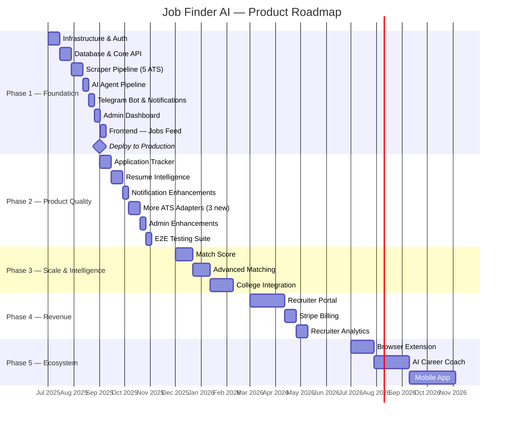

# 16 — Roadmap

**Document Version:** 1.0  
**Status:** Active  
**Last Updated:** 2025-06-22  
**Owner:** Product Lead  

---

## Purpose of This Document

This document defines what gets built, in what order, and why — phase by phase. It is not a Gantt chart. It is not a sprint board. It is the product strategy expressed as a sequenced plan, with clear entry and exit criteria for each phase, so the team always knows where we are and what comes next.

The roadmap connects directly to the task list in `17_TASKS.md` (what to do) and the KPIs in `01_PRD.md` Section 15 (how to measure success). When priorities conflict, this document is the tiebreaker.

---

## Table of Contents

1. [Roadmap Overview](#1-roadmap-overview)
2. [Phase 1 — Foundation](#2-phase-1--foundation)
3. [Phase 2 — Product Quality](#3-phase-2--product-quality)
4. [Phase 3 — Scale & Intelligence](#4-phase-3--scale--intelligence)
5. [Phase 4 — Revenue](#5-phase-4--revenue)
6. [Phase 5 — Ecosystem](#6-phase-5--ecosystem)
7. [Principles That Govern Prioritization](#7-principles-that-govern-prioritization)
8. [What We Are Explicitly Not Building](#8-what-we-are-explicitly-not-building)

---

## 1. Roadmap Overview

### Phase Summary

| Phase | Theme | Duration | Target End | Exit Criteria |
|---|---|---|---|---|
| **1 — Foundation** | Build the pipeline | 8 weeks | Month 2 | Jobs flow from ATS to Telegram in < 30 min |
| **2 — Product Quality** | Make users stay | 8 weeks | Month 4 | Day-7 retention > 40%, WAU > 300 |
| **3 — Scale & Intelligence** | Make matching smarter | 12 weeks | Month 7 | WAU > 2,000, match score live |
| **4 — Revenue** | Make money | 10 weeks | Month 10 | 10+ paying recruiters, MRR > $1,000 |
| **5 — Ecosystem** | Lock in the moat | Ongoing | Month 18+ | Extension live, coach in beta |

---

## 2. Phase 1 — Foundation

**Theme:** Build the automated pipeline end to end. Everything else depends on this working correctly.

**Duration:** Weeks 1–8  
**Team size:** 1–2 engineers  
**Status:** 🔴 Not Started

### Goal

A student registers, sets their profile, and receives a Telegram notification with a matched job within 30 minutes of that job being posted on a company career page. This single flow, working reliably, is the entire goal of Phase 1.

### What Gets Built

**Week 1–2 — Infrastructure & Auth**
- Docker Compose local development environment
- FastAPI application skeleton with middleware
- PostgreSQL schema + all Alembic migrations
- Seed data: skills, role types, cities, initial 50–100 companies
- Full authentication: email/password registration, Google OAuth, JWT sessions
- Admin role and route protection

**Week 3–4 — Scraper Pipeline**
- ATS Auto-Detector (3-stage: URL pattern → HTML signature → API probe)
- 5 ATS adapters: Workday, Greenhouse, Lever, iCIMS, Taleo
- Generic HTML fallback adapter (Playwright-based)
- APScheduler running scrape batches every 15 minutes
- Scrape run logging to `scrape_runs` table
- robots.txt compliance + per-domain rate limiting
- Retry with exponential backoff

**Week 5 — AI Agent Pipeline**
- BaseAgent with caching, retry, logging
- Duplicate Detector (hash-based)
- Job Extractor (GPT-4o)
- Skill Extractor (GPT-4o, includes `degree_required`)
- JD Summarizer (GPT-4o, exactly 5 bullets)
- Job Classifier (GPT-4o-mini, includes `company_type`)
- All 5 prompts in `docs/20_PROMPTS.md`

**Week 6 — Notifications**
- Telegram bot with webhook mode
- All bot commands: /start, /pause, /resume, /settings, /unlink, /help
- Telegram account linking flow (QR + deep link + polling)
- Notification matching service (4-condition SQL query)
- Notification router (channel selection + quiet hours)
- Daily email digest (Resend)
- Notification retry worker
- Quiet hours hold-and-release

**Week 7 — Admin Dashboard**
- Scraper health table (healthy/warning/failed with auto-refresh)
- Company management (add/deactivate + ATS detection)
- Low-confidence job review queue (approve/edit/reject)
- Admin Telegram failure alerts (3 consecutive failures → instant alert)

**Week 8 — Frontend + Deploy**
- `/login` and `/register` pages
- 4-step onboarding flow (skills → preferences → Telegram → complete)
- Jobs feed with filters (role type, location, experience, remote)
- Job detail page (SSR + JSON-LD + AI summary + skill match)
- Production deployment to Railway + Vercel
- CI/CD pipeline (GitHub Actions: lint → test → build → staging → production)
- UptimeRobot monitors configured

### Exit Criteria

All of the following must be true before Phase 2 begins:

- [ ] End-to-end flow verified: job posted on a real company career page → notification received on Telegram within 30 minutes
- [ ] All 5 ATS adapters tested against at least 3 real companies each
- [ ] AI extraction accuracy ≥ 95% on a test set of 20 job descriptions
- [ ] Duplicate detection correctly prevents re-notification on the same job
- [ ] Admin dashboard shows real-time scraper health
- [ ] Telegram bot responds to all 6 commands correctly
- [ ] `/health` endpoint returns 200 in production
- [ ] CI/CD pipeline deploys successfully from `main` without manual steps
- [ ] Zero P0 security vulnerabilities in pre-launch checklist (see `13_SECURITY.md` Section 19)

### Phase 1 KPIs

| KPI | Target | How Measured |
|---|---|---|
| Jobs scraped per day | ≥ 500 | `scrape_runs` table aggregate |
| Scraper success rate | ≥ 95% | `scrape_runs.status = 'success'` / total |
| AI parse success rate | ≥ 95% | `agent_logs.status = 'success'` / total |
| Posting → notification latency | < 30 min | `notification_logs.sent_at` - `jobs.company_posted_at` |
| Telegram delivery success | ≥ 99% | `notification_logs` action = 'sent' / total |
| Registered users (month 1) | ≥ 50 | `users` table count |

---

## 3. Phase 2 — Product Quality

**Theme:** Turn early adopters into retained users. Fix the leaky bucket before growing it.

**Duration:** Weeks 9–16 (Months 3–4)  
**Team size:** 1–2 engineers  
**Status:** 🔴 Not Started

### Goal

Students who register stay active. The product is useful enough that they return without being pushed — they open the app to check their saved jobs, they come back when they get a deadline reminder, they recommend it in their Telegram communities.

Phase 2 delivers the features that create retention: tracking, reminders, and match quality improvements. Without these, users register → receive a few alerts → churn when the novelty wears off.

### What Gets Built

**Application Tracking**
- Save job (bookmark) from web, Telegram, and job detail
- Application status tracker: Saved → Applied → Interviewing → Offer / Rejected
- `/my-jobs` page with status tabs and stats bar
- Status update via web UI and Telegram inline button
- "Closing Soon" badge (≤ 48 hours to deadline)

**Resume Intelligence**
- Resume PDF upload to Cloudflare R2 (private bucket)
- AI-based skill extraction from PDF text (Resume Skill Extractor agent)
- Review screen: user confirms or edits extracted skills
- Auto-populates profile skills on confirmation
- Image-only PDF detection with graceful fallback message

**Notification Enhancements**
- Weekly email digest (Monday 8 AM — top 10 matches from past 7 days)
- Deadline reminder notifications (Telegram + email, 48h before deadline, once per saved job)
- Notification preference refinement: exact match mode, per-channel frequency

**More ATS Adapters**
- SmartRecruiters adapter (REST API)
- BreezyHR adapter (internal Remix route endpoint)
- Ashby adapter (GraphQL)
- Updated ATS detection signatures for all 3

**Admin Enhancements**
- Manual scrape trigger (per company, "Run Now" button)
- User management: list, detail, suspend, reactivate
- Agent failure rate monitoring (alert if > 10% parse failures in 1 hour)

**Full Settings Page**
- Profile tab: skills + role/location/experience
- Notifications tab: channels, frequency, quiet hours
- Resume tab: upload widget + extraction status
- Account tab: change password + account deletion (DangerZone)

**E2E Testing Suite**
- Playwright E2E tests for all critical user journeys
- CI runs E2E against staging environment before production deploy
- Backend test coverage enforced at ≥ 70%

### Entry Criteria (before Phase 2 starts)

- All Phase 1 exit criteria met
- Production has been running stably for at least 1 week with no P0 incidents

### Exit Criteria

All of the following must be true before Phase 3 begins:

- [ ] Day-7 retention ≥ 40% (users who received a notification in week 1 return in week 2)
- [ ] WAU ≥ 300
- [ ] ≥ 60% of registered users have connected Telegram
- [ ] Application tracker: at least 30% of active users have saved at least 1 job
- [ ] Resume upload: at least 20% of users who see the feature use it
- [ ] Deadline reminder sends correctly and `reminder_sent_at` prevents duplicates
- [ ] All 3 new ATS adapters tested against 3 real companies each
- [ ] E2E tests pass in CI for all 5 critical user journeys

### Phase 2 KPIs

| KPI | Target | How Measured |
|---|---|---|
| Registered users | ≥ 500 | `users` table |
| Weekly active users | ≥ 300 | Users with `notification_logs.sent_at` in last 7 days |
| Day-7 retention | ≥ 40% | Users active in week 2 / users who received alert in week 1 |
| Profile completion rate | ≥ 70% | Users with ≥ 1 skill + ≥ 1 role type + ≥ 1 location |
| Telegram bot connection rate | ≥ 60% | `users` with `telegram_id IS NOT NULL` / total |
| Monthly churn | < 5% | Users with 0 notifications received this month vs. last |
| LLM cost / 1,000 users / month | < $50 | OpenAI usage dashboard |

---

## 4. Phase 3 — Scale & Intelligence

**Theme:** Make the matching smarter so users see fewer alerts that are more right, not more alerts that are less right.

**Duration:** Weeks 17–28 (Months 5–7)  
**Team size:** 2 engineers  
**Status:** 🔴 Not Started

### Goal

As user count grows, matching quality becomes the primary differentiator. A platform that sends 10 highly relevant notifications per week is more valuable than one that sends 50 mediocre ones. Phase 3 invests in the intelligence layer.

It also targets a new user segment — college placement cells — to drive organic growth via institutions rather than purely individual sign-ups.

### What Gets Built

**Match Score**
- Deterministic match score algorithm: required skills 80%, preferred 10%, experience band 10%
- Displayed on job cards in the feed (e.g., "4/6 required skills matched")
- Included in Telegram notification (e.g., "You match 4/6 required skills")
- Match score visible in My Jobs tracker
- "Why this matched" tooltip on job detail page
- A/B test: does showing match score increase or decrease apply rate?

**Advanced Matching**
- User feedback loop: "Not Interested" signals feed into per-user negative preference weights
- Salary range preference in profile (filter: "only show roles with disclosed salary")
- Company type preference: product / startup / enterprise (feeds into matching, not just display)
- Skill gap analysis: "You're missing Go and Docker — 8 roles this week required them"

**College Integration**
- Placement officer accounts (new role: `placement_officer`)
- College dashboard: view all job matches for their batch, batch-level skill gap chart
- Bulk notification to college cohort for specific high-relevance roles
- College email domain verification for account creation
- College-specific analytics: top matched companies for this batch

**Semantic Deduplication (Phase 3 upgrade to Duplicate Detector)**
- Detect when the same job appears on two different ATS portals
- Similarity scoring on `raw_description` (cosine similarity via embeddings)
- Merge duplicate records, prefer the apply URL from the more reliable ATS source

### Entry Criteria

- Phase 2 exit criteria met
- WAU ≥ 300 and stable for at least 2 weeks
- LLM cost per 1,000 users/month consistently < $50

### Exit Criteria

- [ ] Match score displayed on all job cards and in Telegram notifications
- [ ] WAU ≥ 2,000
- [ ] "Not Interested" feedback loop demonstrably reduces irrelevant notifications (measured via A/B)
- [ ] At least 5 colleges with a placement officer account
- [ ] At least 50 college batch notifications sent

### Phase 3 KPIs

| KPI | Target | How Measured |
|---|---|---|
| Weekly active users | ≥ 2,000 | |
| Day-7 retention | ≥ 45% | |
| Notification click-through rate | ≥ 35% | Apply Now taps / notifications sent |
| "Not Interested" rate per notification | < 15% | (was ≤ 20% in Phase 2 target) |
| College accounts | ≥ 5 | `users` with `role = 'placement_officer'` |
| LLM cost / 1,000 users / month | < $40 | With semantic dedup + caching improvements |

---

## 5. Phase 4 — Revenue

**Theme:** Monetize by solving a recruiter problem that the student-side product has already created.

**Duration:** Weeks 29–38 (Months 8–10)  
**Team size:** 2–3 engineers  
**Status:** 🔴 Not Started

### Goal

By Phase 4, we have > 2,000 weekly active students on the platform. That is a verified, engaged, skill-profiled audience of freshers and early-career developers. Recruiters at companies hiring freshers will pay for targeted access to this audience. Phase 4 builds the product that lets them do that — while keeping the student experience free and uncompromised.

### What Gets Built

**Recruiter Accounts**
- Recruiter registration with company email verification
- New role: `recruiter`
- Company verification flow (admin approves)
- Recruiter onboarding: company profile, target roles, target experience levels

**Direct Job Posting**
- Job posting form (bypasses scraper pipeline — direct DB insert)
- Company-branded job cards in student feed (labeled "Featured")
- Posted jobs match against student profiles (same matching engine as scraped jobs)
- No unfair advantage: posted jobs compete on match quality, not on placement

**Recruiter Analytics Dashboard**
- View impressions, saves, and apply-link clicks for each posted job (anonymized — no individual student data exposed)
- Aggregate skill profile of students who matched (e.g., "73% of matched students know Python")
- Match quality score for each posting (how well the role aligns with the audience)

**Stripe Billing**
- Subscription: per job posting (pay-per-post) OR monthly flat fee
- Stripe Checkout integration
- Invoice generation and management
- Free tier: 1 posting/month for startups under Series A

**Email → Recruiter Distribution**
- Weekly "talent digest" email to opted-in recruiters: new skills trending in the student base, top-matched role categories, platform stats

### Entry Criteria

- Phase 3 exit criteria met
- WAU ≥ 2,000 and stable for 4+ weeks
- At least 10 recruiters expressing interest (waitlist or direct outreach)

### Exit Criteria

- [ ] 10+ paying recruiter accounts
- [ ] MRR ≥ $1,000
- [ ] Average recruiter retention: 3+ consecutive months of subscription
- [ ] Student experience unchanged: recruiter postings clearly labeled, student can filter them out
- [ ] Stripe billing processes without manual intervention

### Phase 4 KPIs

| KPI | Target | How Measured |
|---|---|---|
| Paying recruiter accounts | ≥ 10 | `users` with `role = 'recruiter'` AND active subscription |
| MRR | ≥ $1,000 | Stripe dashboard |
| Average revenue per account | ≥ $100/month | MRR / paying accounts |
| Recruiter churn | < 10% / month | Stripe subscription cancellation rate |
| Posted jobs per month | ≥ 25 | `jobs` with `source = 'recruiter'` |
| Student NPS (no drop) | ≥ Phase 3 level | In-app survey (quarterly) |

---

## 6. Phase 5 — Ecosystem

**Theme:** Extend the platform beyond job discovery into the broader student career journey.

**Duration:** Month 13+  
**Team size:** 3+ engineers  
**Status:** 🔴 Not Started (planning only)

### Goal

Phase 5 is about making Job Finder AI the platform students use throughout their job search — not just for discovery, but for preparation, application, and career development. This is where the moat gets built: once students use the platform for interview prep and resume tailoring, they're not switching.

### What Gets Built (planning only — not yet scoped in detail)

**Browser Extension**
- One-click job save from any career page (not just scraped sources)
- Auto-detect and extract job data from the current page
- Push to Job Finder AI pipeline for AI processing
- Works with any site, any ATS — the scraper comes to the user

**AI Career Coach**
- Interview prep questions generated from the specific JD the user applied to
- Resume tailoring: "Here's how to rewrite your experience bullets to match this JD"
- Cover letter draft from user profile + JD
- All outputs personalized to the student's skill profile and experience level

**Mobile App (iOS + Android)**
- Native Telegram-like notification experience
- Offline job card saving
- Resume upload via phone camera (OCR)
- Push notifications (complement to Telegram bot)

**Resume Builder**
- Guided wizard: input work experience, projects, skills
- AI-generated bullet points for each experience item
- Export to PDF
- ATS optimization hints (which keywords are missing based on target roles)

### Phase 5 Entry Criteria

- Phase 4 exit criteria met
- MRR ≥ $2,000 (enough to fund Phase 5 development)
- WAU ≥ 5,000

---

## 7. Principles That Govern Prioritization

These principles are used when two features compete for the same engineering time. They are ordered — Principle 1 beats Principle 2 when they conflict.

### Principle 1 — Fix before grow

A leaky bucket filled faster just leaks faster. Do not begin user acquisition until Day-7 retention ≥ 40%. Do not add new features until existing features work reliably for all current users. Phase exit criteria enforce this.

### Principle 2 — Pipeline reliability beats feature richness

A platform that delivers 500 perfectly extracted jobs per day with no notification failures is more valuable than one that delivers 2,000 jobs with 10% parse failures and occasional duplicate notifications. The core pipeline (scrape → extract → match → notify) must be bulletproof before any new features are added.

### Principle 3 — Student experience is never compromised for revenue

Phase 4 introduces recruiter postings. These are clearly labeled and opt-outable. The student feed is never polluted by irrelevant recruiter postings. Revenue is generated by making recruiters reach the right students — not by degrading the student experience. If these goals ever conflict, student experience wins.

### Principle 4 — Measure before building Phase N+1

Each phase has explicit KPIs. Do not begin a new phase until the previous phase's exit criteria are met and KPIs are measured and documented. "We think Phase 2 worked well" is not a basis for starting Phase 3.

### Principle 5 — Small team, big bets

With a 1–3 person team, we cannot build everything. Every item on the roadmap was chosen because it moves the primary metric (WAU, retention, MRR) meaningfully. Features that are nice-to-have but don't move these metrics belong in the backlog, not the roadmap.

---

## 8. What We Are Explicitly Not Building

These are features that have been considered and deliberately excluded. If someone requests any of these, this document is the explanation.

| Feature | Why Excluded | Reconsider When |
|---|---|---|
| Mobile native app | High cost, low marginal value when Telegram + mobile web covers the use case | Phase 5; after MRR > $2,000 |
| Resume builder | Out of scope for a job discovery platform; excellent alternatives exist | Phase 5 only if users explicitly request it |
| Job application auto-submit | Legal risk; we are a discovery platform, not an apply-on-behalf service | Never — this is a non-goal per `01_PRD.md` |
| Recruiter messaging to students | Privacy concern; students haven't opted in to recruiter outreach | Only with explicit student opt-in, Phase 4+ |
| Glassdoor-style company reviews | Different product category; requires its own user-generated content moderation | Not on roadmap |
| LinkedIn competitor features (connections, feed, posts) | We are not building a social network; we are building an automated job alert system | Never |
| Interview scheduling | Good feature; not differentiated; Calendly exists | Backlog only |
| Job board aggregator (all sources) | We scrape ATS portals directly for early access; aggregating already-syndicated jobs defeats the purpose | Never |
| Paid student tier | Our monetization is recruiter-side; charging students creates friction and reduces the network effect | Phase 5 only if recruiter revenue model fails |

---

*The roadmap is a plan, not a promise. Market feedback, user behavior data, and technical discoveries will cause it to change. When it changes, update this document and note what changed and why — the history of roadmap decisions is as valuable as the current plan.*